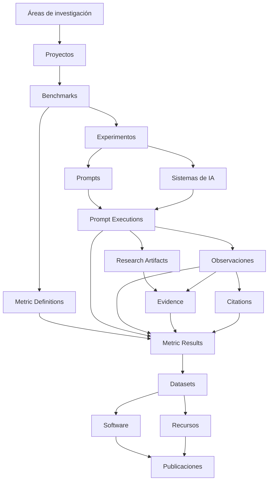

<p align="center">
  
</p>

<p align="center">
  <strong>Infraestructura científica para búsqueda generativa, inteligencia artificial, GEO, benchmarks, evidencias, métricas versionadas e investigación reproducible.</strong>
</p>

<p align="center">
  <a href="./README.md">English</a> · <strong>Español</strong> · <a href="./docs/ESTADO_PROYECTO_ES.md">Estado actual del proyecto</a> · <a href="./docs/MANUAL_USUARIO_ES.md">Manual de usuario</a>
</p>

<p align="center">
  <a href="https://gslhub.com">Web</a> ·
  <a href="https://gslhub.com/research">Investigación</a> ·
  <a href="https://gslhub.com/benchmarks">Benchmarks</a> ·
  <a href="https://gslhub.com/dashboard">Dashboard científico</a> ·
  <a href="https://gslhub.com/publications">Publicaciones</a> ·
  <a href="https://github.com/gslhub">Organización GitHub</a>
</p>

<p align="center">
  
  
  
  
  
  
</p>

---

# GSLHub

**GSLHub — Generative Search Lab Hub** es una plataforma científica independiente para estudiar cómo los sistemas de IA generativa descubren, recuperan, interpretan, citan, resumen y recomiendan información digital.

La plataforma conecta proyectos, benchmarks, experimentos, prompts versionados, perfiles de sistemas de IA, ejecuciones controladas, observaciones, artefactos de investigación, evidencias, citas, Metric Definitions versionadas, Metric Results, datasets, software, recursos y publicaciones dentro de una infraestructura trazable.

GSLHub se desarrolla desde Barcelona con alcance internacional. La plataforma se encuentra actualmente en **Development Mode**: estamos validando el flujo científico con registros sintéticos/de desarrollo antes de la transición irreversible hacia la recogida de datos doctorales reales.

## Estado del proyecto — 14 de agosto de 2026

### Stack validado en producción

```text
Plataforma GSLHub  0.5.5
Payload CMS        3.75.0
@payloadcms/next   3.75.0
Next.js            16.2.10
React / React DOM  19.2.7
Driver MongoDB     6.21.0
Artefactos         Subidas locales persistentes fuera de los releases
Hosting            Hostinger
Base de datos      MongoDB Atlas
```

Payload permanece fijado intencionadamente en `3.75.0`. Las actualizaciones de framework deben probarse en una rama aislada con el flujo completo de administración y operaciones científicas.

### Hito actual

| Área | Estado | Situación actual |
| --- | --- | --- |
| Hosting y despliegue | ✅ Operativo | El despliegue automático desde `main` hacia Hostinger funciona. |
| Administrador Payload | ✅ Operativo | Autenticación, listados, formularios, drafts, versiones y flujos gobernados funcionan en producción. |
| Modelo científico | ✅ Operativo | Está implementada la procedencia Ejecución → Artefacto → Evidencia → Observación → Cita/Métrica. |
| Research Environment | ✅ Implementado | Development Mode, TEST reset, preview del Final Development Reset y bloqueo de activación doctoral están disponibles. |
| Persistencia de artefactos | ✅ Verificada | Los ficheros viven fuera del árbol de despliegue y sobrevivieron a restart y redeploy con el mismo SHA-256. |
| Backup/recovery drill | ✅ Verificado | La recuperación local controlada finalizó y generó un audit permanente en Storage Verification. |
| Metodología métrica | ✅ Validación de desarrollo completada | AIR, CR, MCP y RCR v0.1.0 superaron pruebas deterministas y revisión de desarrollo. |
| Gobernanza de métricas | ✅ Implementada | La autorrevisión técnica y la revisión independiente están separadas de la validación formal. |
| Procedencia de Evidence | ✅ Implementada | Evidence puede enlazar directamente uno o varios Research Artifacts de la misma Prompt Execution. |
| Primera ejecución end-to-end | ✅ Completada | `GSL-EXEC-GEO-0001` terminó con artefactos verificados, evidencias validadas y observación validada. |
| Ejecuciones reservadas restantes | ⏳ Planned | `GSL-EXEC-GEO-0002` a `0005` siguen planificadas. |
| Final Development Reset | ⏳ No ejecutado | Todavía existen registros científicos de desarrollo que deberán limpiarse antes de activar modo doctoral. |
| Doctoral Research Mode | ⛔ No activado | La recogida de datos doctorales reales aún no ha comenzado. |

La fotografía operativa detallada se mantiene en [docs/ESTADO_PROYECTO_ES.md](./docs/ESTADO_PROYECTO_ES.md).

## Primera ejecución completa de desarrollo

El primer recorrido gobernado de principio a fin se ha cerrado correctamente:

```text
GSL-EXEC-GEO-0001                  Completed / Published
├── GSL-ART-GEO-0001               TXT de respuesta / SHA-256 verificado
├── GSL-ART-GEO-0002               Captura / SHA-256 verificado
├── GSL-EVD-GEO-0001               Evidence de respuesta / Validated
├── GSL-EVD-GEO-0002               Evidence visual / Validated
└── GSL-OBS-GEO-0001               Observación de respuesta / Validated
```

Resultado observado:

```text
Response status            Partial response
Citas explícitas           No
Source links               No
Sources panel              No
Visible citation count     0
```

Estos son **datos de validación de desarrollo**, no hallazgos doctorales.

El prompt de `GSL-EXEC-GEO-0001` fue una pregunta general sobre selección de fuentes y no definía un dominio, marca o entidad objetivo. Por tanto, no se deben fabricar resultados AIR/CR/MCP para esta ejecución. RCR requiere varias ejecuciones comparables antes de estar definido.

## Métricas del piloto

Existen definiciones permanentes para:

| Código | Métrica | Versión | Estado de desarrollo |
| --- | --- | --- | --- |
| AIR | Answer Inclusion Rate | 0.1.0 | Prueba determinista y revisión de desarrollo completadas |
| CR | Citation Rate | 0.1.0 | Prueba determinista y revisión de desarrollo completadas |
| MCP | Mean Citation Position | 0.1.0 | Prueba determinista y revisión de desarrollo completadas |
| RCR | Response Consistency Rate | 0.1.0 | Prueba determinista y revisión de desarrollo completadas |

Los resultados sintéticos esperados de los calculadores se verificaron correctamente. Son evidencia de implementación, no resultados doctorales.

Los calculadores target-specific aplican condiciones gobernadas. AIR y CR requieren `targetType + targetValue`; MCP requiere posiciones de cita codificables; RCR requiere varias observaciones comparables y aceptadas.

## Frontera de seguridad del Research Environment

GSLHub separa la validación de desarrollo de la investigación doctoral real.

**Development Mode** permite:

- flujos descartables `TEST-`;
- comprobaciones sintéticas de métricas;
- revisores de prueba;
- acciones de reset;
- ejecuciones end-to-end exclusivamente de desarrollo.

Antes de recoger datos doctorales reales, el administrador deberá ejecutar **Final Development Reset** y comprobar que queda una baseline limpia. Solo después podrá activarse **Doctoral Research Mode**, que es deliberadamente irreversible desde la interfaz de la aplicación.

Estado actual:

```text
Research Environment       Development Mode
Final Development Reset    No ejecutado
Doctoral Research Mode     No activado
```

## Artefactos de investigación persistentes

Los artefactos de producción se almacenan fuera del directorio de release/despliegue de Node.js:

```text
/home/<usuario-hostinger>/domains/gslhub.com/gslhub-data/research-artifacts
```

La prueba controlada verificó:

```text
Upload → HTTP 200
Node.js Restart → mismo fichero / mismo SHA-256 / HTTP 200
Redeploy → mismo fichero / mismo SHA-256 / HTTP 200
Recovery drill → fichero restaurado / mismo SHA-256
```

El alcance del backup operativo incluye:

```text
Base de datos MongoDB
Directorio persistente research-artifacts
Configuración de producción necesaria para reconstruir la aplicación
```

El almacenamiento S3-compatible queda como opción futura de escalado y no bloquea la fase actual.

## Arquitectura científica



## Lo que falta antes de recoger datos doctorales

1. Terminar la validación de desarrollo necesaria para demostrar repetibilidad entre varias ejecuciones.
2. Decidir el papel de `GSL-EXEC-GEO-0002` a `0005`: repeticiones del prompt general para probar RCR y/o sustitución por un protocolo de desarrollo explícitamente target-specific.
3. Ejecutar al menos un flujo completo target-specific para probar AIR, CR y MCP end-to-end con registros reales de colección y no solo fixtures sintéticos.
4. Confirmar RCR con múltiples observaciones aceptadas.
5. Revisar el manejo de timestamps para asegurar que la hora real de ejecución se capture correctamente antes de sellar el snapshot.
6. Verificar el preview y las reglas de preservación del Final Development Reset.
7. Ejecutar Final Development Reset únicamente cuando el producto esté preparado para una baseline doctoral limpia.
8. Confirmar que se eliminan ejecuciones, observaciones, citas, métricas y perfiles TEST de desarrollo y que se preservan los audits permanentes previstos.
9. Congelar benchmark, experimento, diccionario de targets, versiones de prompts, perfiles de sistemas de IA y codebooks del protocolo doctoral.
10. Activar Doctoral Research Mode.
11. Crear y ejecutar el piloto doctoral real bajo el protocolo congelado.
12. Preservar evidencias, validar observaciones/citas, calcular métricas reales y publicar el primer dataset/protocolo/informe doctoral.

## Desarrollo local

```bash
git clone https://github.com/gslhub/website.git
cd website
npm install
cp .env.example .env.local
npm run dev
```

Comprobaciones de calidad:

```bash
npm run lint
npm run typecheck
npm run build
```

Variables requeridas, entre otras:

```env
NEXT_PUBLIC_SITE_URL=http://localhost:3000
PAYLOAD_SECRET=replace-with-a-long-random-secret
DATABASE_URL=mongodb+srv://<usuario>:<contraseña>@<cluster>/?retryWrites=true&w=majority&appName=GSLHub
```

## Política de compatibilidad

No actualizar automáticamente Payload, Next.js o React y no ejecutar `npm audit fix --force` en producción. Las actualizaciones de framework deben probarse en una rama independiente con el flujo completo del administrador.

## Documentación

- [Estado operativo actual del proyecto](./docs/ESTADO_PROYECTO_ES.md)
- [Manual de usuario](./docs/MANUAL_USUARIO_ES.md)
- [Protocolo del primer piloto](./docs/PROTOCOLO_PRIMER_PILOTO_ES.md)
- [Codebook de observaciones y citas](./docs/CODEBOOK_OBSERVACIONES_CITAS_ES.md)
- [Procedimiento de almacenamiento, backup y recuperación](./docs/PROCEDIMIENTO_ALMACENAMIENTO_BACKUP_RECUPERACION_ES.md)
- [Historial en español](./CHANGELOG.es.md)
- [Changelog en inglés](./CHANGELOG.md)

## Contacto

- Web: [gslhub.com](https://gslhub.com)
- GitHub: [github.com/gslhub](https://github.com/gslhub)
- Correo: [research@gslhub.com](mailto:research@gslhub.com)
- Fundador e investigador: [Eduardo José Yauri Luna](https://www.linkedin.com/in/eduardoyauriluna/)

---

<p align="center">
  <strong>Investigación · Benchmarks · Evidencia · Metric Definitions · Metric Results · Software · Datasets · Ciencia abierta</strong>
</p>

<p align="center">
  Última actualización: 14 de agosto de 2026
</p>
