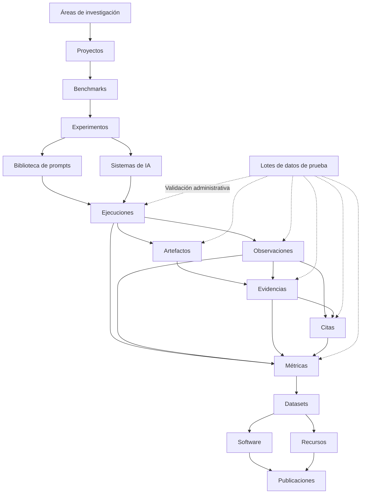

<p align="center">
  
</p>

<p align="center">
  <strong>Infraestructura científica para búsqueda generativa, inteligencia artificial, GEO, benchmarks, evidencias, métricas e investigación reproducible.</strong>
</p>

<p align="center">
  <a href="./README.md">English</a>
  ·
  <strong>Español</strong>
  ·
  <a href="./docs/MANUAL_USUARIO_ES.md">Manual de usuario</a>
</p>

<p align="center">
  <a href="https://gslhub.com">Web</a>
  ·
  <a href="https://gslhub.com/research">Investigación</a>
  ·
  <a href="https://gslhub.com/benchmarks">Benchmarks</a>
  ·
  <a href="https://gslhub.com/dashboard">Dashboard científico</a>
  ·
  <a href="https://gslhub.com/publications">Publicaciones</a>
  ·
  <a href="https://github.com/gslhub">Organización GitHub</a>
</p>

<p align="center">
  
  
  
  
  
</p>

---

# GSLHub

**GSLHub — Generative Search Lab Hub** es una plataforma científica independiente para estudiar cómo los sistemas de inteligencia artificial generativa descubren, recuperan, interpretan, citan, resumen y recomiendan información digital.

La plataforma conecta la gestión de proyectos científicos, diseño de benchmarks, experimentos controlados, prompts versionados, perfiles de sistemas de IA, ejecuciones, observaciones, artefactos, evidencias, citas, métricas, datasets, software, recursos metodológicos y publicaciones dentro de una infraestructura trazable.

GSLHub se desarrolla desde Barcelona con alcance internacional.

> **Estado actual — 26 de julio de 2026:** el CMS científico, los catálogos públicos, el dashboard, la integridad de archivos, la generación administrativa de datos de prueba y las reglas de trazabilidad están operativos. El escenario sintético completo de 27 registros conectados ha sido generado, validado, eliminado de forma segura y repetido en producción. Se han probado reglas de inmutabilidad para proyectos, benchmarks, experimentos, prompts, sistemas de IA, ejecuciones, observaciones, evidencias, citas, métricas, recursos, datasets, software y publicaciones. El siguiente hito es cerrar el protocolo real, verificar almacenamiento y recuperación, y ejecutar las cinco primeras repeticiones reales.

## Misión

GSLHub desarrolla investigación transparente, reproducible y aplicada en:

- búsqueda generativa;
- Generative Engine Optimization (GEO);
- inteligencia artificial;
- recuperación de información;
- selección y citación de fuentes;
- transformación digital;
- automatización;
- ciencia abierta y software científico.

## Visión

GSLHub aspira a convertirse en una referencia internacional independiente sobre visibilidad, recuperación, citación, recomendación y autoridad en sistemas de búsqueda generativa.

La plataforma cubre el ciclo científico completo:

1. definir áreas y proyectos;
2. diseñar benchmarks y experimentos;
3. versionar prompts y documentar sistemas de IA;
4. ejecutar condiciones controladas;
5. conservar respuestas y archivos;
6. codificar observaciones y citas;
7. validar evidencias y cadena de custodia;
8. calcular métricas transparentes;
9. probar el flujo con datos sintéticos administrables;
10. liberar datasets, software, recursos y publicaciones.

## Arquitectura científica



La arquitectura mantiene trazabilidad desde la pregunta científica hasta el sistema evaluado, el prompt exacto, la ejecución, el archivo, la evidencia, la observación, la cita, la métrica y el resultado liberado.

## Estado de la plataforma

### Colecciones Payload

La configuración de producción registra **19 colecciones**.

| Colección | Función | Estado |
| --- | --- | --- |
| Users | Autenticación y roles. | ✅ Operativa |
| Test Data Batches | Generación y limpieza de datos sintéticos. | ✅ Validada |
| Research Areas | Clasificación temática. | ✅ Operativa |
| Researchers | Perfiles e identificadores académicos. | ✅ Operativa |
| Projects | Objetivos, metodología y ciclo del proyecto. | ✅ Gobernanza validada |
| Benchmarks | Protocolos, sistemas y métricas. | ✅ Gobernanza validada |
| Experiments | Preguntas, hipótesis, variables y muestra. | ✅ Gobernanza validada |
| Prompts | Redacción exacta, versión y restricciones. | ✅ Gobernanza validada |
| AI Systems | Proveedor, acceso, capacidades y versión visible. | ✅ Gobernanza validada |
| Prompt Executions | Ejecuciones, entorno, respuesta y revisión. | ✅ Integridad validada |
| Observations | Codificación estructurada. | ✅ Integridad validada |
| Research Artifacts | Archivos privados con SHA-256. | ✅ Validada |
| Evidence | Preservación, integridad y cadena de custodia. | ✅ Integridad validada |
| Citations | Extracción y verificación de fuentes. | ✅ Integridad validada |
| Metrics | Resultados, fórmulas y reproducibilidad. | ✅ Integridad validada |
| Publications | Preprints, artículos e informes. | ✅ Gobernanza validada |
| Software | Versiones y disponibilidad del código. | ✅ Gobernanza validada |
| Datasets | Metodología, formatos y liberación. | ✅ Gobernanza validada |
| Resources | Protocolos, guías y plantillas. | ✅ Gobernanza validada |

### Capacidades validadas

- campos científicos en inglés y español;
- drafts y publicación;
- API pública limitada a contenido publicado;
- roles admin, editor y researcher;
- MongoDB Atlas;
- dashboard científico público;
- uploads privados;
- normalización MIME;
- SHA-256 automático;
- herencia de contexto científico;
- escenario de prueba de 27 registros;
- rollback y reintento;
- eliminación física de archivos;
- unicidad de condiciones experimentales;
- reserva de códigos científicos;
- ciclos de vida controlados;
- snapshots validados inmutables;
- cadena de custodia append-only;
- mensajes de error comprensibles.

## Regla central de gobernanza

GSLHub diferencia entre un documento editable y un registro científico congelado.

Antes de validar o liberar, el usuario puede corregir el contenido. Después, debe conservarse la historia.

Cuando un dato congelado necesita una corrección, las opciones correctas son:

- añadir notas de revisión;
- excluir o rechazar el registro;
- marcarlo deprecated o archived;
- crear una nueva versión;
- crear una nueva ejecución, observación o métrica;
- registrar una corrección formal en publicaciones.

Nunca debe sobrescribirse silenciosamente un registro ya utilizado por trabajo científico.

La explicación completa por colección está en [`docs/MANUAL_USUARIO_ES.md`](./docs/MANUAL_USUARIO_ES.md).

## Resumen de reglas por colección

| Entidad | Momento de congelación | Acción correcta ante cambios |
| --- | --- | --- |
| Project | Active | Nueva versión del proyecto |
| Benchmark | Pilot | Nueva versión del benchmark |
| Experiment | Ready | Nuevo experimento o nueva versión |
| Prompt | Validated | Nuevo prompt versionado |
| AI System | Active o equivalente | Nuevo perfil o snapshot |
| Prompt Execution | Running / Completed | Nueva ejecución o exclusión |
| Observation | Validated | Nueva observación o nota de revisión |
| Research Artifact | Tras captura y hash | Nuevo artefacto |
| Evidence | Validated | Rechazar, archivar o nueva evidencia |
| Citation | Validated | Nueva cita o revisión documentada |
| Metric | Validated | Nuevo resultado métrico |
| Resource | Available | Nueva versión del recurso |
| Dataset | Released | Nueva versión del dataset |
| Software | Alpha o superior | Nueva versión del software |
| Publication | Preprint o Published | Nueva versión o corrección formal |

## Códigos científicos

```text
GSL-EXEC-GEO-0001
GSL-OBS-GEO-0001
GSL-ART-GEO-0001
GSL-EVD-GEO-0001
GSL-CIT-GEO-0001
GSL-MET-GEO-0001
```

Los códigos:

- se normalizan a mayúsculas;
- deben utilizar el prefijo de su colección;
- terminan con al menos cuatro dígitos;
- quedan reservados al crear el registro;
- no pueden modificarse después.

Los códigos `TEST-` solo pueden ser creados por administradores mediante Test Data Batches.

## Unicidad de ejecuciones

No pueden existir dos ejecuciones reales con la misma combinación:

```text
Experiment
Prompt
Prompt Version
AI System
Repetition Number
```

Esto evita duplicar condiciones científicas y consumir dos veces la misma repetición.

## Datos de prueba

### Escenarios

| Escenario | Registros | Objetivo |
| --- | ---: | --- |
| Pilot prompt executions | 5 | Probar ejecuciones planificadas. |
| Full research pipeline | 27 | Probar el pipeline completo. |

El escenario completo crea:

```text
5 Prompt Executions
5 Observations
5 Research Artifacts
5 Evidence records
3 Citations
4 Metric results
────────────────────
27 connected records
```

La eliminación ocurre en orden inverso de dependencias y también elimina los cinco archivos físicos.

Los datos sintéticos permanecen como draft o privados y nunca aparecen en el dashboard público.

## Artefactos y almacenamiento

GSLHub puede conservar:

- capturas;
- PDF;
- exportaciones de respuesta;
- HTML;
- JSON y JSON-LD;
- CSV;
- logs;
- ZIP.

Para cada archivo compatible puede:

1. normalizar el MIME;
2. calcular SHA-256;
3. guardar el checksum;
4. heredar el contexto de la ejecución;
5. restringir el acceso;
6. relacionarlo con evidencia y observaciones;
7. eliminarlo mediante la limpieza del lote propietario.

El almacenamiento actual es local y privado. Debe migrarse a un archivo duradero compatible con S3 antes de recopilar evidencia irremplazable a escala.

## Cadena científica preparada

| Objeto | Registro actual |
| --- | --- |
| Área | Generative Search and GEO |
| Investigador | Eduardo José Yauri Luna |
| Proyecto | GSLHub Generative Search Visibility Benchmark |
| Benchmark | GSLHub Generative Search Visibility Benchmark |
| Experimento | Pilot Validation of the GSLHub Generative Search Visibility Protocol |
| Prompt | Factors Influencing Source Selection in Generative Search |
| Sistema | ChatGPT Search — authenticated web configuration |
| Publicación | A Reproducible Protocol for Measuring Visibility in Generative Search Systems |
| Software | GSLHub Generative Search Benchmark Toolkit |
| Dataset | GSLHub Generative Search Visibility Benchmark Dataset |
| Recurso | GSLHub Generative Search Visibility Benchmark Research Protocol |

Los registros reales siguen como drafts hasta completar sus requisitos científicos y editoriales.

## Web pública

| Ruta | Fuente | Estado |
| --- | --- | --- |
| `/research` | Áreas y proyectos | ✅ Live |
| `/benchmarks` | Benchmarks | ✅ Live |
| `/dashboard` | Registros publicados y métricas validadas | ✅ Live |
| `/publications` | Publicaciones | ✅ Live |
| `/software` | Software | ✅ Live |
| `/datasets` | Datasets | ✅ Live |
| `/resources` | Recursos | ✅ Live |
| `/people` | Investigadores | ✅ Live |

Los drafts, artefactos privados, datos `TEST-` y resultados no validados se excluyen intencionalmente.

## En qué punto estamos

### Terminado

- infraestructura y despliegue;
- CMS científico;
- web pública y dashboard inicial;
- modelo de investigación;
- modelo de análisis;
- uploads y checksums;
- datos de prueba;
- relaciones e inmutabilidad del pipeline;
- códigos científicos;
- unicidad de condiciones;
- gobernanza de proyectos, benchmarks, experimentos, prompts y sistemas;
- gobernanza de recursos, datasets, software y publicaciones;
- manual inicial de reglas de usuario.

### En curso

**Pilot governance**:

- revisar y congelar los registros reales;
- finalizar el codebook;
- congelar AIR, CR, MCP y RCR;
- verificar almacenamiento y backup;
- preparar el procedimiento manual del piloto.

### Pendiente antes del piloto real

1. almacenamiento duradero de evidencia;
2. prueba de backup y recuperación de MongoDB;
3. reglas finales de inclusión y exclusión;
4. checklist de captura;
5. cinco ejecuciones reales sin prefijo `TEST-`;
6. revisión científica de observaciones y citas;
7. scripts deterministas de métricas.

## Próximo hito

```text
Experiment: GSL-EXP-GEO-001
Prompt: GSL-PROMPT-GEO-001 v0.1.0
AI System: GSL-AISYS-001
Repetitions: 5
```

Secuencia recomendada:

1. revisar el proyecto real;
2. pasar el benchmark a Pilot;
3. pasar el experimento a Ready;
4. validar el prompt;
5. confirmar el perfil del sistema de IA;
6. congelar codebook y métricas;
7. verificar almacenamiento y backup;
8. crear cinco ejecuciones;
9. ejecutar cinco sesiones aisladas;
10. conservar respuestas y evidencias;
11. codificar observaciones y citas;
12. calcular métricas;
13. revisar y documentar exclusiones;
14. preparar el primer dataset e informe técnico.

## Roadmap

| Fase | Alcance | Estado |
| --- | --- | --- |
| 1. Infraestructura | Hosting, Next.js, Payload y MongoDB | ✅ Completa |
| 2. CMS científico | Colecciones, relaciones, acceso y localización | ✅ Completa |
| 3. Web pública | Catálogos, navegación, SEO y branding | ✅ Completa |
| 4. Modelo de investigación | Experimentos, prompts, sistemas y ejecuciones | ✅ Completa |
| 5. Modelo de análisis | Observaciones, evidencia, citas y métricas | ✅ Completa |
| 6. Dashboard | Contadores y métricas publicadas | ✅ Versión inicial |
| 7. Integridad de archivos | Uploads, MIME, herencia y SHA-256 | ✅ Validada |
| 8. Datos de prueba | Generación, rollback y limpieza | ✅ Validada |
| 9. Snapshots científicos | Relaciones, estados e inmutabilidad | ✅ Validada |
| 10. Gobernanza del piloto | Versiones, códigos y reglas de liberación | 🚧 Muy avanzada |
| 11. Primer piloto real | Cinco ejecuciones y análisis | ⏳ Siguiente hito |
| 12. Automatización | Métricas, exports y monitorización | ⏳ Planificada |
| 13. Publicación | Dataset, software, protocolo e informe | ⏳ Planificada |
| 14. Ciencia abierta | ORCID, Zenodo, DOI y citación | ⏳ Planificada |
| 15. Escalado | Múltiples sistemas, idiomas y rondas | ⏳ Planificada |

## Stack

- Next.js 16.2.10;
- React 19.2.7;
- TypeScript 5.9;
- Tailwind CSS 4.3.3;
- Payload CMS 3.86.0;
- MongoDB Atlas;
- GitHub;
- Hostinger Cloud;
- Node.js crypto para SHA-256.

## Desarrollo local

```bash
git clone https://github.com/gslhub/website.git
cd website
npm install
cp .env.example .env.local
npm run dev
```

Variables principales:

```env
NEXT_PUBLIC_SITE_URL=http://localhost:3000
PAYLOAD_SECRET=replace-with-a-long-random-secret
DATABASE_URL=mongodb+srv://<username>:<url-encoded-password>@<cluster-hostname>/?retryWrites=true&w=majority&appName=GSLHub
```

Comprobaciones:

```bash
npm run lint
npm run typecheck
npm run build
```

## API REST

```text
GET /api/research-areas
GET /api/researchers
GET /api/projects
GET /api/benchmarks
GET /api/experiments
GET /api/prompts
GET /api/ai-systems
GET /api/prompt-executions
GET /api/observations
GET /api/evidence
GET /api/citations
GET /api/metrics
GET /api/publications
GET /api/software
GET /api/datasets
GET /api/resources
```

Artefactos autenticados:

```text
GET /api/research-artifacts
```

Generación administrativa:

```text
POST /api/test-data-batches/:id/generate
```

## Principios científicos

### Reproducibilidad

Los protocolos, prompts, sistemas, métricas, evidencias y datasets deben permitir replicación independiente.

### Transparencia

Las decisiones, exclusiones, limitaciones y cambios de versión deben quedar documentados.

### Versionado

Los objetos científicos no deben modificarse silenciosamente después de ser utilizados.

### Integridad

La plataforma distingue preparación, datos sintéticos, captura, validación, liberación y publicación.

### Apertura responsable

La ciencia abierta no justifica exponer información privada, restringida, personal o no redistribuible.

### Revisión humana

La automatización debe permanecer sujeta a validación y supervisión científica.

## Documentación

- [README en inglés](./README.md)
- [Manual de usuario y gobernanza científica](./docs/MANUAL_USUARIO_ES.md)

Próximos documentos:

- guía de backup y recuperación;
- protocolo del primer piloto;
- codebook de observaciones y citas;
- guía de exportación y publicación;
- `CITATION.cff`;
- licencia;
- política de seguridad;
- contribución y código de conducta.

## Contacto

- Web: [gslhub.com](https://gslhub.com)
- Dashboard: [gslhub.com/dashboard](https://gslhub.com/dashboard)
- GitHub: [github.com/gslhub](https://github.com/gslhub)
- Correo: [research@gslhub.com](mailto:research@gslhub.com)
- Fundador e investigador: [Eduardo José Yauri Luna](https://www.linkedin.com/in/eduardoyauriluna/)

---

<p align="center">
  <strong>Investigación · Benchmarks · Evidencia · Métricas · Software · Datasets · Ciencia abierta</strong>
</p>

<p align="center">
  Última actualización: 26 de julio de 2026
</p>
