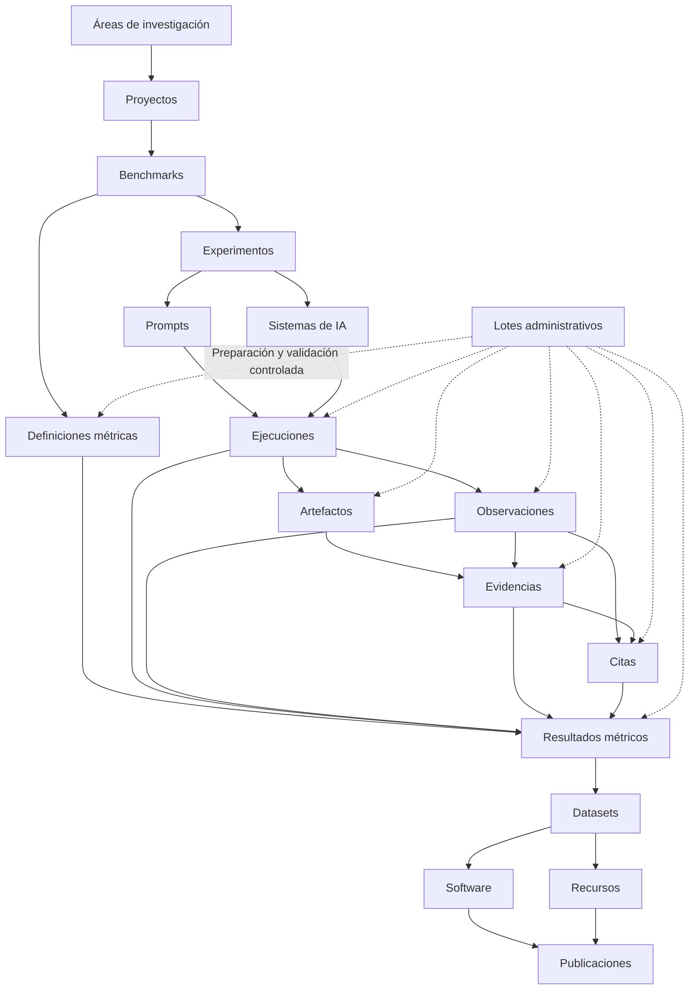

<p align="center">
  
</p>

<p align="center">
  <strong>Infraestructura científica para búsqueda generativa, inteligencia artificial, GEO, benchmarks, evidencias, métricas versionadas e investigación reproducible.</strong>
</p>

<p align="center">
  <a href="./README.md">English</a> · <strong>Español</strong> · <a href="./docs/MANUAL_USUARIO_ES.md">Manual de usuario</a>
</p>

<p align="center">
  <a href="https://gslhub.com">Web</a> ·
  <a href="https://gslhub.com/research">Investigación</a> ·
  <a href="https://gslhub.com/benchmarks">Benchmarks</a> ·
  <a href="https://gslhub.com/dashboard">Dashboard científico</a> ·
  <a href="https://gslhub.com/publications">Publicaciones</a> ·
  <a href="https://github.com/gslhub">Organización GitHub</a>
</p>

<p align="center">
  
  
  
  
  
  
</p>

---

# GSLHub

**GSLHub — Generative Search Lab Hub** es una plataforma científica independiente para estudiar cómo los sistemas de inteligencia artificial generativa descubren, recuperan, interpretan, citan, resumen y recomiendan información digital.

La plataforma conecta proyectos, benchmarks, experimentos, prompts versionados, perfiles de sistemas de IA, ejecuciones controladas, observaciones, artefactos, evidencias, citas, definiciones métricas, resultados calculados, datasets, software, recursos metodológicos y publicaciones dentro de una infraestructura trazable.

GSLHub se desarrolla desde Barcelona con alcance internacional y prepara actualmente su primer piloto doctoral sobre visibilidad y selección de fuentes en sistemas de búsqueda generativa.

## Estado del proyecto — 4 de agosto de 2026

### Stack validado en producción

```text
Plataforma GSLHub  0.4.1
Payload CMS        3.75.0
@payloadcms/next   3.75.0
Next.js            16.2.10
React / React DOM  19.2.7
Driver MongoDB     6.21.0
Artefactos         Subidas locales de Payload
```

El login nativo de Payload, el dashboard autenticado, los listados, formularios y registros existentes están operativos en producción. Los paquetes de Payload permanecen fijados en `3.75.0`; la actualización a `3.86.0` dejó el administrador dentro de una frontera RSC vacía y fue revertida.

### Matriz de estado

| Área | Estado | Situación actual |
| --- | --- | --- |
| Hosting y despliegue | ✅ Operativo | El despliegue automático desde `main` hacia Hostinger funciona. |
| Administrador Payload | ✅ Restaurado | Login, dashboard, formularios y registros funcionan con Payload 3.75.0. |
| Modelo científico | ✅ Preparado para piloto | Veinte colecciones conectadas cubren el ciclo de investigación y publicación. |
| Acceso e integridad | ✅ Implementado | Roles, identificadores, relaciones, snapshots y estados congelados están activos. |
| Web pública | ✅ Operativa | Investigación, benchmarks, publicaciones, software, datasets, recursos y personas están conectados. |
| Pipeline sintético | ✅ Flujo principal probado | El pipeline conectado de 27 registros puede generarse y limpiarse de forma segura. |
| Metodología métrica | ✅ Revisión inicial completa | AIR, CR, MCP y RCR tienen revisión, codebook y ficha Payload bilingües. |
| Sincronización métrica | 🚧 Pendiente de despliegue | El registro central y el servicio idempotente permanente están en `main`. |
| Calculadores deterministas | 🚧 Pendientes de ejecución | Existen escenarios AIR, CR, MCP y RCR; deben ejecutarse tras desplegar 0.4.1. |
| Contexto real del piloto | 🚧 Preparado | Proyecto, benchmark, experimento, prompt y sistema existen; falta el congelado final. |
| Primer piloto controlado | ⏳ No iniciado | Aún deben crearse y ejecutarse cinco sesiones reales. |
| Persistencia de artefactos | 🚧 Verificación pendiente | Se eligió almacenamiento local; faltan pruebas de reinicio, despliegue, backup y restauración. |
| Dataset y publicación | ⏳ Planificado | Todavía no debe afirmarse una publicación científica formal. |

## Capacidades completadas

- aplicación Next.js en producción con persistencia MongoDB Atlas;
- autenticación nativa de Payload y acceso por roles;
- campos científicos bilingües con fallback inglés;
- veinte colecciones Payload con relaciones gobernadas;
- ejecuciones controladas con reglas de unicidad;
- herencia de contexto científico entre observaciones, artefactos, evidencias, citas y métricas;
- identificadores científicos reservados e inmutables;
- integridad SHA-256 para artefactos y entradas/salidas de métricas;
- cadena de custodia append-only para evidencias;
- snapshots científicos inmutables después de validación o publicación;
- separación entre Metric Definitions versionadas y Metric Results calculados;
- herencia automática del snapshot metodológico en cada resultado;
- generación administrativa, rollback y limpieza controlados;
- catálogos públicos y dashboard científico inicial;
- metodología AIR, CR, MCP y RCR v0.1.0 revisada en español e inglés;
- registro central único de las cuatro métricas del piloto;
- flujo permanente crear-o-sincronizar que nunca sobrescribe definiciones congeladas;
- escenarios de validación determinista para las cuatro métricas;
- almacenamiento local de artefactos para la fase doctoral actual.

## Secuencia operativa inmediata

1. Desplegar y compilar la versión `0.4.1`.
2. Ejecutar **Permanent pilot metric definitions** desde Administrative Batches.
3. Confirmar cuatro registros sincronizados, ambos idiomas y `Missing Data Policy = Report separately`.
4. Ejecutar por separado AIR, CR, MCP y RCR deterministas.
5. Confirmar resultados esperados, snapshots heredados y checksums estables.
6. Limpiar los lotes descartables `TEST-`.
7. Completar la revisión científica independiente y solo entonces informar `Validated At` y `Validated By`.

Instrucciones detalladas:

- [Runbook de sincronización y validación en español](./docs/metrics/PILOT_METRIC_SYNC_AND_VALIDATION_ES.md)
- [Runbook en inglés](./docs/metrics/PILOT_METRIC_SYNC_AND_VALIDATION.md)

## Métricas del piloto

| Código | Métrica | Finalidad | Precisión | Estado |
| --- | --- | --- | ---: | --- |
| AIR | Answer Inclusion Rate | Proporción de respuestas elegibles que incluyen visiblemente el objetivo | 4 | Under review |
| CR | Citation Rate | Proporción de ejecuciones elegibles que citan visiblemente el objetivo | 4 | Under review |
| MCP | Mean Citation Position | Media de la primera posición de cita dentro de una superficie congelada | 2 | Under review |
| RCR | Response Consistency Rate | Proporción de comparaciones con variación `none` o `low` | 4 | Under review |

Las cuatro definiciones utilizan:

```text
Missing Data Policy: Report separately
Open Methodology: true
Lifecycle Status: Under review
Validated At: vacío
Validated By: vacío
```

La validación formal congela los campos científicos protegidos. Los cambios metodológicos posteriores requieren una nueva versión semántica y no la sobrescritura de v0.1.0.

## Resultados deterministas esperados

```text
AIR  3 / 4 = 0,7500, con una exclusión informada
CR   2 / 4 = 0,5000
MCP  posiciones 1, 2, 3 → 6 / 3 = 2,00
RCR  none, low, low, high → 3 / 4 = 0,7500
```

Son comprobaciones sintéticas de los calculadores, no resultados doctorales.

## Lo que falta antes del piloto real

1. Desplegar y ejecutar la sincronización métrica.
2. Ejecutar y revisar independientemente los cuatro escenarios deterministas.
3. Aprobar el diccionario del objetivo utilizado por AIR y CR.
4. Aprobar la superficie primaria y el orden utilizado por MCP.
5. Aprobar la regla de base y el codebook de variación de RCR.
6. Validar las cuatro Metric Definitions con fecha e investigador responsable.
7. Cerrar las reglas de inclusión, exclusión y control de calidad.
8. Verificar la persistencia de `research-artifacts/` tras reinicio y redespliegue.
9. Probar backup y restauración de MongoDB y artefactos locales.
10. Revisar y congelar benchmark, experimento, prompt y perfil del sistema.
11. Preparar el checklist de ejecución, captura y evidencia.
12. Crear exactamente cinco Prompt Executions reales con códigos `GSL-EXEC-`.
13. Ejecutar cinco sesiones aisladas bajo el protocolo congelado.
14. Preservar la respuesta y la interfaz de cada ejecución.
15. Codificar y revisar observaciones y citas.
16. Calcular y verificar independientemente las cuatro métricas reales.
17. Preparar el primer dataset, protocolo e informe técnico.

El almacenamiento compatible con S3 **no es un bloqueo** para esta fase. Se reconsiderará cuando aumenten el volumen, la colaboración o los requisitos de disponibilidad y preservación.

## Arquitectura científica



Se preserva la trazabilidad desde la pregunta de investigación y el protocolo congelado hasta el sistema, prompt, ejecución, evidencia, codificación, cita, definición, cálculo y publicación.

## Colecciones Payload

La configuración de producción registra **20 colecciones**.

| Grupo | Colecciones |
| --- | --- |
| Administración | Users, Test Data Batches |
| Investigación | Research Areas, Researchers, Projects, Benchmarks, Publications |
| Operaciones | Experiments, Prompts, AI Systems, Prompt Executions, Observations, Research Artifacts, Evidence, Citations, Metric Definitions, Metrics |
| Resultados | Software, Datasets, Resources |

## Identificadores científicos

```text
GSL-EXEC-GEO-0001
GSL-OBS-GEO-0001
GSL-ART-GEO-0001
GSL-EVD-GEO-0001
GSL-CIT-GEO-0001
GSL-MDEF-AIR-0001
GSL-MET-GEO-0001
```

Los códigos se normalizan, se reservan al crear el registro y permanecen inmutables. El namespace `TEST-` se reserva para datos sintéticos controlados por el administrador.

## Artefactos y almacenamiento local

```ts
upload: {
  staticDir: 'research-artifacts'
}
```

Las copias operativas deben incluir:

```text
Base de datos MongoDB
Directorio research-artifacts/
Variables de entorno de producción
```

Antes de recoger evidencia irremplazable, debe completarse una prueba de persistencia tras reinicio/redespliegue y una restauración documentada.

## Rutas públicas

| Ruta | Fuente | Estado |
| --- | --- | --- |
| `/research` | Research Areas y Projects | ✅ Activa |
| `/benchmarks` | Benchmarks y Metric Definitions | ✅ Activa |
| `/dashboard` | Registros publicados y métricas validadas | ✅ Versión inicial |
| `/publications` | Publications | ✅ Activa |
| `/software` | Software | ✅ Activa |
| `/datasets` | Datasets | ✅ Activa |
| `/resources` | Resources | ✅ Activa |
| `/people` | Researchers | ✅ Activa |

Los borradores, artefactos privados, datos `TEST-`, definiciones bajo revisión y cálculos no validados quedan fuera de las afirmaciones científicas públicas.

## Stack tecnológico

- Next.js 16.2.10;
- React y React DOM 19.2.7;
- TypeScript 5.9;
- Tailwind CSS 4.3.3;
- Payload CMS 3.75.0;
- MongoDB Atlas;
- Node.js crypto para SHA-256;
- GitHub y Hostinger Cloud;
- almacenamiento local de artefactos de Payload.

## Política de compatibilidad

La combinación validada no debe actualizarse automáticamente:

```text
payload
@payloadcms/next
@payloadcms/ui
@payloadcms/db-mongodb
@payloadcms/richtext-lexical
next
react
react-dom
```

No ejecutar `npm audit fix --force` en producción. Las actualizaciones deben probarse en una rama separada y verificar login, dashboard, listados y formularios antes de su promoción.

El repositorio fija las dependencias directas, pero todavía **no contiene `package-lock.json`**. Crear un lockfile validado sigue siendo una tarea de reproducibilidad.

Consultar la [incidencia de compatibilidad Payload/Next](./docs/COMPATIBILIDAD_PAYLOAD_NEXT_ES.md).

## Desarrollo local

```bash
git clone https://github.com/gslhub/website.git
cd website
npm install
cp .env.example .env.local
npm run dev
```

Variables necesarias:

```env
NEXT_PUBLIC_SITE_URL=http://localhost:3000
PAYLOAD_SECRET=replace-with-a-long-random-secret
DATABASE_URL=mongodb+srv://<username>:<url-encoded-password>@<cluster-hostname>/?retryWrites=true&w=majority&appName=GSLHub
```

Comprobaciones:

```bash
npm run lint
npm run typecheck
npm run build
```

## Estructura del repositorio

```text
.
├── app/                         Web pública, dashboard, Payload y APIs
├── cms/
│   ├── access/                  Reglas de acceso científico
│   ├── collections/             Colecciones científicas y administrativas
│   ├── endpoints/               Acciones administrativas
│   ├── hooks/                   Integridad y ciclos de vida
│   ├── metrics/                 Calculadores y registro métrico revisado
│   ├── pilot/                   Preparación permanente del piloto
│   ├── storage/                 Metadatos de almacenamiento local
│   └── test-data/               Validación sintética y limpieza
├── components/                  Componentes compartidos, marca y admin
├── docs/                        Manuales, revisiones, codebooks y runbooks
├── public/brand/                Recursos de marca
├── research-artifacts/          Subidas privadas locales en runtime
├── CHANGELOG.md                 Historial en inglés
├── CHANGELOG.es.md              Historial en español
├── payload.config.ts            Configuración Payload
├── README.md                    Documentación en inglés
└── README.es.md                 Documentación en español
```

## Documentación

- [Manual de usuario y gobernanza](./docs/MANUAL_USUARIO_ES.md)
- [Runbook de sincronización métrica](./docs/metrics/PILOT_METRIC_SYNC_AND_VALIDATION_ES.md)
- [Runbook en inglés](./docs/metrics/PILOT_METRIC_SYNC_AND_VALIDATION.md)
- [Revisiones métricas](./docs/metrics/)
- [Codebooks operativos](./docs/codebooks/)
- [Historial en español](./CHANGELOG.es.md)
- [Historial en inglés](./CHANGELOG.md)

## Hoja de ruta

| Fase | Alcance | Estado |
| --- | --- | --- |
| 1–6 | Infraestructura, CMS, web pública, integridad y ciclo sintético | ✅ Completo |
| 7 | Metodología y codebooks métricos | ✅ Revisión inicial completa |
| 8 | Sincronización permanente y ejecución determinista | 🚧 Hito actual |
| 9 | Persistencia local, backup y restauración | 🚧 Verificación pendiente |
| 10 | Congelado del protocolo y cinco ejecuciones reales | ⏳ Siguiente fase operativa |
| 11 | Cálculo real y revisión independiente | ⏳ Planificado |
| 12 | Dataset, software e informe técnico | ⏳ Planificado |
| 13 | ORCID, Zenodo, DOI y citación formal | ⏳ Planificado |
| 14 | Comparación de sistemas, idiomas y rondas | ⏳ Escalado futuro |

## Citación

Se añadirá un `CITATION.cff` y un flujo formal de archivo antes de la primera publicación académica.

Mientras tanto:

```text
GSLHub — Generative Search Lab Hub. Plataforma científica independiente para búsqueda generativa, GEO, inteligencia artificial e investigación reproducible. https://gslhub.com
```

No debe asignarse DOI, fecha de publicación ni estado de release científico a borradores o datos sintéticos.

## Contacto

- Web: [gslhub.com](https://gslhub.com)
- Dashboard: [gslhub.com/dashboard](https://gslhub.com/dashboard)
- GitHub: [github.com/gslhub](https://github.com/gslhub)
- Correo: [research@gslhub.com](mailto:research@gslhub.com)
- Fundador e investigador: [Eduardo José Yauri Luna](https://www.linkedin.com/in/eduardoyauriluna/)

---

<p align="center">
  <strong>Investigación · Benchmarks · Evidencia · Definiciones métricas · Resultados · Software · Datasets · Ciencia abierta</strong>
</p>

<p align="center">
  Última actualización: 4 de agosto de 2026
</p>
