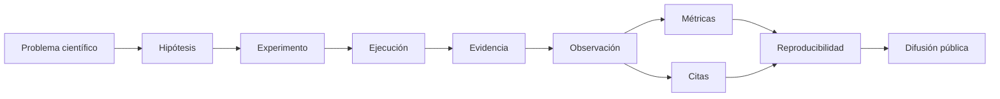

<p align="center">
  
</p>

<p align="center">
  <strong>Infraestructura científica para búsqueda generativa, GEO, evidencia gobernada, métricas e investigación reproducible con IA.</strong>
</p>

<p align="center">
  <a href="./README.md">English</a> · <strong>Español</strong> · <a href="./docs/ESTADO_PROYECTO_ES.md">Estado del proyecto</a> · <a href="./docs/PROJECT-MATRIX.md">Matriz del proyecto</a> · <a href="./docs/DOCTORAL-DEMO.md">Demo doctoral</a>
</p>

<p align="center">
  <a href="https://gslhub.com">Web</a> ·
  <a href="https://gslhub.com/research">Investigación</a> ·
  <a href="https://gslhub.com/es/research-infrastructure">Infraestructura de investigación</a> ·
  <a href="https://gslhub.com/dashboard">Dashboard científico</a> ·
  <a href="https://github.com/gslhub">GitHub</a>
</p>

<p align="center">
  
  
  
  
  
  
</p>

---

# GSLHub

**GSLHub — Generative Search Lab Hub** es una plataforma independiente de investigación aplicada para estudiar cómo los sistemas de IA generativa descubren, seleccionan, citan, resumen y recomiendan información digital.

La plataforma se desarrolla como infraestructura de investigación para la línea doctoral:

> **Del SEO al GEO (Generative Engine Optimization): desarrollo y validación de un modelo científico para optimizar la visibilidad de organizaciones en motores de búsqueda generativos basados en inteligencia artificial.**

GSLHub conecta experimentos controlados, ejecuciones de prompts, observaciones, artefactos de investigación, evidencias, citas y métricas gobernadas dentro de un único flujo auditable.

## Versión actual — 0.6.2

La versión `0.6.2` constituye la **baseline de producto Doctoral-ready**.

Consolida:

- frontend público responsive para móvil, tablet, portátil y escritorio;
- administrador Payload responsive y tablas científicas adaptadas;
- dashboard propio de Research Operations tras el login;
- dashboard interno bilingüe EN/ES;
- soporte claro/oscuro usando los tokens nativos de tema de Payload;
- demostrador público bilingüe de Research Infrastructure;
- acceso directo al Research CMS privado desde el frontend;
- separación pública/privada entre difusión y operaciones gobernadas;
- protección frente a version skew de assets de Next.js;
- procedimiento validado de purga de caché de Hostinger tras redeploys de frontend.

Los hotfix visuales `0.6.x` no han modificado schemas científicos, calculadores métricos ni registros gobernados de investigación.

## Modelo de investigación GSLHub

GSLHub se articula alrededor de una cadena científica sencilla:



La matriz completa queda preservada en **[docs/PROJECT-MATRIX.md](./docs/PROJECT-MATRIX.md)** para explicar el sistema de forma coherente en contextos técnicos, científicos y doctorales.

### Matriz del proyecto — vista resumida

| Capa | Propósito científico | Salida operativa |
| --- | --- | --- |
| Problema científico | Definir qué se quiere explicar | Alcance de Project / Benchmark |
| Hipótesis | Formular una expectativa contrastable | Hipótesis del Experiment |
| Experimento | Definir el método controlado | Protocolo, prompts, AI Systems y repeticiones |
| Ejecución | Realizar una prueba gobernada | Snapshot de Prompt Execution |
| Evidencia | Preservar el resultado bruto | Research Artifact + Evidence |
| Observación | Codificar lo realmente observado | Registro analítico estructurado |
| Citas | Registrar visibilidad de fuentes | Dominio/fuente y posición de cita |
| Métricas | Cuantificar resultados | AIR, CR, MCP, RCR |
| Reproducibilidad | Probar integridad y repetibilidad | SHA-256, almacenamiento, recovery y controles de ciclo de vida |
| Difusión | Publicar solo resultados seguros | Dashboard público / páginas de investigación |

## Explicación académica de cinco minutos

El demostrador público de Research Infrastructure y el runbook doctoral explican GSLHub mediante la misma secuencia:

```text
Problema
→ Hipótesis
→ Experimento
→ Ejecución
→ Evidencia
→ Métricas
→ Reproducibilidad
```

Demostrador público:

- English: `https://gslhub.com/research-infrastructure`
- Español: `https://gslhub.com/es/research-infrastructure`

Guion reutilizable de presentación:

- **[docs/DOCTORAL-DEMO.md](./docs/DOCTORAL-DEMO.md)**

La capa pública permite explicar el proyecto sin exponer el esquema completo del CMS ni artefactos restringidos.

## Regresión de desarrollo — completada

La regresión interna final generó y verificó un pipeline completo descartable:

```text
Full research pipeline TEST   PASS
├── 5 Prompt Executions
├── 5 Observations
├── 5 Research Artifacts
├── 5 Evidence records
├── 3 Citations
└── 4 synthetic Metric records

Calculadores deterministas
├── AIR = 3/4 = 0.75   PASS
├── CR  = 2/4 = 0.50   PASS
├── MCP = 6/3 = 2.00   PASS
└── RCR = 3/4 = 0.75   PASS

Limpieza TEST               PASS
```

Todos los batches TEST y registros sintéticos generados fueron eliminados correctamente tras la validación.

## Piloto gobernado de desarrollo

La primera ejecución completa se conserva como registro de validación no doctoral:

```text
GSL-EXEC-GEO-0001                  Completed / Published
├── GSL-ART-GEO-0001               Respuesta raw / SHA-256 verificado
├── GSL-ART-GEO-0002               Captura / SHA-256 verificado
├── GSL-EVD-GEO-0001               Evidencia validada
├── GSL-EVD-GEO-0002               Evidencia validada
└── GSL-OBS-GEO-0001               Observación Validated / Published
```

Las ejecuciones reservadas de desarrollo siguen intactas:

```text
GSL-EXEC-GEO-0002   Planned
GSL-EXEC-GEO-0003   Planned
GSL-EXEC-GEO-0004   Planned
GSL-EXEC-GEO-0005   Planned
```

Son **registros de validación de desarrollo**, no hallazgos doctorales.

## Métricas científicas principales

| Código | Métrica | Versión | Unidad |
| --- | --- | --- | --- |
| AIR | Answer Inclusion Rate | 0.1.0 | proporción |
| CR | Citation Rate | 0.1.0 | proporción |
| MCP | Mean Citation Position | 0.1.0 | posición |
| RCR | Response Consistency Rate | 0.1.0 | proporción |

Los calculadores aplican reglas de elegibilidad y procedencia. No se generan métricas target-specific cuando falta el target o la evidencia requerida.

## Reproducibilidad y gobernanza

GSLHub ya soporta:

- prompts, experimentos y Metric Definitions versionados;
- ejecuciones repetidas y controladas;
- snapshots científicos inmutables después de transiciones gobernadas;
- procedencia directa Evidence ↔ Research Artifact;
- almacenamiento persistente fuera de los releases;
- verificación de integridad SHA-256;
- control de calidad y revisión independiente;
- separación Development / Doctoral Research;
- Final Development Reset controlado;
- auditorías permanentes de Storage Verification;
- comprobaciones documentadas de restart, redeploy y recovery.

## Research CMS

Las personas investigadoras autorizadas utilizan el CMS privado para las operaciones gobernadas. El dashboard de Research Operations funciona como entrada clara para presentación, manteniendo toda la profundidad operativa en las colecciones internas.

Áreas principales:

- Research Environment;
- Experiments y Prompts;
- AI Systems;
- Prompt Executions;
- Observations;
- Research Artifacts;
- Evidence;
- Citations;
- Metric Definitions;
- Metrics;
- Storage Verifications.

El dashboard sigue el locale seleccionado y el tema claro/oscuro activo de Payload.

## Artefactos persistentes

Los artefactos de investigación de producción se almacenan fuera del árbol de despliegue Node.js:

```text
/home/<usuario-hostinger>/domains/gslhub.com/gslhub-data/research-artifacts
```

Secuencia verificada:

```text
Upload → HTTP 200
Restart → mismo SHA-256 / HTTP 200
Redeploy → mismo SHA-256 / HTTP 200
Recovery drill → fichero restaurado / mismo SHA-256
```

## Nota operativa de despliegue

GSLHub usa versionado de despliegue de Next.js para reducir desajustes entre HTML y assets. Hostinger puede mantener además caché documental fuera del proceso Node.js.

Regla operativa tras cambios de frontend/CSS:

```text
Deploy main
→ build/restart correcto
→ purgar caché de servidor de Hostinger
→ purgar caché CDN de Hostinger si está activa
→ smoke test escritorio
→ smoke test móvil
```

Este procedimiento evita que HTML antiguo en caché siga apuntando a assets de un despliegue anterior.

## Frontera actual de investigación

```text
Research Environment       Development Mode
Final Development Reset    No ejecutado
Doctoral Research Mode     No activado
Datos doctorales reales    0
```

GSLHub permanece en Development Mode hasta congelar el protocolo doctoral y obtener una baseline limpia mediante Final Development Reset.

## Siguiente fase

El foco inmediato es académico, no añadir funcionalidades arbitrarias:

1. preparar el preproyecto y dossier doctoral;
2. preparar el CV investigador;
3. utilizar GSLHub como demostrador operativo en reuniones con posible dirección de tesis;
4. congelar preguntas, hipótesis, diccionario de targets, prompts, perfiles de AI Systems y codebooks;
5. ejecutar preview y Final Development Reset;
6. verificar baseline limpia;
7. activar Doctoral Research Mode;
8. iniciar la recogida de datos doctorales reales.

## Stack validado

```text
Plataforma GSLHub  0.6.2
Payload CMS        3.75.0
Next.js            16.2.10
React              19.2.7
Driver MongoDB     6.21.0
Base de datos      MongoDB Atlas
Hosting            Hostinger
Artefactos         Almacenamiento local persistente fuera de releases
```

Las versiones permanecen fijadas hasta que cualquier actualización supere en una rama aislada el administrador y el flujo científico completos.

## Desarrollo local

```bash
git clone https://github.com/gslhub/website.git
cd website
npm install
cp .env.example .env.local
npm run dev
```

Quality gate:

```bash
npm run lint
npm run typecheck
npm run build
```

## Documentación

### Proyecto y presentación

- [Matriz del proyecto y arquitectura de investigación](./docs/PROJECT-MATRIX.md)
- [Demostración doctoral / para dirección de tesis en cinco minutos](./docs/DOCTORAL-DEMO.md)
- [Estado operativo actual](./docs/ESTADO_PROYECTO_ES.md)

### Operaciones científicas

- [Manual de usuario](./docs/MANUAL_USUARIO_ES.md)
- [Protocolo del primer piloto](./docs/PROTOCOLO_PRIMER_PILOTO_ES.md)
- [Codebook de observaciones y citas](./docs/CODEBOOK_OBSERVACIONES_CITAS_ES.md)
- [Procedimiento de almacenamiento, backup y recuperación](./docs/PROCEDIMIENTO_ALMACENAMIENTO_BACKUP_RECUPERACION_ES.md)
- [Historial en español](./CHANGELOG.es.md)
- [Changelog en inglés](./CHANGELOG.md)

## Licencia y copyright

El software de GSLHub contenido en este repositorio se distribuye bajo la **GNU Affero General Public License v3.0 (AGPL-3.0-only)**. Consulta [`LICENSE`](./LICENSE) para el texto completo de la licencia y [`NOTICE.md`](./NOTICE.md) para la información de copyright, componentes de terceros y marca.

La licencia de software no concede derechos de marca sobre el nombre GSLHub ni sobre sus identificadores de marca asociados. Los resultados de investigación o materiales de terceros pueden tener condiciones independientes cuando se indiquen expresamente.

Copyright © 2026 Eduardo Yauri.

## Contacto

- Web: [gslhub.com](https://gslhub.com)
- GitHub: [github.com/gslhub](https://github.com/gslhub)
- Correo: [research@gslhub.com](mailto:research@gslhub.com)

---

<p align="center"><strong>Investigación · GEO · Evidencia · Métricas · Reproducibilidad · Ciencia abierta</strong></p>
<p align="center">Última actualización: 18 de agosto de 2026</p>
