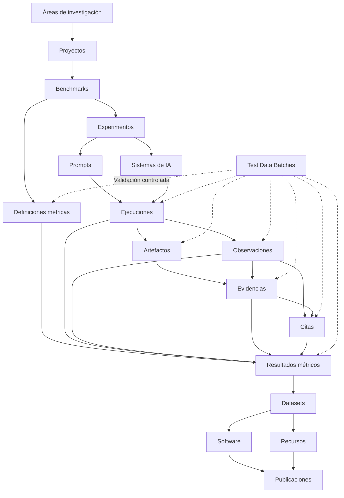

<p align="center">
  
</p>

<p align="center">
  <strong>Infraestructura científica para búsqueda generativa, inteligencia artificial, GEO, benchmarks, evidencias, métricas versionadas e investigación reproducible.</strong>
</p>

<p align="center">
  <a href="./README.md">English</a>
  ·
  <strong>Español</strong>
  ·
  <a href="./docs/MANUAL_USUARIO_ES.md">Manual de usuario</a>
</p>

<p align="center">
  <a href="https://gslhub.com">Web</a>
  ·
  <a href="https://gslhub.com/research">Investigación</a>
  ·
  <a href="https://gslhub.com/benchmarks">Benchmarks</a>
  ·
  <a href="https://gslhub.com/dashboard">Dashboard científico</a>
  ·
  <a href="https://gslhub.com/publications">Publicaciones</a>
  ·
  <a href="https://github.com/gslhub">Organización GitHub</a>
</p>

<p align="center">
  
  
  
  
  
  
</p>

---

# GSLHub

**GSLHub — Generative Search Lab Hub** es una plataforma científica independiente para estudiar cómo los sistemas de inteligencia artificial generativa descubren, recuperan, interpretan, citan, resumen y recomiendan información digital.

La plataforma conecta proyectos, benchmarks, experimentos, prompts versionados, perfiles de sistemas de IA, ejecuciones controladas, observaciones, artefactos, evidencias, citas, definiciones métricas, resultados calculados, datasets, software, recursos metodológicos y publicaciones dentro de una infraestructura trazable.

GSLHub se desarrolla desde Barcelona con alcance internacional y actualmente sirve para preparar un piloto de investigación doctoral sobre visibilidad y selección de fuentes en sistemas de búsqueda generativa.

## Estado del proyecto — 31 de julio de 2026

### Conclusión actual

El administrador de producción vuelve a estar operativo después de restaurar la última combinación validada:

```text
Payload CMS       3.75.0
@payloadcms/next  3.75.0
Next.js           16.2.10
React             19.2.7
React DOM         19.2.7
Driver MongoDB    6.21.0
Artefactos        Uploads locales de Payload
```

Se han verificado en producción el login nativo de Payload, el dashboard autenticado, las listas de colecciones, los formularios de creación y los registros existentes.

Una actualización posterior a Payload 3.86.0 provocó que el administrador renderizara una frontera vacía de React Server Components aunque la autenticación, las APIs y los datos del servidor continuaban funcionando. La regresión a Payload 3.75.0 recuperó toda la interfaz. Estas versiones quedan fijadas intencionadamente hasta que una futura actualización se pruebe de forma aislada.

### Matriz de estado

| Área | Estado | Situación actual |
| --- | --- | --- |
| Hosting y despliegue | ✅ Operativo | El despliegue automático desde `main` a Hostinger funciona. |
| Administrador nativo de Payload | ✅ Restaurado y verificado | Login, dashboard, formularios, listados y registros funcionan con Payload 3.75.0. |
| Modelo científico | ✅ Completo para el piloto | Veinte colecciones conectadas cubren el ciclo de investigación y publicación. |
| Acceso, ciclos e integridad | ✅ Implementados | Roles, reserva de códigos, relaciones y congelación científica están activos. |
| Web pública y catálogos | ✅ Operativos | Investigación, benchmarks, publicaciones, software, datasets, recursos y personas están conectados. |
| Pruebas sintéticas end-to-end | ✅ Flujo principal validado | El pipeline sintético de 27 registros se generó, revisó, eliminó de forma segura y repitió. |
| Gobernanza métrica | 🚧 Muy avanzada | AIR, CR, MCP y RCR v0.1.0 existen como definiciones bilingües en revisión. |
| Registros reales del piloto | 🚧 Preparados | Proyecto, benchmark, experimento, prompt y sistema existen; falta su congelación científica final. |
| Primer piloto controlado | ⏳ No iniciado | Falta crear y ejecutar las cinco ejecuciones reales. |
| Almacenamiento de artefactos | ✅ Estrategia local elegida | Los uploads locales son suficientes para la fase doctoral actual. Falta comprobar persistencia y recuperación. |
| Cálculo determinista | 🚧 Parcialmente implementado | Existen escenarios administrativos; faltan calculadores finales y pruebas de producción. |
| Dataset y publicaciones | ⏳ Planificados | Existen drafts, pero todavía no debe declararse una liberación científica formal. |
| Flujo de ciencia abierta | ⏳ Planificado | ORCID, Zenodo, DOI, `CITATION.cff` y metadatos finales quedan para fases posteriores. |

## Qué está terminado

- aplicación Next.js en producción y persistencia en MongoDB Atlas;
- autenticación nativa de Payload y acceso por roles;
- campos científicos bilingües con fallback en inglés;
- veinte colecciones y sus relaciones;
- gobernanza de proyectos, benchmarks, experimentos, prompts y sistemas de IA;
- ejecuciones controladas con reglas de unicidad;
- herencia de contexto entre observaciones, artefactos, evidencias, citas y métricas;
- espacios de nombres y códigos científicos reservados;
- SHA-256 automático para artefactos subidos;
- cadena de custodia append-only;
- snapshots científicos inmutables después de validar o liberar;
- Metric Definitions versionadas separadas de los Metric Results calculados;
- snapshots metodológicos automáticos en Metric Results;
- exposición canónica de `metricDefinitions` en la API del benchmark;
- Test Data Batches solo para administradores, con rollback y limpieza;
- catálogos públicos y dashboard inicial;
- manual en español de usuario y gobernanza;
- configuración de compatibilidad validada en producción.

## Qué falta antes del primer piloto real

1. Revisar AIR, CR, MCP y RCR v0.1.0 campo por campo.
2. Confirmar fórmulas, rangos, inputs, agregación, datos ausentes, supuestos y limitaciones.
3. Completar `Validated At` y `Validated By`, y pasar las definiciones aceptadas a `Validated`.
4. Finalizar el codebook de observaciones y citas.
5. Cerrar las reglas de inclusión, exclusión y control de calidad.
6. Revisar y congelar proyecto, benchmark, experimento, prompt y perfil de sistema reales.
7. Comprobar que `research-artifacts/` sobrevive a reinicios y nuevos despliegues de producción.
8. Definir y probar un procedimiento de backup y restauración de MongoDB y `research-artifacts/`.
9. Preparar el checklist de ejecución, captura y evidencia.
10. Crear exactamente cinco Prompt Executions reales planificadas con códigos `GSL-EXEC-`.
11. Ejecutar cinco sesiones aisladas bajo el protocolo congelado.
12. Conservar respuesta y evidencia de interfaz de cada ejecución.
13. Codificar y revisar observaciones, citas y exclusiones.
14. Calcular AIR, CR, MCP y RCR mediante procedimientos deterministas.
15. Revisar la ronda completa antes de preparar el primer dataset y el informe técnico.

El almacenamiento compatible con S3 **no es un bloqueo para el piloto doctoral actual**. Se reconsiderará cuando aumenten el volumen de archivos, la colaboración, los requisitos de disponibilidad o las necesidades formales de preservación.

## Próximo hito inmediato

```text
Project:             GSL-GEO-BENCH-01
Benchmark:           GSL-BENCH-GEO-01 v0.1.0
Experiment:          GSL-EXP-GEO-001
Prompt:              GSL-PROMPT-GEO-001 v0.1.0
AI System:           GSL-AISYS-001
Metric Definitions:  AIR / CR / MCP / RCR v0.1.0
Repeticiones previstas: 5
```

Orden recomendado:

1. validar las cuatro Metric Definitions;
2. terminar el codebook de observaciones y citas;
3. verificar persistencia, backup y restauración de los artefactos locales;
4. congelar benchmark, experimento, prompt y perfil del sistema;
5. crear las cinco ejecuciones reales planificadas;
6. ejecutar la ronda controlada;
7. codificar observaciones, evidencias y citas;
8. calcular y verificar de forma independiente las cuatro métricas;
9. preparar el primer dataset, protocolo e informe técnico.

## Arquitectura científica



La arquitectura conserva la trazabilidad desde la pregunta y el protocolo aprobado hasta el sistema evaluado, el prompt exacto, la ejecución, las evidencias, las observaciones codificadas, las citas, la definición métrica, el resultado calculado y el output liberado.

## Colecciones Payload

La configuración de producción registra **20 colecciones**.

| Grupo | Colecciones |
| --- | --- |
| Administración | Users, Test Data Batches |
| Investigación | Research Areas, Researchers, Projects, Benchmarks, Publications |
| Operaciones de investigación | Experiments, Prompts, AI Systems, Prompt Executions, Observations, Research Artifacts, Evidence, Citations, Metric Definitions, Metrics |
| Outputs | Software, Datasets, Resources |

Todas las colecciones continúan en Payload 3.75.0. Los documentos de MongoDB no se migraron ni se reescribieron durante la regresión de compatibilidad.

## Regla central de gobernanza

GSLHub distingue entre un documento de trabajo editable y un registro científico congelado.

Antes de validar o liberar, un usuario autorizado puede corregir el contenido. Después, la historia debe conservarse. Una corrección posterior debe utilizar notas, exclusión, deprecación, una nueva versión, una nueva ejecución o un registro formal de corrección, en lugar de sobrescribir silenciosamente el historial científico.

Las reglas detalladas están en [`docs/MANUAL_USUARIO_ES.md`](./docs/MANUAL_USUARIO_ES.md).

## Identificadores científicos

Ejemplos:

```text
GSL-EXEC-GEO-0001
GSL-OBS-GEO-0001
GSL-ART-GEO-0001
GSL-EVD-GEO-0001
GSL-CIT-GEO-0001
GSL-MDEF-AIR-0001
GSL-MET-GEO-0001
```

Los códigos se normalizan, son específicos de cada colección, quedan reservados al crear el registro y después son inmutables. El prefijo `TEST-` está reservado para datos sintéticos controlados por administradores.

## Unicidad de ejecuciones

No pueden existir dos ejecuciones reales con la misma combinación:

```text
Experiment
Prompt
Prompt Version
AI System
Repetition Number
```

Esto evita duplicar condiciones científicas y reutilizar una repetición por accidente.

## Gobernanza métrica

Una Metric Definition guarda la metodología versionada: fórmula, rango, inputs, agregación, política de datos ausentes, precisión, supuestos, limitaciones y procedimiento de validación.

Un Metric Result guarda un valor calculado y hereda automáticamente un snapshot inmutable de la definición enlazada. Los resultados reales deben usar una definición `Validated` o `Active`.

Definiciones actuales del piloto:

| Métrica | Función | Versión | Estado actual |
| --- | --- | --- | --- |
| AIR | Tasa de inclusión o aparición en IA | 0.1.0 | Under review |
| CR | Tasa de citación | 0.1.0 | Under review |
| MCP | Posición media de citación | 0.1.0 | Under review |
| RCR | Tasa de citas relevantes | 0.1.0 | Under review |

## Test Data Batches

Los escenarios implementados incluyen:

- cinco Prompt Executions de prueba;
- pipeline científico completo de 27 registros conectados;
- definiciones métricas permanentes del piloto;
- reserva de ejecuciones reales permanentes;
- definiciones métricas desechables para revisión;
- vinculación entre definiciones y resultados calculados;
- sincronización del registro métrico del benchmark;
- validación determinista de AIR;
- validación determinista de CR;
- validación determinista de MCP;
- validación determinista de RCR.

Los registros sintéticos permanecen como draft o privados, utilizan códigos `TEST-` y nunca deben presentarse como resultados científicos.

## Artefactos y almacenamiento local

La colección `research-artifacts` utiliza el sistema local nativo de Payload:

```ts
upload: {
  staticDir: 'research-artifacts'
}
```

Los formatos admitidos incluyen capturas, PDF, HTML, JSON, JSON-LD, CSV, texto, logs y ZIP. El flujo puede normalizar tipos MIME, calcular SHA-256, heredar contexto y restringir el acceso.

En la fase actual, los backups operativos deben incluir:

```text
Base de datos MongoDB
Directorio research-artifacts/
Variables de entorno de producción
```

Antes de recopilar evidencia irremplazable, hay que comprobar la persistencia después de reiniciar y redesplegar, y completar al menos una restauración documentada.

## Web pública

| Ruta | Fuente | Estado |
| --- | --- | --- |
| `/research` | Áreas y proyectos | ✅ Live |
| `/benchmarks` | Benchmarks y Metric Definitions | ✅ Live |
| `/dashboard` | Registros publicados y métricas validadas | ✅ Versión inicial |
| `/publications` | Publicaciones | ✅ Live |
| `/software` | Software | ✅ Live |
| `/datasets` | Datasets | ✅ Live |
| `/resources` | Recursos | ✅ Live |
| `/people` | Investigadores | ✅ Live |

Los drafts, artefactos privados, datos `TEST-`, definiciones en revisión y cálculos no validados se excluyen de las afirmaciones científicas públicas.

## Roadmap

| Fase | Alcance | Estado |
| --- | --- | --- |
| 1 | Infraestructura y despliegue | ✅ Completa |
| 2 | CMS científico y acceso | ✅ Completa |
| 3 | Web pública y catálogos | ✅ Completa |
| 4 | Modelos de investigación y análisis | ✅ Completos |
| 5 | Integridad, ciclos y snapshots científicos | ✅ Completa |
| 6 | Datos sintéticos, rollback y limpieza | ✅ Validación principal completada |
| 7 | Gobernanza métrica | 🚧 Revisión científica pendiente |
| 8 | Persistencia y recuperación local | 🚧 Verificación pendiente |
| 9 | Protocolo y codebook del piloto | 🚧 En curso |
| 10 | Primeras cinco ejecuciones reales | ⏳ Próximo hito operativo |
| 11 | Cálculo determinista y revisión | ⏳ Planificado |
| 12 | Dataset, software e informe técnico | ⏳ Planificados |
| 13 | ORCID, Zenodo, DOI y citación formal | ⏳ Planificados |
| 14 | Comparación entre sistemas, idiomas y rondas | ⏳ Escalado futuro |

## Stack tecnológico

- Next.js 16.2.10;
- React y React DOM 19.2.7;
- TypeScript 5.9;
- Tailwind CSS 4.3.3;
- Payload CMS 3.75.0;
- MongoDB Atlas;
- Node.js crypto para SHA-256;
- GitHub;
- Hostinger Cloud;
- almacenamiento local de artefactos con Payload.

## Política de compatibilidad

La combinación validada no debe actualizarse automáticamente:

```text
payload
@payloadcms/next
@payloadcms/ui
@payloadcms/db-mongodb
@payloadcms/richtext-lexical
next
react
react-dom
```

No se debe ejecutar `npm audit fix --force` en producción sin revisar las versiones resultantes y probar el administrador completo en una rama separada.

El repositorio fija las dependencias directas, pero **todavía no contiene `package-lock.json`**. Crear y subir un lockfile validado es una tarea pendiente de reproducibilidad para evitar que dependencias transitivas cambien silenciosamente entre despliegues.

La incidencia y la regresión aceptada están documentadas en [`docs/COMPATIBILIDAD_PAYLOAD_NEXT_ES.md`](./docs/COMPATIBILIDAD_PAYLOAD_NEXT_ES.md).

## Estructura del repositorio

```text
.
├── app/                         Web pública, dashboard, Payload y APIs
├── cms/
│   ├── access/                  Reglas de acceso científico
│   ├── collections/             Colecciones científicas y administrativas
│   ├── endpoints/               Acciones administrativas
│   ├── hooks/                   Ciclos e integridad
│   ├── pilot/                   Preparación controlada del piloto
│   ├── storage/                 Metadatos del almacenamiento local
│   └── test-data/               Generación, validación y limpieza
├── components/                  Componentes compartidos, marca y administración
├── docs/                        Manuales y gobernanza
├── public/brand/                Identidad visual
├── research-artifacts/          Uploads locales privados en runtime
├── payload.config.ts            Configuración Payload
├── README.md                    Documentación inglesa
└── README.es.md                 Documentación española
```

## API REST

Endpoints públicos y autenticados de Payload:

```text
GET /api/research-areas
GET /api/researchers
GET /api/projects
GET /api/benchmarks
GET /api/experiments
GET /api/prompts
GET /api/ai-systems
GET /api/prompt-executions
GET /api/observations
GET /api/research-artifacts
GET /api/evidence
GET /api/citations
GET /api/metric-definitions
GET /api/metrics
GET /api/publications
GET /api/software
GET /api/datasets
GET /api/resources
```

Generación controlada por administradores:

```text
POST /api/test-data-batches/:id/generate
```

El acceso anónimo se limita al contenido científico publicado. Los artefactos privados y los registros operativos en draft requieren autenticación.

## Desarrollo local

```bash
git clone https://github.com/gslhub/website.git
cd website
npm install
cp .env.example .env.local
npm run dev
```

Variables necesarias:

```env
NEXT_PUBLIC_SITE_URL=http://localhost:3000
PAYLOAD_SECRET=replace-with-a-long-random-secret
DATABASE_URL=mongodb+srv://<username>:<url-encoded-password>@<cluster-hostname>/?retryWrites=true&w=majority&appName=GSLHub
```

Controles de calidad:

```bash
npm run lint
npm run typecheck
npm run build
```

## Notas de despliegue

- producción se despliega automáticamente desde `main` a Hostinger;
- se utilizan `next build` y `next start`;
- deben evitarse despliegues rápidos superpuestos;
- hay que respaldar MongoDB y los artefactos locales antes de cambios estructurales;
- las actualizaciones de dependencias deben probarse en una rama aislada;
- después de cambios del framework se debe comprobar login, dashboard, listado y formulario.

## Documentación pendiente

- codebook final de observaciones y citas;
- protocolo de ejecución y captura del primer piloto;
- procedimiento de backup y recuperación de MongoDB y archivos locales;
- especificación de cálculo determinista y pruebas;
- guía de exportación y anonimización del dataset;
- `CITATION.cff`;
- licencia del repositorio;
- política de seguridad;
- guía de contribución y código de conducta.

## Citación

Antes de la primera liberación académica se añadirá `CITATION.cff` y un flujo formal de archivo.

Hasta entonces, la plataforma puede citarse como:

```text
GSLHub — Generative Search Lab Hub. Plataforma científica independiente para búsqueda generativa, GEO, inteligencia artificial e investigación reproducible. https://gslhub.com
```

No debe asignarse DOI, fecha de publicación o estado de liberación académica a registros draft o sintéticos.

## Contacto

- Web: [gslhub.com](https://gslhub.com)
- Dashboard: [gslhub.com/dashboard](https://gslhub.com/dashboard)
- GitHub: [github.com/gslhub](https://github.com/gslhub)
- Email: [research@gslhub.com](mailto:research@gslhub.com)
- Fundador e investigador: [Eduardo José Yauri Luna](https://www.linkedin.com/in/eduardoyauriluna/)

---

<p align="center">
  <strong>Research · Benchmarks · Evidence · Metric Definitions · Metric Results · Software · Datasets · Open Science</strong>
</p>

<p align="center">
  Última actualización: 31 de julio de 2026
</p>
