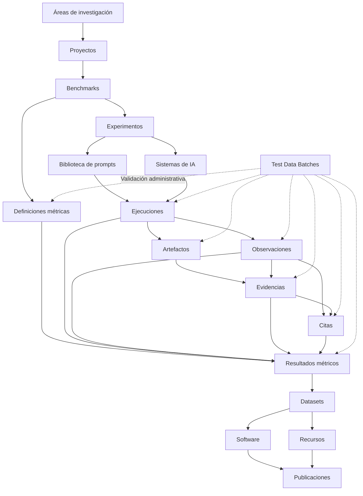

<p align="center">
  
</p>

<p align="center">
  <strong>Infraestructura científica para búsqueda generativa, inteligencia artificial, GEO, benchmarks, evidencias, métricas versionadas e investigación reproducible.</strong>
</p>

<p align="center">
  <a href="./README.md">English</a>
  ·
  <strong>Español</strong>
  ·
  <a href="./docs/MANUAL_USUARIO_ES.md">Manual de usuario</a>
</p>

<p align="center">
  <a href="https://gslhub.com">Web</a>
  ·
  <a href="https://gslhub.com/research">Investigación</a>
  ·
  <a href="https://gslhub.com/benchmarks">Benchmarks</a>
  ·
  <a href="https://gslhub.com/dashboard">Dashboard científico</a>
  ·
  <a href="https://gslhub.com/publications">Publicaciones</a>
  ·
  <a href="https://github.com/gslhub">Organización GitHub</a>
</p>

<p align="center">
  
  
  
  
  
</p>

---

# GSLHub

**GSLHub — Generative Search Lab Hub** es una plataforma científica independiente para estudiar cómo los sistemas de inteligencia artificial generativa descubren, recuperan, interpretan, citan, resumen y recomiendan información digital.

La plataforma conecta la gestión de proyectos científicos, diseño de benchmarks, experimentos controlados, prompts versionados, perfiles de sistemas de IA, ejecuciones, observaciones, artefactos, evidencias, citas, definiciones métricas versionadas, resultados calculados, datasets, software, recursos metodológicos y publicaciones dentro de una infraestructura trazable.

GSLHub se desarrolla desde Barcelona con alcance internacional.

> **Estado actual — 26 de julio de 2026:** el CMS científico, los catálogos públicos, el dashboard, la integridad de archivos, Test Data Batches y las reglas de trazabilidad están operativos. El pipeline sintético completo de 27 registros se ha generado, validado, eliminado de forma segura y repetido en producción. Las Metric Definitions están separadas de los Metric Results; AIR, CR, MCP y RCR v0.1.0 existen como drafts bilingües en revisión; los resultados heredan snapshots metodológicos inmutables; y la API del benchmark expone su registro canónico `metricDefinitions`. El siguiente hito es revisar y validar las cuatro definiciones, finalizar el codebook, verificar almacenamiento y recuperación, congelar los registros reales del piloto y ejecutar las primeras cinco repeticiones controladas.

## Misión

GSLHub desarrolla investigación transparente, reproducible y aplicada en:

- búsqueda generativa;
- Generative Engine Optimization (GEO);
- inteligencia artificial;
- recuperación de información;
- selección y citación de fuentes;
- transformación digital;
- automatización;
- ciencia abierta y software científico.

Su misión es convertir preguntas reales sobre búsqueda mediada por IA en métodos documentados, experimentos medibles, datasets reutilizables, software científico y resultados citables.

## Visión

GSLHub aspira a convertirse en una referencia internacional independiente sobre visibilidad, recuperación, citación, recomendación y autoridad en sistemas de búsqueda generativa.

La plataforma cubre el ciclo científico completo:

1. definir áreas y proyectos;
2. diseñar benchmarks y experimentos;
3. versionar prompts y documentar sistemas de IA;
4. ejecutar condiciones controladas;
5. conservar respuestas y archivos;
6. codificar observaciones y citas;
7. validar evidencias y cadena de custodia;
8. definir, versionar y validar métricas;
9. calcular resultados métricos desde inputs trazables;
10. probar el flujo mediante Test Data Batches;
11. liberar datasets, software, recursos y publicaciones.

## Arquitectura científica



La arquitectura mantiene trazabilidad desde la pregunta científica y el protocolo aprobado hasta el sistema evaluado, el prompt exacto, la ejecución, el archivo, la evidencia, la observación, la cita, la definición métrica, el resultado calculado y el output liberado.

## Estado de la plataforma

### Colecciones Payload

La configuración de producción registra **20 colecciones**.

| Colección | Función | Estado |
| --- | --- | --- |
| Users | Autenticación y roles. | ✅ Operativa |
| Test Data Batches | Generación, sincronización y limpieza administrativa. | ✅ Validada |
| Research Areas | Clasificación temática. | ✅ Operativa |
| Researchers | Perfiles e identificadores académicos. | ✅ Operativa |
| Projects | Objetivos, metodología y ciclo del proyecto. | ✅ Gobernanza validada |
| Benchmarks | Protocolos, sistemas y registro de definiciones métricas. | ✅ Gobernanza validada |
| Experiments | Preguntas, hipótesis, variables y muestra. | ✅ Gobernanza validada |
| Prompts | Redacción exacta, versión y restricciones. | ✅ Gobernanza validada |
| AI Systems | Proveedor, acceso, capacidades y versión visible. | ✅ Gobernanza validada |
| Prompt Executions | Ejecuciones, entorno, respuesta y revisión. | ✅ Integridad validada |
| Observations | Codificación estructurada. | ✅ Integridad validada |
| Research Artifacts | Archivos privados con SHA-256. | ✅ Validada |
| Evidence | Preservación, integridad y cadena de custodia. | ✅ Integridad validada |
| Citations | Extracción y verificación de fuentes. | ✅ Integridad validada |
| Metric Definitions | Fórmulas, rangos, inputs e interpretación versionados. | ✅ Operativa — en revisión |
| Metrics | Resultados calculados y reproducibilidad. | ✅ Integridad ligada a definiciones |
| Publications | Preprints, artículos e informes. | ✅ Gobernanza validada |
| Software | Versiones y disponibilidad del código. | ✅ Gobernanza validada |
| Datasets | Metodología, formatos y liberación. | ✅ Gobernanza validada |
| Resources | Protocolos, guías y plantillas. | ✅ Gobernanza validada |

### Capacidades validadas

- campos científicos en inglés y español;
- drafts y publicación;
- API pública limitada a contenido publicado;
- roles admin, editor y researcher;
- MongoDB Atlas;
- dashboard científico público;
- uploads privados;
- normalización MIME;
- SHA-256 automático;
- herencia de contexto científico;
- Test Data Batches solo para administradores;
- rollback, reintento y limpieza por propiedad;
- eliminación física de archivos;
- escenario sintético repetible de 27 registros;
- unicidad de condiciones experimentales;
- reserva de códigos científicos;
- ciclos de vida controlados;
- snapshots validados inmutables;
- cadena de custodia append-only;
- separación entre definiciones métricas y resultados;
- herencia automática del snapshot metodológico;
- validación de proyecto y benchmark en definiciones y resultados;
- exposición canónica de `metricDefinitions` en la API del benchmark;
- mensajes de error comprensibles.

## Regla central de gobernanza

GSLHub diferencia entre un documento editable y un registro científico congelado.

Antes de validar o liberar, el usuario puede corregir el contenido. Después, debe conservarse la historia.

Cuando un dato congelado necesita una corrección, las opciones correctas son:

- añadir notas de revisión;
- excluir o rechazar el registro;
- marcarlo deprecated o archived;
- crear una nueva versión;
- crear una nueva ejecución, observación, cita o resultado métrico;
- registrar una corrección formal en publicaciones.

Nunca debe sobrescribirse silenciosamente un registro ya utilizado por trabajo científico.

La explicación completa por colección está en [`docs/MANUAL_USUARIO_ES.md`](./docs/MANUAL_USUARIO_ES.md).

## Resumen de reglas por colección

| Entidad | Momento de congelación | Acción correcta ante cambios |
| --- | --- | --- |
| Project | Active | Nueva versión del proyecto |
| Benchmark | Pilot | Nueva versión del benchmark |
| Experiment | Ready | Nuevo experimento o nueva versión |
| Prompt | Validated | Nuevo prompt versionado |
| AI System | Active o equivalente | Nuevo perfil o snapshot |
| Prompt Execution | Running / Completed | Nueva ejecución o exclusión |
| Observation | Validated | Nueva observación o nota de revisión |
| Research Artifact | Tras captura y hash | Nuevo artefacto |
| Evidence | Validated | Rechazar, archivar o nueva evidencia |
| Citation | Validated | Nueva cita o revisión documentada |
| Metric Definition | Validated | Nueva versión de la definición |
| Metric Result | Validated | Nuevo resultado calculado |
| Resource | Available | Nueva versión del recurso |
| Dataset | Released | Nueva versión del dataset |
| Software | Alpha o superior | Nueva versión del software |
| Publication | Preprint o Published | Nueva versión o corrección formal |

## Códigos científicos

```text
GSL-EXEC-GEO-0001
GSL-OBS-GEO-0001
GSL-ART-GEO-0001
GSL-EVD-GEO-0001
GSL-CIT-GEO-0001
GSL-MDEF-AIR-0001
GSL-MET-GEO-0001
```

Los códigos:

- se normalizan a mayúsculas;
- deben utilizar el prefijo de su colección;
- terminan con al menos cuatro dígitos;
- quedan reservados al crear el registro;
- no pueden modificarse después.

Los códigos `TEST-` solo pueden ser creados por administradores mediante Test Data Batches.

## Unicidad de ejecuciones

No pueden existir dos ejecuciones reales con la misma combinación:

```text
Experiment
Prompt
Prompt Version
AI System
Repetition Number
```

Esto evita duplicar condiciones científicas y consumir dos veces la misma repetición.

## Reglas de integridad por capa

### Projects

Un proyecto queda metodológicamente congelado al pasar a `Active`.

Se protegen el código, slug, tipo, objetivos, metodología, fecha de inicio y áreas. Al completarse también queda sellada la fecha final.

### Benchmarks

Un benchmark queda congelado al pasar a `Pilot`.

Se protegen código, tipo, versión, alcance, protocolo, sistemas, métricas resumidas, `metricDefinitions`, fecha de inicio, proyecto y áreas.

La API deriva `metricDefinitions` desde las relaciones canónicas almacenadas en Metric Definitions. Así se evita depender de un benchmark antiguo o desincronizado.

### Experiments

Un experimento queda congelado al pasar a `Ready`.

Se protegen pregunta, hipótesis, objetivo, protocolo, muestreo, criterios, variables, repeticiones y relaciones principales.

### Prompts

Un prompt queda congelado al pasar a `Validated` y exige `Validated At`.

El texto exacto, versión, idioma, instrucciones, placeholders y restricciones no pueden modificarse. Una palabra distinta exige una nueva versión.

### AI Systems

Un perfil de evaluación queda congelado al pasar a `Active`, `Limited`, `Deprecated`, `Unavailable` o `Archived`.

Se protegen acceso, plan, versiones visibles, canal, capacidades, idiomas y método de identificación. Un cambio de interfaz o condición requiere un nuevo perfil o snapshot.

### Prompt Executions

Las condiciones reales son únicas. Cuando una ejecución comienza se sellan el prompt, contexto, repetición, fecha y entorno. Al completarse también se sellan respuesta, fuentes, tiempos y uso.

Una ejecución completada no puede volver a estado planificado o en curso.

### Observations

Las observaciones heredan proyecto, benchmark, experimento, prompt y sistema desde la ejecución.

Una observación validada no puede moverse a otra ejecución ni recodificarse silenciosamente. Las notas de revisión y exclusión siguen disponibles.

### Research Artifacts

Los artefactos utilizan identificadores reservados, contexto heredado y SHA-256 automático. Un archivo distinto debe representarse como un nuevo artefacto.

### Evidence

Una evidencia validada exige verificación de integridad, control de calidad aceptado y fecha de validación.

El contenido preservado es inmutable y la cadena de custodia solo admite nuevos eventos.

### Citations

Una cita debe utilizar observación y evidencia de la misma ejecución y contexto científico.

Tras validarse quedan sellados fuente, URL, dominio, posición, contexto, verificación y relaciones.

### Metric Definitions

Una Metric Definition documenta una versión de un método científico de cálculo. Incluye:

- código de definición y código de métrica;
- versión semántica;
- categoría, dirección y unidad de análisis;
- tipo de valor y unidad;
- fórmula y pseudocódigo;
- definiciones de numerador y denominador;
- agregación y política de datos ausentes;
- rango válido y precisión;
- inputs requeridos;
- supuestos, limitaciones y procedimiento de validación;
- proyecto, benchmark, investigadores y recursos.

La combinación `Metric Code + Version` debe ser única. Desde `Validated`, la fórmula y el resto del método quedan congelados. Un cambio requiere una nueva versión.

### Metric Results

Todo resultado real debe enlazar una definición `Validated` o `Active`.

El resultado hereda automáticamente código, nombre, versión, categoría, dirección, alcance, tipo, unidad, precisión, fórmula, agregación y política de datos ausentes. Estos campos quedan como solo lectura.

Los inputs deben pertenecer al proyecto, benchmark, experimento, prompt y sistema declarados. Tras validarse quedan congelados el valor, la muestra, los inputs, los desgloses y la reproducibilidad.

### Resources

Un recurso `Available` exige fecha de publicación y contenido o ubicación canónica.

Su versión, contenido, URLs, licencia y relaciones quedan congelados.

### Datasets

```text
Planned → Collecting → Cleaning → Validating → Released → Archived
```

Un dataset liberado exige fecha, disponibilidad final, formato y un número positivo de registros. Un dataset público también exige repositorio o DOI, licencia y Open Data.

### Software

El software sigue un ciclo desde Planned hasta Alpha, Beta, Stable, Maintenance, Deprecated y Archived.

Desde Alpha quedan congelados fecha, versión, disponibilidad, repositorio, licencia, lenguajes, tecnologías y relaciones.

### Publications

Un preprint o publicación exige fecha, autor, DOI o URL y venue.

Título, abstract, keywords, datos bibliográficos, autores y relaciones quedan congelados tras la liberación académica.

## Test Data Batches

### Escenarios

| Escenario | Registros | Objetivo |
| --- | ---: | --- |
| Pilot prompt executions | 5 | Probar ejecuciones planificadas. |
| Full research pipeline | 27 | Probar el pipeline completo. |
| Pilot metric definitions | 4 | Crear AIR, CR, MCP y RCR v0.1.0 bilingües en revisión. |
| Metric definition linkage | 4 u 8 | Crear cuatro resultados y generar automáticamente las cuatro definiciones cuando no exista ninguna. |
| Synchronize benchmark metric registry | 4 referencias | Sincronizar el benchmark sin crear ni eliminar definiciones. |

El escenario completo crea:

```text
5 Prompt Executions
5 Observations
5 Research Artifacts
5 Evidence records
3 Citations
4 Metric results
────────────────────
27 connected records
```

La vinculación métrica prueba:

```text
Metric Definition v0.1.0
          ↓
Snapshot metodológico heredado
          ↓
Metric Result TEST- calculado
```

Reglas de seguridad:

- los registros científicos generados quedan como draft o privados;
- cada registro eliminable pertenece al lote por ID y código;
- los fallos parciales ejecutan rollback;
- los lotes fallidos pueden reintentarse;
- la eliminación respeta el orden inverso de dependencias;
- se eliminan los archivos físicos de prueba;
- las definiciones promovidas se conservan;
- la sincronización del benchmark es permanente y no se revierte al borrar su lote administrativo;
- los datos sintéticos nunca se presentan como resultados científicos.

## Artefactos y almacenamiento

GSLHub puede conservar capturas, PDF, exportaciones, HTML, JSON, JSON-LD, CSV, logs y ZIP.

Para cada archivo compatible puede normalizar MIME, calcular SHA-256, guardar el checksum, heredar contexto, restringir el acceso y eliminarlo mediante la limpieza del lote propietario.

El almacenamiento actual es local y privado. Debe migrarse a un archivo duradero compatible con S3 antes de recopilar evidencia irremplazable a escala.

## Cadena científica preparada

| Objeto | Registro actual |
| --- | --- |
| Área | Generative Search and GEO |
| Investigador | Eduardo José Yauri Luna |
| Proyecto | GSLHub Generative Search Visibility Benchmark |
| Benchmark | GSLHub Generative Search Visibility Benchmark |
| Experimento | Pilot Validation of the GSLHub Generative Search Visibility Protocol |
| Prompt | Factors Influencing Source Selection in Generative Search |
| Sistema | ChatGPT Search — authenticated web configuration |
| Definiciones métricas | AIR, CR, MCP y RCR v0.1.0 — Under review |
| Publicación | A Reproducible Protocol for Measuring Visibility in Generative Search Systems |
| Software | GSLHub Generative Search Benchmark Toolkit |
| Dataset | GSLHub Generative Search Visibility Benchmark Dataset |
| Recurso | GSLHub Generative Search Visibility Benchmark Research Protocol |

Los registros reales siguen como drafts hasta completar sus requisitos científicos y editoriales.

## Web pública

| Ruta | Fuente | Estado |
| --- | --- | --- |
| `/research` | Áreas y proyectos | ✅ Live |
| `/benchmarks` | Benchmarks y Metric Definitions canónicas | ✅ Live |
| `/dashboard` | Registros publicados y métricas validadas | ✅ Live |
| `/publications` | Publicaciones | ✅ Live |
| `/software` | Software | ✅ Live |
| `/datasets` | Datasets | ✅ Live |
| `/resources` | Recursos | ✅ Live |
| `/people` | Investigadores | ✅ Live |

Los drafts, artefactos privados, datos `TEST-`, definiciones en revisión y cálculos no validados se excluyen de las afirmaciones científicas públicas.

## En qué punto estamos

### Terminado

- infraestructura y despliegue automático;
- CMS científico;
- web pública y dashboard inicial;
- modelo de investigación;
- modelo de análisis;
- uploads y checksums;
- Test Data Batches;
- relaciones e inmutabilidad del pipeline;
- códigos científicos;
- unicidad de condiciones;
- gobernanza de proyectos, benchmarks, experimentos, prompts y sistemas;
- gobernanza de recursos, datasets, software y publicaciones;
- colección de Metric Definitions versionadas;
- separación entre metodología y resultados calculados;
- AIR, CR, MCP y RCR v0.1.0 bilingües;
- herencia automática del snapshot en Metric Results;
- exposición canónica de `metricDefinitions` en la API del benchmark;
- manual inicial de usuario y gobernanza.

### Hito actual

**Gobernanza métrica y preparación del piloto**:

- revisar científicamente AIR, CR, MCP y RCR v0.1.0;
- corregir textos, fórmulas, rangos, inputs y limitaciones mientras sigan `Under review`;
- completar `Validated At` y `Validated By`;
- pasar las definiciones aceptadas a `Validated` y congelarlas;
- finalizar el codebook de observaciones y citas;
- congelar benchmark, experimento, prompt y sistema reales;
- verificar almacenamiento duradero y recuperación;
- preparar el procedimiento exacto del piloto.

### Pendiente antes del piloto real

1. aprobación científica de AIR, CR, MCP y RCR;
2. codebook definitivo de observaciones y citas;
3. almacenamiento duradero de evidencia;
4. prueba de backup y recuperación de MongoDB y archivos;
5. reglas finales de inclusión y exclusión;
6. checklist de ejecución y captura;
7. cinco ejecuciones reales sin prefijo `TEST-`;
8. revisión científica de observaciones y citas;
9. calculadores deterministas y pruebas de verificación.

## Próximo hito

```text
Project: GSL-GEO-BENCH-01
Benchmark: GSL-BENCH-GEO-01 v0.1.0
Experiment: GSL-EXP-GEO-001
Prompt: GSL-PROMPT-GEO-001 v0.1.0
AI System: GSL-AISYS-001
Metric Definitions: AIR / CR / MCP / RCR v0.1.0
Repetitions: 5
```

Secuencia recomendada:

1. revisar AIR, CR, MCP y RCR campo por campo;
2. validar y congelar las cuatro definiciones;
3. finalizar el codebook;
4. verificar almacenamiento y recuperación;
5. revisar el proyecto real;
6. pasar el benchmark a `Pilot`;
7. pasar el experimento a `Ready`;
8. validar el prompt;
9. confirmar el perfil del sistema;
10. crear cinco ejecuciones reales planificadas;
11. ejecutar cinco sesiones aisladas;
12. conservar respuestas y evidencias de interfaz;
13. codificar observaciones y citas;
14. calcular métricas mediante procedimientos deterministas;
15. revisar y documentar exclusiones;
16. preparar el primer dataset e informe técnico.

## Roadmap

| Fase | Alcance | Estado |
| --- | --- | --- |
| 1. Infraestructura | Hosting, Next.js, Payload y MongoDB | ✅ Completa |
| 2. CMS científico | Colecciones, relaciones, acceso y localización | ✅ Completa |
| 3. Web pública | Catálogos, navegación, SEO y branding | ✅ Completa |
| 4. Modelo de investigación | Experimentos, prompts, sistemas y ejecuciones | ✅ Completa |
| 5. Modelo de análisis | Observaciones, evidencia, citas y métricas | ✅ Completa |
| 6. Dashboard | Contadores y métricas publicadas | ✅ Versión inicial |
| 7. Integridad de archivos | Uploads, MIME, herencia y SHA-256 | ✅ Validada |
| 8. Datos de prueba | Generación, rollback, sincronización y limpieza | ✅ Validada |
| 9. Snapshots científicos | Relaciones, estados e inmutabilidad | ✅ Validada |
| 10. Gobernanza métrica | Definiciones, versiones, herencia y registro del benchmark | 🚧 Muy avanzada — revisión pendiente |
| 11. Gobernanza del piloto | Registros reales, codebook, almacenamiento y checklist | 🚧 Muy avanzada |
| 12. Primer piloto real | Cinco ejecuciones y análisis | ⏳ Siguiente hito |
| 13. Automatización | Calculadores métricos, exports y monitorización | ⏳ Planificada |
| 14. Publicación | Dataset, software, protocolo e informe | ⏳ Planificada |
| 15. Ciencia abierta | ORCID, Zenodo, DOI y citación | ⏳ Planificada |
| 16. Escalado | Múltiples sistemas, idiomas y rondas | ⏳ Planificada |

## Stack

- Next.js 16.2.10;
- React 19.2.7;
- TypeScript 5.9;
- Tailwind CSS 4.3.3;
- Payload CMS 3.86.0;
- MongoDB Atlas;
- GitHub;
- Hostinger Cloud;
- Node.js crypto para SHA-256.

## Estructura del repositorio

```text
.
├── app/                         Web pública, dashboard, Payload y APIs
├── cms/
│   ├── access/                  Reglas de acceso
│   ├── collections/             Colecciones científicas y administrativas
│   ├── endpoints/               Acciones administrativas
│   ├── hooks/                   Ciclos, integridad y modelos de lectura
│   └── test-data/               Generación, sincronización y limpieza
├── components/                  Componentes compartidos y de administración
├── docs/                        Manuales y gobernanza
├── public/brand/                Identidad visual
├── payload.config.ts            Configuración Payload
├── README.md                    Documentación inglesa
└── README.es.md                 Documentación española
```

## Modelo de datos y acceso

- investigadores y editores autenticados pueden preparar registros;
- los administradores controlan acciones destructivas y Test Data Batches;
- los drafts solo se ven dentro del CMS autenticado;
- usuarios anónimos reciben únicamente contenido publicado;
- los artefactos requieren autenticación;
- los datos de prueba permanecen draft o privados;
- las relaciones científicas son explícitas;
- los campos localizados usan fallback inglés;
- GSLHub tiene configuración propia de CORS, CSRF y autenticación.

## API REST

```text
GET /api/research-areas
GET /api/researchers
GET /api/projects
GET /api/benchmarks
GET /api/experiments
GET /api/prompts
GET /api/ai-systems
GET /api/prompt-executions
GET /api/observations
GET /api/evidence
GET /api/citations
GET /api/metric-definitions
GET /api/metrics
GET /api/publications
GET /api/software
GET /api/datasets
GET /api/resources
```

La respuesta de benchmarks incluye un array derivado `metricDefinitions`, construido desde las relaciones canónicas de cada definición.

Artefactos autenticados:

```text
GET /api/research-artifacts
```

Generación y sincronización administrativa:

```text
POST /api/test-data-batches/:id/generate
```

## Desarrollo local

```bash
git clone https://github.com/gslhub/website.git
cd website
npm install
cp .env.example .env.local
npm run dev
```

Variables principales:

```env
NEXT_PUBLIC_SITE_URL=http://localhost:3000
PAYLOAD_SECRET=replace-with-a-long-random-secret
DATABASE_URL=mongodb+srv://<username>:<url-encoded-password>@<cluster-hostname>/?retryWrites=true&w=majority&appName=GSLHub
```

Comprobaciones:

```bash
npm run lint
npm run typecheck
npm run build
```

## Notas de despliegue

- producción se despliega desde `main` en Hostinger Cloud;
- el build sigue siendo `next build`;
- no añadir `payload generate:importmap` sin volver a probar Node en producción;
- evitar despliegues rápidos y solapados;
- no ejecutar `npm audit fix --force` sin revisar compatibilidad;
- los avisos de auditoría son independientes de errores TypeScript o build.

## Principios científicos

### Reproducibilidad

Protocolos, prompts, sistemas, definiciones métricas, cálculos, evidencias y datasets deben permitir replicación independiente.

### Transparencia

Las decisiones, exclusiones, limitaciones y cambios de versión deben quedar documentados.

### Versionado

Los objetos científicos no deben modificarse silenciosamente después de ser utilizados.

### Integridad

La plataforma distingue preparación, validación sintética, captura, revisión, validación, cálculo, liberación y publicación.

### Apertura responsable

La ciencia abierta no justifica exponer información privada, restringida, personal o no redistribuible.

### Revisión humana

La automatización permanece sujeta a validación y supervisión científica.

## Documentación

- [README en inglés](./README.md)
- [Manual de usuario y gobernanza científica](./docs/MANUAL_USUARIO_ES.md)

Próximos documentos:

- guía de backup y recuperación;
- protocolo del primer piloto;
- codebook de observaciones y citas;
- especificación de cálculo métrico y pruebas de verificación;
- guía de exportación y publicación;
- `CITATION.cff`;
- licencia;
- política de seguridad;
- contribución y código de conducta.

## Contacto

- Web: [gslhub.com](https://gslhub.com)
- Dashboard: [gslhub.com/dashboard](https://gslhub.com/dashboard)
- GitHub: [github.com/gslhub](https://github.com/gslhub)
- Correo: [research@gslhub.com](mailto:research@gslhub.com)
- Fundador e investigador: [Eduardo José Yauri Luna](https://www.linkedin.com/in/eduardoyauriluna/)

---

<p align="center">
  <strong>Investigación · Benchmarks · Evidencia · Definiciones métricas · Resultados métricos · Software · Datasets · Ciencia abierta</strong>
</p>

<p align="center">
  Última actualización: 26 de julio de 2026
</p>
