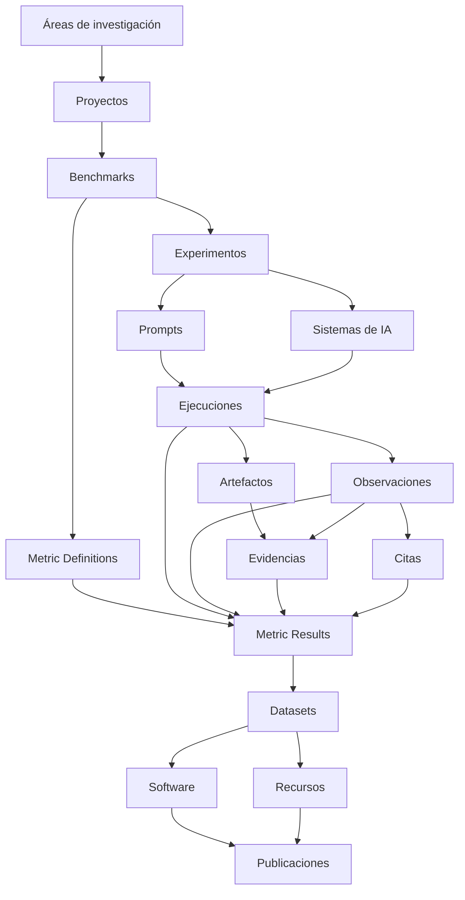

<p align="center">
  
</p>

<p align="center">
  <strong>Infraestructura científica para búsqueda generativa, inteligencia artificial, GEO, benchmarks, evidencias, métricas versionadas e investigación reproducible.</strong>
</p>

<p align="center">
  <a href="./README.md">English</a> · <strong>Español</strong> · <a href="./docs/MANUAL_USUARIO_ES.md">Manual de usuario</a>
</p>

<p align="center">
  <a href="https://gslhub.com">Web</a> ·
  <a href="https://gslhub.com/research">Investigación</a> ·
  <a href="https://gslhub.com/benchmarks">Benchmarks</a> ·
  <a href="https://gslhub.com/dashboard">Dashboard científico</a> ·
  <a href="https://gslhub.com/publications">Publicaciones</a> ·
  <a href="https://github.com/gslhub">Organización GitHub</a>
</p>

<p align="center">
  
  
  
  
  
  
</p>

---

# GSLHub

**GSLHub — Generative Search Lab Hub** es una plataforma científica independiente para estudiar cómo los sistemas de IA generativa descubren, recuperan, interpretan, citan, resumen y recomiendan información digital.

La plataforma conecta proyectos, benchmarks, experimentos, prompts versionados, perfiles de sistemas de IA, ejecuciones controladas, observaciones, artefactos, evidencias, citas, Metric Definitions, Metric Results, datasets, software, recursos y publicaciones dentro de una infraestructura trazable.

GSLHub se desarrolla desde Barcelona con alcance internacional y actualmente prepara un piloto doctoral sobre visibilidad y selección de fuentes en sistemas de búsqueda generativa.

## Estado del proyecto — 4 de agosto de 2026

### Stack validado en producción

```text
Plataforma GSLHub  0.4.2
Payload CMS        3.75.0
@payloadcms/next   3.75.0
Next.js            16.2.10
React / React DOM  19.2.7
Driver MongoDB     6.21.0
Artefactos         Subidas locales de Payload
```

El administrador nativo de Payload está operativo en producción. Payload permanece fijado intencionadamente en `3.75.0`; la actualización a `3.86.0` produjo una frontera vacía de React Server Components y fue revertida.

### Hito actual

| Área | Estado | Situación actual |
| --- | --- | --- |
| Hosting y despliegue | ✅ Operativo | El despliegue automático desde `main` hacia Hostinger funciona. |
| Administrador Payload | ✅ Operativo | Login, dashboard, listados y formularios funcionan. |
| Modelo científico | ✅ Preparado para piloto | Veinte colecciones conectadas cubren el ciclo de investigación. |
| Metodología métrica | ✅ Revisión inicial completa | AIR, CR, MCP y RCR tienen especificaciones y codebooks bilingües. |
| Sincronización permanente | ✅ Completada | Las cuatro definiciones v0.1.0 fueron sincronizadas en ambos idiomas. |
| Validación determinista | ✅ Completada | AIR, CR, MCP y RCR produjeron los resultados sintéticos esperados. |
| Limpieza TEST | ✅ Completada | Se eliminaron resultados, ejecuciones, observaciones y citas descartables. |
| Definiciones permanentes | ✅ Conservadas | AIR, CR, MCP y RCR continúan en `Under review` y `Draft`. |
| Autorrevisión técnica | 🚧 Siguiente acción | La versión 0.4.2 incorpora una acción permanente y gobernada. |
| Revisión científica independiente | ⏳ Pendiente | Una persona investigadora diferente debe revisar antes de validar. |
| Piloto real | ⏳ No iniciado | Falta preparar y ejecutar cinco sesiones reales controladas. |
| Persistencia y recuperación | 🚧 Pendiente | Faltan pruebas de reinicio, redespliegue, backup y restauración. |

## Métricas del piloto verificadas

| Código | Métrica | Resultado determinista | Estado |
| --- | --- | --- | --- |
| AIR | Answer Inclusion Rate | `3 / 4 = 0,7500`, una exclusión informada | Under review |
| CR | Citation Rate | `2 / 4 = 0,5000`, una exclusión informada | Under review |
| MCP | Mean Citation Position | posiciones `1, 2, 3`; media `2,00` | Under review |
| RCR | Response Consistency Rate | `none, low, low, high`; `3 / 4 = 0,7500` | Under review |

Estos valores son comprobaciones sintéticas de los calculadores, no hallazgos doctorales. Sus registros `TEST-` fueron eliminados después de la revisión.

Las cuatro definiciones permanentes conservan:

```text
Version: 0.1.0
Lifecycle Status: Under review
Editorial Status: Draft
Missing Data Policy: Report separately
Validated At: vacío
Validated By: vacío
```

## Gobernanza de la revisión técnica

La versión 0.4.2 añade un bloque específico `Technical Review` a las Metric Definitions. Separa la autorrevisión técnica del autor de la validación científica formal.

La autorrevisión técnica registra:

- persona revisora y fecha;
- estado de validación determinista;
- resultado observado para cada métrica;
- notas bilingües;
- estado de revisión independiente.

La validación formal queda bloqueada hasta completar:

1. Technical Review;
2. validación determinista en estado `Passed`;
3. revisión de una persona investigadora independiente y distinta del autor;
4. campos formales `Validated At` y `Validated By`.

Mientras una definición esté en `planned` o `under-review`, Payload rechaza completar `Validated At` o `Validated By`. Después de validar, la revisión técnica y los campos científicos protegidos quedan inmutables.

## Siguiente acción inmediata

Después de que la versión 0.4.2 compile y se despliegue:

1. Abrir **Administration → Administrative Batches**.
2. Crear un lote usando:

```text
Record pilot metric author technical review — AIR, CR, MCP and RCR v0.1.0
```

3. Ejecutar la acción.
4. Confirmar `Status: Completed` y `Record Count: 4`.
5. Verificar en cada definición:

```text
Technical Review Status: Completed
Review Mode: Author self-review
Reviewed By: Eduardo José Yauri Luna
Deterministic Validation Status: Passed
Independent Review Status: Pending
Lifecycle Status: Under review
Validated At / By: vacíos
```

Runbooks:

- [Sincronización y validación determinista](./docs/metrics/PILOT_METRIC_SYNC_AND_VALIDATION_ES.md)
- [Autorrevisión técnica](./docs/metrics/PILOT_METRIC_TECHNICAL_REVIEW_ES.md)
- [Runbook técnico en inglés](./docs/metrics/PILOT_METRIC_TECHNICAL_REVIEW.md)

## Arquitectura científica



## Colecciones Payload

La configuración de producción registra 20 colecciones:

| Grupo | Colecciones |
| --- | --- |
| Administración | Users, Administrative Batches |
| Investigación | Research Areas, Researchers, Projects, Benchmarks, Publications |
| Operaciones | Experiments, Prompts, AI Systems, Prompt Executions, Observations, Research Artifacts, Evidence, Citations, Metric Definitions, Metrics |
| Resultados | Software, Datasets, Resources |

## Artefactos de investigación

La fase doctoral actual utiliza subidas locales de Payload:

```text
research-artifacts/
```

Las copias operativas deben incluir:

```text
Base de datos MongoDB
Directorio research-artifacts/
Variables de entorno de producción
```

S3 no es un bloqueo para esta fase y queda como opción futura de escalado.

## Lo que falta antes del primer piloto real

1. Desplegar y registrar la autorrevisión técnica.
2. Obtener revisión científica independiente para AIR, CR, MCP y RCR.
3. Completar la validación formal de las métricas.
4. Aprobar el diccionario del objetivo de AIR y CR.
5. Aprobar la superficie y convención de orden de MCP.
6. Aprobar la base y reglas de variación de RCR.
7. Verificar la persistencia local tras reinicio y redespliegue.
8. Probar backup y restauración de MongoDB y artefactos.
9. Congelar benchmark, experimento, prompt y perfil del sistema.
10. Crear exactamente cinco ejecuciones reales `GSL-EXEC-`.
11. Ejecutar cinco sesiones aisladas bajo el protocolo congelado.
12. Preservar evidencias, codificar observaciones y citas y calcular las métricas reales.
13. Preparar el primer dataset, protocolo e informe técnico.

## Desarrollo local

```bash
git clone https://github.com/gslhub/website.git
cd website
npm install
cp .env.example .env.local
npm run dev
```

Comprobaciones de calidad:

```bash
npm run lint
npm run typecheck
npm run build
```

Variables requeridas:

```env
NEXT_PUBLIC_SITE_URL=http://localhost:3000
PAYLOAD_SECRET=replace-with-a-long-random-secret
DATABASE_URL=mongodb+srv://<usuario>:<contraseña>@<cluster>/?retryWrites=true&w=majority&appName=GSLHub
```

## Política de compatibilidad

No actualizar automáticamente Payload, Next.js o React y no ejecutar `npm audit fix --force` en producción. Las actualizaciones de framework deben probarse en una rama independiente con todo el flujo del administrador.

El repositorio todavía necesita un `package-lock.json` validado para fijar dependencias transitivas.

## Historial y documentación

- [Historial en español](./CHANGELOG.es.md)
- [Changelog en inglés](./CHANGELOG.md)
- [Manual de usuario](./docs/MANUAL_USUARIO_ES.md)
- [Incidencia de compatibilidad Payload/Next](./docs/COMPATIBILIDAD_PAYLOAD_NEXT_ES.md)

## Contacto

- Web: [gslhub.com](https://gslhub.com)
- GitHub: [github.com/gslhub](https://github.com/gslhub)
- Correo: [research@gslhub.com](mailto:research@gslhub.com)
- Fundador e investigador: [Eduardo José Yauri Luna](https://www.linkedin.com/in/eduardoyauriluna/)

---

<p align="center">
  <strong>Investigación · Benchmarks · Evidencia · Metric Definitions · Metric Results · Software · Datasets · Ciencia abierta</strong>
</p>

<p align="center">
  Última actualización: 4 de agosto de 2026
</p>
