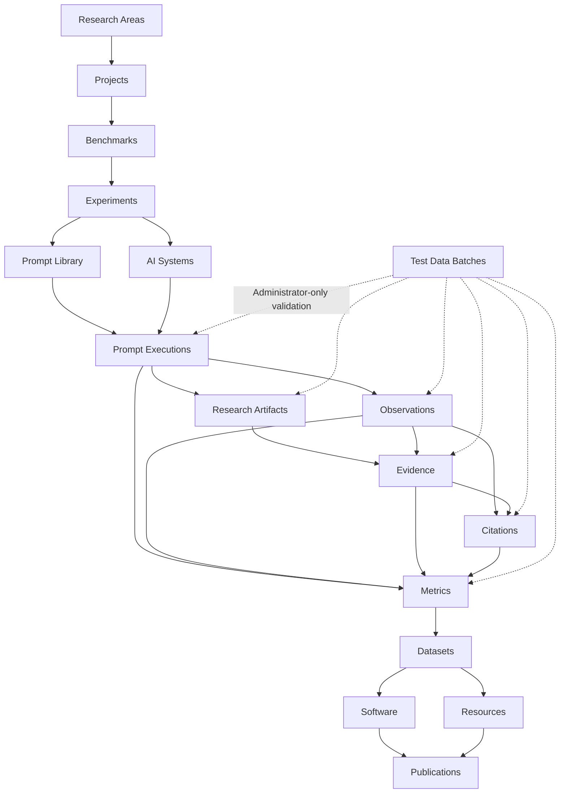

<p align="center">
  
</p>

<p align="center">
  <strong>Scientific infrastructure for Generative Search, Artificial Intelligence, GEO, benchmarks, evidence, metrics and reproducible research.</strong>
</p>

<p align="center">
  <strong>English</strong>
  ·
  <a href="./README.es.md">Español</a>
  ·
  <a href="./docs/MANUAL_USUARIO_ES.md">Spanish user manual</a>
</p>

<p align="center">
  <a href="https://gslhub.com">Website</a>
  ·
  <a href="https://gslhub.com/research">Research</a>
  ·
  <a href="https://gslhub.com/benchmarks">Benchmarks</a>
  ·
  <a href="https://gslhub.com/dashboard">Scientific Dashboard</a>
  ·
  <a href="https://gslhub.com/publications">Publications</a>
  ·
  <a href="https://github.com/gslhub">GitHub organization</a>
</p>

<p align="center">
  
  
  
  
  
</p>

---

# GSLHub

**GSLHub — Generative Search Lab Hub** is an independent scientific platform for studying how generative artificial intelligence systems discover, retrieve, interpret, cite, summarize and recommend digital information.

The platform connects scientific project management, benchmark design, controlled experiments, versioned prompts, AI-system profiles, prompt executions, observations, research artifacts, evidence, citations, metrics, datasets, software, methodological resources and publications inside one traceable infrastructure.

GSLHub is based in Barcelona and is being developed with an international research scope.

> **Current stage — 26 July 2026:** the scientific CMS, public catalogues, dashboard, file-integrity workflow, administrator test-data framework and end-to-end relationship protections are operational. The complete 27-record synthetic pipeline has been generated, validated, safely deleted and repeated in production. Governance and immutability rules have now been tested for projects, benchmarks, experiments, prompts, AI-system profiles, prompt executions, observations, evidence, citations, metrics, resources, datasets, software and publications. The next milestone is to freeze the real pilot protocol, verify durable storage and recovery, and run the first five real controlled executions.

## Mission

GSLHub develops transparent, reproducible and practice-led research in:

- generative search;
- Generative Engine Optimization (GEO);
- artificial intelligence;
- information retrieval;
- source selection and citation;
- digital transformation;
- process automation;
- open science and research software.

Its mission is to transform real-world questions about AI-mediated search into documented methods, measurable experiments, reusable datasets, research software and citable scientific outputs.

## Vision

GSLHub aims to become an independent international reference for research on visibility, retrieval, citation, recommendation and authority in generative search systems.

The platform supports the full scientific lifecycle:

1. define research areas and projects;
2. design benchmarks and experiments;
3. version prompts and document AI systems;
4. execute controlled research runs;
5. preserve responses and uploaded research artifacts;
6. code observations and source-level citations;
7. validate evidence and chain of custody;
8. calculate transparent metrics;
9. test the workflow with disposable administrator-only data;
10. release datasets, software, resources and publications.

## Scientific architecture



The architecture preserves traceability from the research question and approved protocol to the evaluated system, exact prompt, execution, file, evidence, observation, citation, metric and released output.

## Current platform status

### Payload CMS collections

The production configuration registers **19 collections**.

| Collection | Purpose | Status |
| --- | --- | --- |
| Users | Authentication and role management. | ✅ Operational |
| Test Data Batches | Administrator-only sample generation and cleanup. | ✅ Validated |
| Research Areas | Scientific classification. | ✅ Operational |
| Researchers | Researcher profiles and scholarly identifiers. | ✅ Operational |
| Projects | Objectives, methodology and project lifecycle. | ✅ Governance validated |
| Benchmarks | Protocols, systems and metric definitions. | ✅ Governance validated |
| Experiments | Questions, hypotheses, variables and sampling. | ✅ Governance validated |
| Prompts | Exact wording, versions and constraints. | ✅ Governance validated |
| AI Systems | Providers, access conditions, capabilities and visible versions. | ✅ Governance validated |
| Prompt Executions | Controlled runs, environment, response and review. | ✅ Integrity validated |
| Observations | Structured coding of generated responses. | ✅ Integrity validated |
| Research Artifacts | Private files with automatic SHA-256. | ✅ Validated |
| Evidence | Preserved records, integrity and chain of custody. | ✅ Integrity validated |
| Citations | Source extraction and verification. | ✅ Integrity validated |
| Metrics | Results, formulas and reproducibility metadata. | ✅ Integrity validated |
| Publications | Preprints, articles and technical reports. | ✅ Governance validated |
| Software | Versions and source availability. | ✅ Governance validated |
| Datasets | Methodology, formats and release metadata. | ✅ Governance validated |
| Resources | Protocols, guides and templates. | ✅ Governance validated |

### Validated capabilities

- English and Spanish localized scientific fields;
- draft and publish workflows;
- anonymous published-only access;
- administrator, editor and researcher roles;
- MongoDB Atlas persistence;
- public REST API and scientific dashboard;
- private research artifact uploads;
- scientific MIME normalization;
- automatic SHA-256 checksums;
- inherited scientific context;
- administrator-only test-data generation;
- rollback, retry and ownership-based cleanup;
- physical upload deletion during cleanup;
- repeatable 27-record synthetic pipeline;
- unique controlled execution conditions;
- reserved scientific code namespaces;
- controlled lifecycle transitions;
- immutable validated and released snapshots;
- append-only evidence chain of custody;
- human-readable integrity errors.

## Central governance rule

GSLHub distinguishes an editable working document from a frozen scientific record.

Before validation or release, a user may correct the content. After validation or release, the historical record must be preserved.

When a frozen record needs correction, the correct action is one of the following:

- add review or validation notes;
- exclude or reject the record;
- mark it deprecated or archived;
- create a new version;
- create a new execution, observation, citation or metric result;
- create a formal correction record for a publication.

A scientific record already used by research must never be silently overwritten.

The detailed user-facing rules are documented in [`docs/MANUAL_USUARIO_ES.md`](./docs/MANUAL_USUARIO_ES.md).

## Governance summary by entity

| Entity | Freeze point | Correct action when the scientific definition changes |
| --- | --- | --- |
| Project | Active | Create a new project version |
| Benchmark | Pilot | Create a new benchmark version |
| Experiment | Ready | Create a new experiment or version |
| Prompt | Validated | Create a new prompt version |
| AI System | Active or equivalent | Create a new profile or snapshot |
| Prompt Execution | Running / Completed | Create a new execution or exclude the run |
| Observation | Validated | Create a new observation or add review notes |
| Research Artifact | Captured and hashed | Create a new artifact |
| Evidence | Validated | Reject, archive or create new evidence |
| Citation | Validated | Create a new citation or document the review |
| Metric | Validated | Create a new metric result |
| Resource | Available | Create a new resource version |
| Dataset | Released | Create a new dataset version |
| Software | Alpha or later | Create a new software version |
| Publication | Preprint or Published | Create a new version or formal correction |

## Scientific code namespaces

```text
GSL-EXEC-GEO-0001
GSL-OBS-GEO-0001
GSL-ART-GEO-0001
GSL-EVD-GEO-0001
GSL-CIT-GEO-0001
GSL-MET-GEO-0001
```

Codes:

- are normalized to uppercase;
- must use the correct collection prefix;
- end with at least four digits;
- are reserved when the record is created;
- cannot be changed later.

The `TEST-` namespace is reserved for administrators and Test Data Batches.

## Controlled execution uniqueness

Two real executions cannot reserve the same combination:

```text
Experiment
Prompt
Prompt Version
AI System
Repetition Number
```

This prevents duplicate scientific conditions and accidental reuse of a repetition.

## Integrity rules by layer

### Projects

A project becomes methodologically frozen when it reaches `Active`.

Protected fields include project code, slug, type, objectives, methodology, start date and research areas. A completed project also seals its end date.

### Benchmarks

A benchmark becomes frozen at `Pilot`.

Its code, type, version, scope, protocol, systems, metrics, start date, project and research areas cannot be overwritten after the pilot begins.

### Experiments

An experiment becomes frozen at `Ready`.

Its research question, hypothesis, objective, protocol, sampling, inclusion and exclusion criteria, variables, planned repetitions and core relationships are protected.

### Prompts

A prompt becomes frozen at `Validated` and requires `Validated At`.

The exact wording, version, language, execution instructions, placeholders and constraints cannot be edited after validation. A one-word change requires a new version.

### AI systems

An evaluation profile becomes frozen at `Active`, `Limited`, `Deprecated`, `Unavailable` or `Archived`.

Access modes, account tier, model and interface versions, release channel, capabilities, languages and identification method are protected. A changed interface or access condition requires a new system profile or snapshot.

### Prompt executions

Real execution conditions are unique. When a run starts, its prompt snapshot, scientific context, repetition, date and environment are sealed. Completion also seals the response, source presentation, timing and usage metadata.

Completed runs cannot return to planned or running states.

### Observations

Observations inherit project, benchmark, experiment, prompt and AI system from the prompt execution.

Validated observations cannot be moved to another execution or silently recoded. Quality-control notes and exclusion metadata remain available.

### Research artifacts

Artifacts use reserved identifiers, inherited execution context and automatic SHA-256. A replacement file must be represented as a new artifact rather than a silent overwrite.

### Evidence

Validated evidence requires integrity verification, accepted quality control and a validation date.

Its preserved content and metadata are immutable. Chain-of-custody events are append-only.

### Citations

A citation must use an observation and evidence belonging to the same prompt execution and scientific context.

Validated source metadata, URL, domain, position, citation context, verification and relationships are sealed.

### Metrics

Metric inputs must belong to the declared project, benchmark, experiment, prompt and AI system.

Value types, valid ranges, denominators, sample size and validation status are checked. Validated formulas, inputs, results, breakdowns and reproducibility metadata are immutable.

### Resources

An `Available` resource requires a publication date and content or a canonical location.

Its released version, content, URLs, license and scientific relationships are frozen.

### Datasets

A dataset follows:

```text
Planned → Collecting → Cleaning → Validating → Released → Archived
```

A released dataset requires a release date, final availability, at least one format and a positive record count. A public release also requires a repository or DOI, license and Open Data.

### Software

Software follows a controlled release lifecycle from Planned to Alpha, Beta, Stable, Maintenance, Deprecated and Archived.

From Alpha onward, the release date, version, source availability, repository, license, languages, technologies and scientific relationships are frozen.

### Publications

A preprint or publication requires a publication date, at least one author, a DOI or canonical URL, and a venue.

Title, abstract, keywords, bibliographic metadata, authors and relationships are frozen after scholarly release.

## Administrator test-data framework

### Scenarios

| Scenario | Records | Purpose |
| --- | ---: | --- |
| Pilot prompt executions | 5 | Validate planned execution records. |
| Full research pipeline | 27 | Validate the complete operational pipeline. |

The full scenario creates:

```text
5 Prompt Executions
5 Observations
5 Research Artifacts
5 Evidence records
3 Citations
4 Metric results
────────────────────
27 connected records
```

Safety rules:

- generated records stay draft or private;
- each record is owned by its batch through document ID and scientific code;
- partial failures roll back;
- failed batches can be retried;
- generated batches cannot be duplicated;
- deletion follows reverse dependency order;
- all five physical files are deleted;
- synthetic data is never presented as scientific findings.

## Research artifacts and storage

GSLHub can preserve:

- screenshots;
- PDFs;
- response exports;
- HTML snapshots;
- JSON and JSON-LD;
- CSV;
- logs;
- ZIP archives.

For supported uploads it can normalize MIME, calculate SHA-256, store integrity metadata, inherit execution context, restrict access and remove files through owned test-data cleanup.

The current archive uses private local storage. Durable S3-compatible or equivalent versioned storage is still required before irreplaceable evidence is collected at scale.

## Current scientific assets

| Scientific object | Current record |
| --- | --- |
| Research area | Generative Search and GEO |
| Researcher | Eduardo José Yauri Luna |
| Project | GSLHub Generative Search Visibility Benchmark |
| Benchmark | GSLHub Generative Search Visibility Benchmark |
| Experiment | Pilot Validation of the GSLHub Generative Search Visibility Protocol |
| Prompt | Factors Influencing Source Selection in Generative Search |
| AI system | ChatGPT Search — authenticated web configuration |
| Publication | A Reproducible Protocol for Measuring Visibility in Generative Search Systems |
| Software | GSLHub Generative Search Benchmark Toolkit |
| Dataset | GSLHub Generative Search Visibility Benchmark Dataset |
| Resource | GSLHub Generative Search Visibility Benchmark Research Protocol |

Real editorial and operational records remain drafts until their scientific requirements are complete.

## Public website

| Page | Data source | Status |
| --- | --- | --- |
| `/research` | Research Areas and Projects | ✅ Live |
| `/benchmarks` | Benchmarks | ✅ Live |
| `/dashboard` | Published operational records and validated metrics | ✅ Live |
| `/publications` | Publications | ✅ Live |
| `/software` | Software | ✅ Live |
| `/datasets` | Datasets | ✅ Live |
| `/resources` | Resources | ✅ Live |
| `/people` | Researchers | ✅ Live |

Drafts, private artifacts, `TEST-` records and unvalidated calculations are intentionally excluded.

## Where the project stands

### Completed

- infrastructure and automatic deployment;
- scientific CMS;
- public website and initial dashboard;
- research data model;
- analysis data model;
- uploads and checksums;
- administrator test data;
- end-to-end scientific context validation;
- immutable execution, observation, evidence, citation and metric snapshots;
- code reservation and execution uniqueness;
- governance for projects, benchmarks, experiments, prompts and AI systems;
- release governance for resources, datasets, software and publications;
- first Spanish user-governance manual.

### Current milestone

**Pilot governance**:

- review and freeze the real scientific records;
- finalize the observation and citation codebook;
- freeze AIR, CR, MCP and RCR definitions;
- verify durable storage and recovery;
- prepare the exact manual pilot procedure.

### Remaining before the first real pilot

1. durable evidence storage;
2. tested MongoDB and file recovery;
3. final inclusion and exclusion rules;
4. execution and capture checklist;
5. five real executions without `TEST-` codes;
6. scientific review of observations and citations;
7. deterministic metric scripts.

## Immediate next milestone

```text
Experiment: GSL-EXP-GEO-001
Prompt: GSL-PROMPT-GEO-001 v0.1.0
AI System: GSL-AISYS-001
Planned repetitions: 5
```

Recommended sequence:

1. review the real project;
2. move the benchmark to Pilot;
3. move the experiment to Ready;
4. validate the prompt;
5. confirm the AI-system profile;
6. freeze the codebook and metric definitions;
7. verify storage and backup;
8. create five real planned executions;
9. run five isolated sessions;
10. preserve responses and interface evidence;
11. code observations and citations;
12. calculate metrics;
13. review and document exclusions;
14. prepare the first dataset and technical report.

## Development roadmap

| Phase | Scope | Status |
| --- | --- | --- |
| 1. Infrastructure | Hosting, Next.js, Payload and MongoDB | ✅ Complete |
| 2. Scientific CMS | Collections, relationships, access and localization | ✅ Complete |
| 3. Public website | Catalogues, navigation, SEO and branding | ✅ Complete |
| 4. Research model | Experiments, prompts, systems and executions | ✅ Complete |
| 5. Analysis model | Observations, evidence, citations and metrics | ✅ Complete |
| 6. Dashboard | Published counters and metric presentation | ✅ Initial version |
| 7. Artifact integrity | Uploads, MIME, inheritance and SHA-256 | ✅ Validated |
| 8. Test-data lifecycle | Generation, rollback and cleanup | ✅ Validated |
| 9. Scientific snapshots | Relationships, lifecycle and immutability | ✅ Validated |
| 10. Pilot governance | Versions, codes and release rules | 🚧 Advanced |
| 11. First real pilot | Five executions and analysis | ⏳ Next milestone |
| 12. Automation | Metric scripts, exports and monitoring | ⏳ Planned |
| 13. Publication pipeline | Dataset, software, protocol and report | ⏳ Planned |
| 14. Open science | ORCID, Zenodo, DOI and citation metadata | ⏳ Planned |
| 15. Comparative scaling | Multiple systems, languages and rounds | ⏳ Planned |

## Technology stack

- Next.js 16.2.10;
- React 19.2.7;
- TypeScript 5.9;
- Tailwind CSS 4.3.3;
- Payload CMS 3.86.0;
- MongoDB Atlas;
- GitHub;
- Hostinger Cloud;
- Node.js crypto for SHA-256.

## Repository structure

```text
.
├── app/                         Public site, dashboard, Payload and APIs
├── cms/
│   ├── access/                  Scientific access rules
│   ├── collections/             Scientific and admin collections
│   ├── endpoints/               Administrator actions
│   ├── hooks/                   Lifecycle and integrity controls
│   └── test-data/               Generation and cleanup
├── components/                  Shared, brand and admin components
├── docs/                        User and governance documentation
├── public/brand/                Brand assets
├── scripts/                     Controlled scripts
├── payload.config.ts            Payload configuration
├── README.md                    English documentation
└── README.es.md                 Spanish documentation
```

## Data and access model

- authenticated researchers and editors can prepare scientific records;
- administrators control destructive actions and test-data batches;
- drafts remain visible only inside the authenticated CMS;
- anonymous users receive published records only;
- research artifacts require authentication;
- test data stays draft or private;
- scientific relationships are explicit;
- English and Spanish localized fields use English fallback;
- GSLHub uses dedicated CORS, CSRF and authentication settings.

## REST API

```text
GET /api/research-areas
GET /api/researchers
GET /api/projects
GET /api/benchmarks
GET /api/experiments
GET /api/prompts
GET /api/ai-systems
GET /api/prompt-executions
GET /api/observations
GET /api/evidence
GET /api/citations
GET /api/metrics
GET /api/publications
GET /api/software
GET /api/datasets
GET /api/resources
```

Authenticated artifacts:

```text
GET /api/research-artifacts
```

Administrator generation:

```text
POST /api/test-data-batches/:id/generate
```

## Local development

```bash
git clone https://github.com/gslhub/website.git
cd website
npm install
cp .env.example .env.local
npm run dev
```

Required variables:

```env
NEXT_PUBLIC_SITE_URL=http://localhost:3000
PAYLOAD_SECRET=replace-with-a-long-random-secret
DATABASE_URL=mongodb+srv://<username>:<url-encoded-password>@<cluster-hostname>/?retryWrites=true&w=majority&appName=GSLHub
```

Quality checks:

```bash
npm run lint
npm run typecheck
npm run build
```

## Deployment notes

- production deploys automatically from `main` to Hostinger Cloud;
- the build command remains `next build`;
- do not add `payload generate:importmap` without retesting the production Node.js environment;
- avoid overlapping rapid deployments;
- do not run `npm audit fix --force` without reviewing Payload, Next.js and React compatibility;
- dependency audit warnings are separate from TypeScript and build failures.

## Scientific principles

### Reproducibility

Protocols, prompts, systems, metrics, evidence and datasets should support independent replication.

### Transparency

Methodological decisions, exclusions, limitations and version changes should remain traceable.

### Versioning

Scientific objects must not change silently after use.

### FAIR data

Released datasets should be findable, accessible, interoperable and reusable whenever legal and ethical conditions allow it.

### Research integrity

The platform distinguishes preparation, synthetic validation, capture, review, validation, release and publication.

### Responsible openness

Open science does not justify exposing private, personal, restricted or non-redistributable information.

### Human review

Automation remains subject to documented validation and scientific oversight.

## Documentation

- [Spanish README](./README.es.md)
- [Spanish user and scientific-governance manual](./docs/MANUAL_USUARIO_ES.md)

Planned documents:

- backup and recovery procedure;
- first-pilot protocol;
- observation and citation codebook;
- dataset export guide;
- `CITATION.cff`;
- repository license;
- security policy;
- contribution guide and code of conduct.

## Citation

A repository-level `CITATION.cff` and Zenodo workflow will be added before the first formal release.

Until then, cite the public platform as:

```text
GSLHub — Generative Search Lab Hub. Independent scientific platform for generative search, GEO, artificial intelligence and reproducible research. https://gslhub.com
```

Do not assign a DOI, publication date or scholarly release status to draft or synthetic test records.

## Contact

- Website: [gslhub.com](https://gslhub.com)
- Dashboard: [gslhub.com/dashboard](https://gslhub.com/dashboard)
- GitHub: [github.com/gslhub](https://github.com/gslhub)
- Research email: [research@gslhub.com](mailto:research@gslhub.com)
- Founder and researcher: [Eduardo José Yauri Luna](https://www.linkedin.com/in/eduardoyauriluna/)

---

<p align="center">
  <strong>Research · Benchmarks · Evidence · Metrics · Software · Datasets · Open Science</strong>
</p>

<p align="center">
  Last updated: 26 July 2026
</p>
