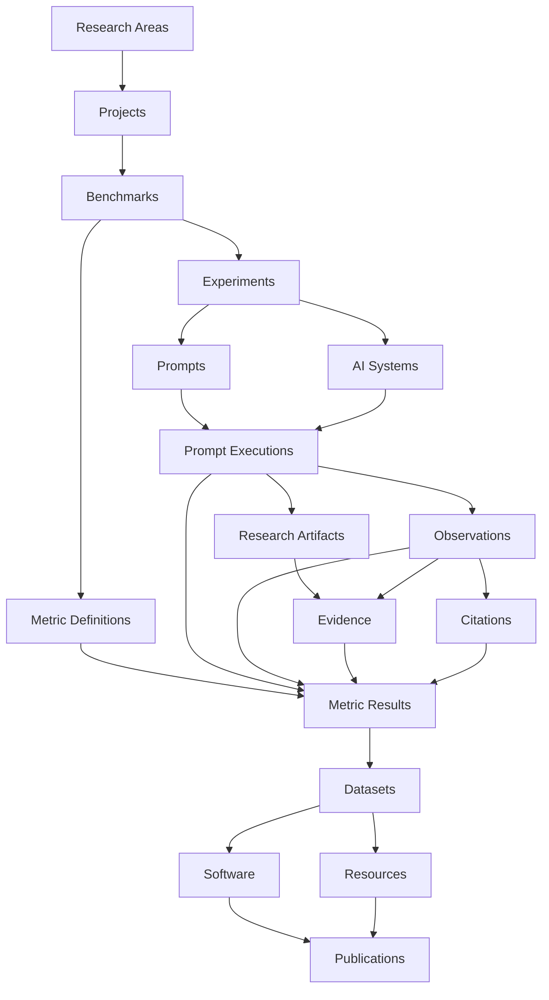

<p align="center">
  
</p>

<p align="center">
  <strong>Scientific infrastructure for Generative Search, Artificial Intelligence, GEO, benchmarks, evidence, versioned metrics and reproducible research.</strong>
</p>

<p align="center">
  <strong>English</strong> · <a href="./README.es.md">Español</a> · <a href="./docs/ESTADO_PROYECTO_ES.md">Current project status</a> · <a href="./docs/MANUAL_USUARIO_ES.md">Spanish user manual</a>
</p>

<p align="center">
  <a href="https://gslhub.com">Website</a> ·
  <a href="https://gslhub.com/research">Research</a> ·
  <a href="https://gslhub.com/benchmarks">Benchmarks</a> ·
  <a href="https://gslhub.com/dashboard">Scientific Dashboard</a> ·
  <a href="https://gslhub.com/publications">Publications</a> ·
  <a href="https://github.com/gslhub">GitHub organization</a>
</p>

<p align="center">
  
  
  
  
  
  
</p>

---

# GSLHub

**GSLHub — Generative Search Lab Hub** is an independent scientific platform for studying how generative AI systems discover, retrieve, interpret, cite, summarize and recommend digital information.

The platform connects projects, benchmarks, experiments, versioned prompts, AI-system profiles, controlled executions, observations, research artifacts, evidence, citations, versioned Metric Definitions, Metric Results, datasets, software, resources and publications inside one traceable infrastructure.

GSLHub is developed from Barcelona with an international research scope. The platform is currently in **Development Mode**: the scientific workflow is being validated with synthetic/development records before the irreversible transition to doctoral data collection.

## Project status — 14 August 2026

### Validated production stack

```text
GSLHub platform    0.5.5
Payload CMS        3.75.0
@payloadcms/next   3.75.0
Next.js            16.2.10
React / React DOM  19.2.7
MongoDB driver     6.21.0
Artifact storage   Persistent local Payload uploads outside deployment releases
Hosting            Hostinger
Database           MongoDB Atlas
```

Payload remains intentionally pinned at `3.75.0`. Framework upgrades must be tested on an isolated branch with the complete administrator and scientific workflow.

### Current milestone

| Area | Status | Current position |
| --- | --- | --- |
| Hosting and deployment | ✅ Operational | Automatic deployment from `main` to Hostinger works. |
| Payload administrator | ✅ Operational | Authentication, lists, forms, drafts, versions and governed workflows work in production. |
| Scientific data model | ✅ Operational | Execution → Artifact → Evidence → Observation → Citation/Metric provenance is implemented. |
| Research Environment | ✅ Implemented | Development Mode, TEST reset, Final Development Reset preview and irreversible Doctoral Research Mode gate are available. |
| Persistent artifact storage | ✅ Verified | Files are stored outside the deployment tree and survived Node.js restart and redeploy with identical SHA-256. |
| Backup/recovery drill | ✅ Verified | Controlled local artifact recovery completed and produced a permanent Storage Verification audit. |
| Metric methodology | ✅ Development validation complete | AIR, CR, MCP and RCR v0.1.0 passed deterministic checks and development review. |
| Metric governance | ✅ Implemented | Author technical review and independent-review fields are separated from formal validation. |
| Evidence provenance | ✅ Implemented | Evidence can link directly to one or more verified Research Artifacts from the same Prompt Execution. |
| First end-to-end execution | ✅ Completed | `GSL-EXEC-GEO-0001` completed with verified raw artifacts, validated evidence and validated observation. |
| Remaining reserved executions | ⏳ Planned | `GSL-EXEC-GEO-0002` through `0005` remain planned. |
| Final Development Reset | ⏳ Not executed | Development scientific records still exist and must be removed before doctoral activation. |
| Doctoral Research Mode | ⛔ Not activated | Real doctoral collection has not started. |

The detailed operational checkpoint is maintained in [docs/ESTADO_PROYECTO_ES.md](./docs/ESTADO_PROYECTO_ES.md).

## First end-to-end development execution

The first complete governed run has been closed successfully:

```text
GSL-EXEC-GEO-0001                  Completed / Published
├── GSL-ART-GEO-0001               Raw response TXT / SHA-256 verified
├── GSL-ART-GEO-0002               Screenshot / SHA-256 verified
├── GSL-EVD-GEO-0001               Response-export evidence / Validated
├── GSL-EVD-GEO-0002               Screenshot evidence / Validated
└── GSL-OBS-GEO-0001               Response-level observation / Validated
```

Observed response outcome:

```text
Response status            Partial response
Explicit citations         No
Source links               No
Sources panel              No
Visible citation count     0
```

This is **development-validation data**, not a doctoral finding.

The prompt used in `GSL-EXEC-GEO-0001` was a general source-selection question and did not define a specific target domain, brand or entity. Therefore target-specific AIR/CR/MCP results must not be fabricated for this execution. RCR requires multiple comparable executions before it is defined.

## Pilot metrics

Permanent definitions exist for:

| Code | Metric | Version | Development state |
| --- | --- | --- | --- |
| AIR | Answer Inclusion Rate | 0.1.0 | Deterministically tested and development-reviewed |
| CR | Citation Rate | 0.1.0 | Deterministically tested and development-reviewed |
| MCP | Mean Citation Position | 0.1.0 | Deterministically tested and development-reviewed |
| RCR | Response Consistency Rate | 0.1.0 | Deterministically tested and development-reviewed |

Synthetic calculator checks produced the expected test results. These checks are implementation evidence only and must not be reported as doctoral findings.

Target-specific calculators enforce governed input conditions. AIR and CR require a concrete `targetType + targetValue`; MCP requires codable citation positions; RCR requires multiple accepted comparable observations.

## Research Environment safety boundary

GSLHub separates development validation from doctoral research.

**Development Mode** permits:

- disposable `TEST-` workflows;
- synthetic metric checks;
- test reviewers;
- reset actions;
- development-only end-to-end executions.

Before real doctoral data collection, the administrator must run **Final Development Reset** and verify the clean baseline. Only then may **Doctoral Research Mode** be activated. Activation is intentionally irreversible from the application interface.

Current status:

```text
Research Environment       Development Mode
Final Development Reset    Not executed
Doctoral Research Mode     Not activated
```

## Persistent research artifacts

Production artifacts are stored outside the Node.js deployment/release directory:

```text
/home/<hostinger-user>/domains/gslhub.com/gslhub-data/research-artifacts
```

The controlled persistence test verified:

```text
Upload → HTTP 200
Node.js Restart → same file / same SHA-256 / HTTP 200
Redeploy → same file / same SHA-256 / HTTP 200
Recovery drill → restored file / same SHA-256
```

Operational backup scope includes:

```text
MongoDB database
persistent research-artifacts directory
production configuration required to reconstruct the application
```

S3-compatible object storage remains a future scaling option rather than a blocker for the current phase.

## Scientific architecture



## What remains before doctoral data collection

1. Finish the remaining development validation needed to prove repeatability across multiple executions.
2. Decide the role of `GSL-EXEC-GEO-0002` through `0005`: repeated general-prompt runs for RCR testing and/or replacement with an explicitly target-specific development protocol.
3. Run at least one complete target-specific development path so AIR, CR and MCP are tested end-to-end with real collection records rather than only deterministic synthetic fixtures.
4. Confirm multi-execution RCR behavior with accepted observations.
5. Review timestamp handling and ensure actual execution timestamps are captured correctly before snapshots seal.
6. Verify the Final Development Reset preview and preservation rules.
7. Execute Final Development Reset only when the product is considered ready for a clean doctoral baseline.
8. Confirm development executions, observations, citations, metrics and TEST researcher profiles are removed while permanent infrastructure audits remain preserved as designed.
9. Freeze the benchmark, experiment, target dictionary, prompt versions, AI-system profiles and codebooks for the doctoral protocol.
10. Activate Doctoral Research Mode.
11. Create and run the real doctoral pilot under the frozen protocol.
12. Preserve evidence, validate observations/citations, calculate real metrics and release the first doctoral dataset/protocol report.

## Local development

```bash
git clone https://github.com/gslhub/website.git
cd website
npm install
cp .env.example .env.local
npm run dev
```

Quality checks:

```bash
npm run lint
npm run typecheck
npm run build
```

Required environment variables include:

```env
NEXT_PUBLIC_SITE_URL=http://localhost:3000
PAYLOAD_SECRET=replace-with-a-long-random-secret
DATABASE_URL=mongodb+srv://<username>:<password>@<cluster-hostname>/?retryWrites=true&w=majority&appName=GSLHub
```

## Compatibility policy

Do not automatically upgrade the pinned Payload, Next.js or React packages and do not run `npm audit fix --force` against production. Test framework upgrades on a separate branch with the complete administrator workflow.

## Documentation

- [Current operational project status — Spanish](./docs/ESTADO_PROYECTO_ES.md)
- [Spanish user manual](./docs/MANUAL_USUARIO_ES.md)
- [First pilot protocol — Spanish](./docs/PROTOCOLO_PRIMER_PILOTO_ES.md)
- [Observation and citation codebook — Spanish](./docs/CODEBOOK_OBSERVACIONES_CITAS_ES.md)
- [Storage, backup and recovery procedure — Spanish](./docs/PROCEDIMIENTO_ALMACENAMIENTO_BACKUP_RECUPERACION_ES.md)
- [English changelog](./CHANGELOG.md)
- [Spanish changelog](./CHANGELOG.es.md)

## Contact

- Website: [gslhub.com](https://gslhub.com)
- GitHub: [github.com/gslhub](https://github.com/gslhub)
- Research email: [research@gslhub.com](mailto:research@gslhub.com)
- Founder and researcher: [Eduardo José Yauri Luna](https://www.linkedin.com/in/eduardoyauriluna/)

---

<p align="center">
  <strong>Research · Benchmarks · Evidence · Metric Definitions · Metric Results · Software · Datasets · Open Science</strong>
</p>

<p align="center">
  Last updated: 14 August 2026
</p>
