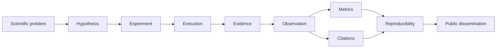

<p align="center">
  
</p>

<p align="center">
  <strong>Scientific infrastructure for Generative Search, GEO, governed evidence, metrics and reproducible AI research.</strong>
</p>

<p align="center">
  <strong>English</strong> · <a href="./README.es.md">Español</a> · <a href="./docs/ESTADO_PROYECTO_ES.md">Project status</a> · <a href="./docs/PROJECT-MATRIX.md">Project matrix</a> · <a href="./docs/DOCTORAL-DEMO.md">Doctoral demo</a>
</p>

<p align="center">
  <a href="https://gslhub.com">Website</a> ·
  <a href="https://gslhub.com/research">Research</a> ·
  <a href="https://gslhub.com/research-infrastructure">Research Infrastructure</a> ·
  <a href="https://gslhub.com/dashboard">Scientific Dashboard</a> ·
  <a href="https://github.com/gslhub">GitHub</a>
</p>

<p align="center">
  
  
  
  
  
</p>

---

# GSLHub

**GSLHub — Generative Search Lab Hub** is an independent applied-research platform for studying how generative AI systems discover, select, cite, summarize and recommend digital information.

The platform is being developed as research infrastructure for the doctoral line:

> **From SEO to GEO (Generative Engine Optimization): development and validation of a scientific model to optimize organizational visibility in AI-based generative search engines.**

GSLHub connects controlled experiments, prompt executions, observations, research artifacts, evidence, citations and governed metrics inside one auditable workflow.

## Current release — 0.6.2

Version `0.6.2` is the current **Doctoral-ready product baseline**.

It consolidates:

- responsive public frontend for mobile, tablet, laptop and desktop;
- responsive Payload administrator and scientific tables;
- custom Research Operations dashboard after CMS login;
- bilingual EN/ES Research Operations dashboard;
- light/dark theme support using Payload-native theme tokens;
- public bilingual Research Infrastructure demonstrator;
- direct private Research CMS access from the public frontend;
- public/private separation between dissemination and governed operations;
- deployment version-skew protection for Next.js assets;
- validated Hostinger cache-purge procedure after frontend redeploys.

No scientific schemas, metric calculators or governed research records were changed by the `0.6.x` UI hotfixes.

## GSLHub research model

GSLHub is designed around a simple scientific chain:



The complete operational matrix is preserved in **[docs/PROJECT-MATRIX.md](./docs/PROJECT-MATRIX.md)** so the system can be explained consistently in technical, scientific and doctoral contexts.

### Project matrix — compact view

| Layer | Scientific purpose | Operational output |
| --- | --- | --- |
| Scientific problem | Define what must be explained | Project / Benchmark scope |
| Hypothesis | State a testable expectation | Experiment hypothesis |
| Experiment | Define controlled method | Protocol, prompts, AI systems, repetitions |
| Execution | Run one governed trial | Prompt Execution snapshot |
| Evidence | Preserve the raw result | Research Artifact + Evidence |
| Observation | Code what was actually observed | Structured analytical record |
| Citations | Record source visibility | Source/domain and citation position |
| Metrics | Quantify outcomes | AIR, CR, MCP, RCR |
| Reproducibility | Prove integrity and repeatability | SHA-256, storage, recovery, lifecycle controls |
| Dissemination | Publish only safe outputs | Public dashboard / research pages |

## Five-minute academic explanation

The public Research Infrastructure demonstrator and the doctoral-demo runbook explain GSLHub through the same sequence:

```text
Problem
→ Hypothesis
→ Experiment
→ Execution
→ Evidence
→ Metrics
→ Reproducibility
```

Public demonstrator:

- English: `https://gslhub.com/research-infrastructure`
- Español: `https://gslhub.com/es/research-infrastructure`

Presentation runbook:

- **[docs/DOCTORAL-DEMO.md](./docs/DOCTORAL-DEMO.md)**

The public layer never needs to expose the full internal CMS schema or restricted research artifacts.

## Development regression — completed

The final internal regression generated and verified a complete disposable research pipeline:

```text
Full research pipeline TEST   PASS
├── 5 Prompt Executions
├── 5 Observations
├── 5 Research Artifacts
├── 5 Evidence records
├── 3 Citations
└── 4 synthetic Metric records

Deterministic calculators
├── AIR = 3/4 = 0.75   PASS
├── CR  = 2/4 = 0.50   PASS
├── MCP = 6/3 = 2.00   PASS
└── RCR = 3/4 = 0.75   PASS

TEST cleanup                PASS
```

All disposable TEST batches and their generated records were removed successfully after validation.

## Governed development pilot

The first complete development execution remains preserved as a non-doctoral validation record:

```text
GSL-EXEC-GEO-0001                  Completed / Published
├── GSL-ART-GEO-0001               Raw response / SHA-256 verified
├── GSL-ART-GEO-0002               Screenshot / SHA-256 verified
├── GSL-EVD-GEO-0001               Validated evidence
├── GSL-EVD-GEO-0002               Validated evidence
└── GSL-OBS-GEO-0001               Validated / Published observation
```

Reserved development executions remain untouched:

```text
GSL-EXEC-GEO-0002   Planned
GSL-EXEC-GEO-0003   Planned
GSL-EXEC-GEO-0004   Planned
GSL-EXEC-GEO-0005   Planned
```

These are **development-validation records**, not doctoral findings.

## Core scientific metrics

| Code | Metric | Version | Unit |
| --- | --- | --- | --- |
| AIR | Answer Inclusion Rate | 0.1.0 | proportion |
| CR | Citation Rate | 0.1.0 | proportion |
| MCP | Mean Citation Position | 0.1.0 | position |
| RCR | Response Consistency Rate | 0.1.0 | proportion |

Metric calculators enforce eligibility and provenance rules. Target-specific metrics are not created when the required target or evidence does not exist.

## Reproducibility and governance

GSLHub currently supports:

- versioned prompts, experiments and metric definitions;
- controlled repeated executions;
- immutable scientific snapshots after governed lifecycle transitions;
- direct Evidence ↔ Research Artifact provenance;
- persistent research-artifact storage outside deployment releases;
- SHA-256 integrity verification;
- quality-control and independent-review workflows;
- Development / Doctoral Research separation;
- controlled Final Development Reset;
- permanent storage-verification audits;
- documented restart, redeploy and recovery checks.

## Research CMS

Authorized researchers use the private Payload CMS for governed operations. The Research Operations dashboard provides a presentation-friendly entry point while keeping full operational depth available through the underlying collections.

Primary operational areas:

- Research Environment;
- Experiments and Prompts;
- AI Systems;
- Prompt Executions;
- Observations;
- Research Artifacts;
- Evidence;
- Citations;
- Metric Definitions;
- Metrics;
- Storage Verifications.

The dashboard follows the selected Payload locale and the active Payload light/dark theme.

## Persistent research artifacts

Production research artifacts are stored outside the Node.js deployment tree:

```text
/home/<hostinger-user>/domains/gslhub.com/gslhub-data/research-artifacts
```

Verified sequence:

```text
Upload → HTTP 200
Restart → same SHA-256 / HTTP 200
Redeploy → same SHA-256 / HTTP 200
Recovery drill → restored file / same SHA-256
```

## Production deployment note

GSLHub uses Next.js deployment versioning to reduce stale asset/version skew. Hostinger may additionally cache document responses outside the Node.js process.

Operational rule after frontend/CSS changes:

```text
Deploy main
→ build/restart succeeds
→ purge Hostinger server cache
→ purge Hostinger CDN cache when enabled
→ desktop smoke test
→ mobile smoke test
```

This procedure prevents stale cached HTML from referencing assets from a previous deployment.

## Current research boundary

```text
Research Environment       Development Mode
Final Development Reset    Not executed
Doctoral Research Mode     Not activated
Real doctoral data         0
```

GSLHub remains in Development Mode until the doctoral protocol is frozen and the Final Development Reset produces a clean baseline.

## Next phase

The immediate focus is academic preparation rather than additional product features:

1. prepare the doctoral proposal and research dossier;
2. prepare the research-oriented CV;
3. use GSLHub as the working demonstrator for thesis-supervisor discussions;
4. freeze research questions, hypotheses, target dictionary, prompts, AI-system profiles and codebooks;
5. preview and execute Final Development Reset;
6. verify a clean baseline;
7. activate Doctoral Research Mode;
8. begin real doctoral data collection.

## Validated production stack

```text
GSLHub platform    0.6.2
Payload CMS        3.75.0
Next.js            16.2.10
React              19.2.7
MongoDB driver     6.21.0
Database           MongoDB Atlas
Hosting            Hostinger
Artifact storage   Persistent local storage outside deployment releases
```

Framework versions remain intentionally pinned until upgrades pass the complete administrator and scientific workflow on an isolated branch.

## Local development

```bash
git clone https://github.com/gslhub/website.git
cd website
npm install
cp .env.example .env.local
npm run dev
```

Quality gate:

```bash
npm run lint
npm run typecheck
npm run build
```

## Documentation

### Project and presentation

- [Project matrix and research architecture](./docs/PROJECT-MATRIX.md)
- [Five-minute doctoral / supervisor demonstration](./docs/DOCTORAL-DEMO.md)
- [Current operational project status — Spanish](./docs/ESTADO_PROYECTO_ES.md)

### Scientific operations

- [Spanish user manual](./docs/MANUAL_USUARIO_ES.md)
- [First pilot protocol — Spanish](./docs/PROTOCOLO_PRIMER_PILOTO_ES.md)
- [Observation and citation codebook — Spanish](./docs/CODEBOOK_OBSERVACIONES_CITAS_ES.md)
- [Storage, backup and recovery procedure — Spanish](./docs/PROCEDIMIENTO_ALMACENAMIENTO_BACKUP_RECUPERACION_ES.md)
- [English changelog](./CHANGELOG.md)
- [Spanish changelog](./CHANGELOG.es.md)

## Contact

- Website: [gslhub.com](https://gslhub.com)
- GitHub: [github.com/gslhub](https://github.com/gslhub)
- Research email: [research@gslhub.com](mailto:research@gslhub.com)

---

<p align="center"><strong>Research · GEO · Evidence · Metrics · Reproducibility · Open Science</strong></p>
<p align="center">Last updated: 16 August 2026</p>
