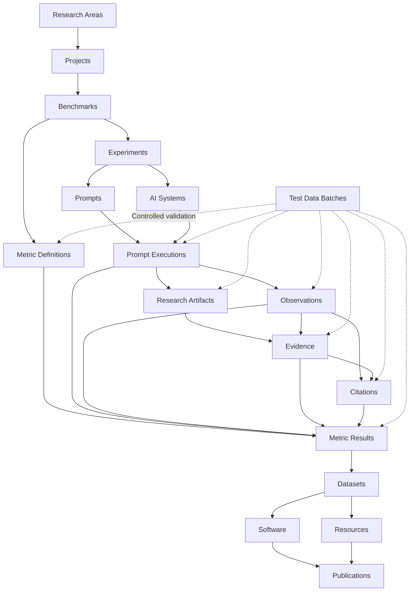

<p align="center">
  
</p>

<p align="center">
  <strong>Scientific infrastructure for Generative Search, Artificial Intelligence, GEO, benchmarks, evidence, versioned metrics and reproducible research.</strong>
</p>

<p align="center">
  <strong>English</strong>
  ·
  <a href="./README.es.md">Español</a>
  ·
  <a href="./docs/MANUAL_USUARIO_ES.md">Spanish user manual</a>
</p>

<p align="center">
  <a href="https://gslhub.com">Website</a>
  ·
  <a href="https://gslhub.com/research">Research</a>
  ·
  <a href="https://gslhub.com/benchmarks">Benchmarks</a>
  ·
  <a href="https://gslhub.com/dashboard">Scientific Dashboard</a>
  ·
  <a href="https://gslhub.com/publications">Publications</a>
  ·
  <a href="https://github.com/gslhub">GitHub organization</a>
</p>

<p align="center">
  
  
  
  
  
  
</p>

---

# GSLHub

**GSLHub — Generative Search Lab Hub** is an independent scientific platform for studying how generative artificial intelligence systems discover, retrieve, interpret, cite, summarize and recommend digital information.

The platform connects projects, benchmarks, experiments, versioned prompts, AI-system profiles, controlled executions, observations, research artifacts, evidence, citations, metric definitions, calculated metric results, datasets, software, methodological resources and publications inside one traceable infrastructure.

GSLHub is developed from Barcelona with an international research scope and currently supports the preparation of a doctoral research pilot on visibility and source selection in generative search systems.

## Project status — 31 July 2026

### Current conclusion

The production administrator is operational again after restoring the last validated compatibility set:

```text
Payload CMS       3.75.0
@payloadcms/next  3.75.0
Next.js           16.2.10
React             19.2.7
React DOM         19.2.7
MongoDB driver    6.21.0
Artifact storage  Local Payload uploads
```

The native Payload login, authenticated dashboard, collection lists, creation forms and existing records have been verified in production.

A later upgrade to Payload 3.86.0 caused the administrator to render an empty React Server Components boundary even though authentication, APIs and server data remained available. Reverting Payload packages to 3.75.0 restored the complete interface. These versions are therefore intentionally pinned until a future upgrade is tested separately.

### Status matrix

| Area | Status | Current position |
| --- | --- | --- |
| Production hosting and deployment | ✅ Operational | Automatic deployment from `main` to Hostinger works. |
| Native Payload administrator | ✅ Restored and verified | Login, dashboard, forms, lists and records work with Payload 3.75.0. |
| Scientific data model | ✅ Complete for pilot | Twenty connected collections cover the research and publication lifecycle. |
| Access, lifecycle and integrity rules | ✅ Implemented | Roles, code reservation, relationship validation and frozen scientific states are active. |
| Public website and catalogues | ✅ Operational | Research, benchmarks, publications, software, datasets, resources and people are connected. |
| Synthetic end-to-end testing | ✅ Core flow validated | The 27-record synthetic pipeline has been generated, inspected, deleted safely and repeated. |
| Metric governance | 🚧 Advanced | AIR, CR, MCP and RCR v0.1.0 exist as bilingual definitions under review. |
| Real pilot records | 🚧 Prepared | Project, benchmark, experiment, prompt and AI-system records exist; final scientific freeze is pending. |
| First controlled pilot | ⏳ Not started | Five real executions still need to be created and run. |
| Research artifact storage | ✅ Local strategy selected | Local Payload uploads are sufficient for the current doctoral phase. Persistence and recovery must still be tested. |
| Deterministic metric calculation | 🚧 Partly implemented | Administrative validation scenarios exist; final production calculators and verification tests remain pending. |
| Dataset and publication release | ⏳ Planned | Draft records exist, but no formal scientific release should be claimed yet. |
| Open-science release workflow | ⏳ Planned | ORCID, Zenodo, DOI, `CITATION.cff` and release metadata remain future work. |

## What is complete

- production Next.js application and MongoDB Atlas persistence;
- native Payload authentication and role-based access;
- bilingual scientific fields with English fallback;
- twenty Payload collections and their relationships;
- project, benchmark, experiment, prompt and AI-system lifecycle governance;
- controlled prompt executions with uniqueness rules;
- inherited scientific context across observations, artifacts, evidence, citations and metrics;
- reserved scientific code namespaces;
- automatic SHA-256 for uploaded research artifacts;
- append-only evidence chain-of-custody rules;
- immutable validated or released scientific snapshots;
- versioned Metric Definitions separated from calculated Metric Results;
- automatic methodological snapshots in Metric Results;
- canonical benchmark `metricDefinitions` exposure through the API;
- administrator-only Test Data Batches with rollback and cleanup;
- public catalogues and initial dashboard;
- Spanish user and scientific-governance manual;
- validated production compatibility configuration.

## What remains before the first real pilot

1. Review AIR, CR, MCP and RCR v0.1.0 field by field.
2. Confirm formulas, ranges, required inputs, aggregation, missing-data policy, assumptions and limitations.
3. Complete `Validated At` and `Validated By`, then move accepted definitions to `Validated`.
4. Finalize the observation and citation codebook.
5. Finalize inclusion, exclusion and quality-control rules.
6. Review and freeze the real project, benchmark, experiment, prompt and AI-system profile.
7. Confirm that `research-artifacts/` survives application restart and production redeployment.
8. Define and test a backup and restore procedure for MongoDB plus `research-artifacts/`.
9. Prepare the execution, capture and evidence checklist.
10. Create exactly five real planned Prompt Executions with `GSL-EXEC-` codes.
11. Run five isolated sessions under the frozen protocol.
12. Preserve the response and interface evidence for each run.
13. Code and review observations, citations and exclusions.
14. Calculate AIR, CR, MCP and RCR through deterministic procedures.
15. Review the complete round before preparing the first dataset and technical report.

S3-compatible object storage is **not a blocker for the current doctoral pilot**. It will be reconsidered when file volume, collaboration, availability or formal preservation requirements increase.

## Immediate next milestone

```text
Project:            GSL-GEO-BENCH-01
Benchmark:          GSL-BENCH-GEO-01 v0.1.0
Experiment:         GSL-EXP-GEO-001
Prompt:             GSL-PROMPT-GEO-001 v0.1.0
AI System:          GSL-AISYS-001
Metric Definitions: AIR / CR / MCP / RCR v0.1.0
Planned repetitions: 5
```

Recommended order:

1. validate the four Metric Definitions;
2. finish the observation and citation codebook;
3. verify local artifact persistence, backup and restore;
4. freeze the benchmark, experiment, prompt and AI-system profile;
5. create five real planned executions;
6. run the controlled round;
7. code observations, evidence and citations;
8. calculate and independently verify the four metrics;
9. prepare the first dataset, protocol release and technical report.

## Scientific architecture



The architecture preserves traceability from the research question and approved protocol to the evaluated system, exact prompt, execution, evidence, coded observations, source-level citations, metric definition, calculated result and released output.

## Payload collections

The production configuration registers **20 collections**.

| Group | Collections |
| --- | --- |
| Administration | Users, Test Data Batches |
| Research | Research Areas, Researchers, Projects, Benchmarks, Publications |
| Research Operations | Experiments, Prompts, AI Systems, Prompt Executions, Observations, Research Artifacts, Evidence, Citations, Metric Definitions, Metrics |
| Outputs | Software, Datasets, Resources |

All collections remain in Payload 3.75.0. MongoDB documents were not migrated or rewritten during the compatibility rollback.

## Central governance rule

GSLHub distinguishes an editable working document from a frozen scientific record.

Before validation or release, authorized users may correct the content. After validation or release, the historical record must be preserved. A later correction should use review notes, exclusion, deprecation, a new version, a new execution or a formal correction record rather than silently overwriting prior scientific history.

Detailed collection rules are documented in [`docs/MANUAL_USUARIO_ES.md`](./docs/MANUAL_USUARIO_ES.md).

## Scientific identifiers

Examples:

```text
GSL-EXEC-GEO-0001
GSL-OBS-GEO-0001
GSL-ART-GEO-0001
GSL-EVD-GEO-0001
GSL-CIT-GEO-0001
GSL-MDEF-AIR-0001
GSL-MET-GEO-0001
```

Codes are normalized, collection-specific, reserved when the record is created and immutable afterward. The `TEST-` namespace is reserved for administrator-controlled synthetic data.

## Controlled execution uniqueness

Two real executions cannot reserve the same combination:

```text
Experiment
Prompt
Prompt Version
AI System
Repetition Number
```

This prevents duplicate scientific conditions and accidental reuse of a repetition.

## Metric governance

A Metric Definition stores the versioned methodology: formula, valid range, inputs, aggregation, missing-data policy, rounding, assumptions, limitations and validation procedure.

A Metric Result stores a calculated value and automatically inherits an immutable snapshot of the linked definition. Real results must reference a `Validated` or `Active` definition.

Current pilot definitions:

| Metric | Purpose | Version | Current state |
| --- | --- | --- | --- |
| AIR | AI inclusion / appearance rate | 0.1.0 | Under review |
| CR | Citation rate | 0.1.0 | Under review |
| MCP | Mean citation position | 0.1.0 | Under review |
| RCR | Relevant citation rate | 0.1.0 | Under review |

## Administrator test-data framework

Implemented scenarios include:

- five pilot Prompt Execution drafts;
- a complete 27-record connected research pipeline;
- permanent pilot metric definitions;
- permanent real pilot execution reservations;
- disposable metric-definition review drafts;
- metric-definition linkage and calculated test results;
- benchmark metric-registry synchronization;
- deterministic AIR validation;
- deterministic CR validation;
- deterministic MCP validation;
- deterministic RCR validation.

Synthetic records remain draft or private, use `TEST-` identifiers and must never be presented as scientific findings.

## Research artifacts and local storage

The `research-artifacts` collection uses Payload's native local upload system:

```ts
upload: {
  staticDir: 'research-artifacts'
}
```

Supported artifacts include screenshots, PDF, HTML, JSON, JSON-LD, CSV, text, logs and ZIP archives. The workflow can normalize MIME types, calculate SHA-256, inherit execution context and restrict access.

For the current phase, operational backups must include:

```text
MongoDB database
research-artifacts/ directory
production environment variables
```

Before collecting irreplaceable pilot evidence, verify persistence across restart and redeployment and complete one documented restore test.

## Public website

| Route | Source | Status |
| --- | --- | --- |
| `/research` | Research Areas and Projects | ✅ Live |
| `/benchmarks` | Benchmarks and Metric Definitions | ✅ Live |
| `/dashboard` | Published operational records and validated metrics | ✅ Initial version |
| `/publications` | Publications | ✅ Live |
| `/software` | Software | ✅ Live |
| `/datasets` | Datasets | ✅ Live |
| `/resources` | Resources | ✅ Live |
| `/people` | Researchers | ✅ Live |

Drafts, private artifacts, `TEST-` data, under-review metric definitions and unvalidated calculations are intentionally excluded from public scientific claims.

## Roadmap

| Phase | Scope | Status |
| --- | --- | --- |
| 1 | Infrastructure and deployment | ✅ Complete |
| 2 | Scientific CMS and access model | ✅ Complete |
| 3 | Public website and catalogues | ✅ Complete |
| 4 | Research and analysis data models | ✅ Complete |
| 5 | Integrity, lifecycle and scientific snapshots | ✅ Complete |
| 6 | Test-data lifecycle and rollback | ✅ Core validation complete |
| 7 | Metric governance | 🚧 Scientific review pending |
| 8 | Local storage persistence and recovery | 🚧 Verification pending |
| 9 | Pilot protocol and codebook | 🚧 In progress |
| 10 | First five real executions | ⏳ Next operational milestone |
| 11 | Deterministic calculation and review | ⏳ Planned |
| 12 | Dataset, software and technical report | ⏳ Planned |
| 13 | ORCID, Zenodo, DOI and formal citation | ⏳ Planned |
| 14 | Comparative systems, languages and rounds | ⏳ Future scale-up |

## Technology stack

- Next.js 16.2.10;
- React and React DOM 19.2.7;
- TypeScript 5.9;
- Tailwind CSS 4.3.3;
- Payload CMS 3.75.0;
- MongoDB Atlas;
- Node.js crypto for SHA-256;
- GitHub;
- Hostinger Cloud;
- local Payload artifact storage.

## Compatibility policy

The currently validated set must not be upgraded automatically:

```text
payload
@payloadcms/next
@payloadcms/ui
@payloadcms/db-mongodb
@payloadcms/richtext-lexical
next
react
react-dom
```

Do not run `npm audit fix --force` against production without reviewing the resulting framework versions and testing the complete administrator on a separate branch.

The repository currently pins direct dependency versions, but does **not yet contain `package-lock.json`**. Creating and committing a validated lockfile is a remaining reproducibility task so transitive dependencies cannot change silently between deployments.

The compatibility incident and accepted rollback are documented in [`docs/COMPATIBILIDAD_PAYLOAD_NEXT_ES.md`](./docs/COMPATIBILIDAD_PAYLOAD_NEXT_ES.md).

## Repository structure

```text
.
├── app/                         Public site, dashboard, Payload and APIs
├── cms/
│   ├── access/                  Scientific access rules
│   ├── collections/             Scientific and administrative collections
│   ├── endpoints/               Administrator actions
│   ├── hooks/                   Lifecycle and integrity controls
│   ├── pilot/                   Controlled pilot preparation
│   ├── storage/                 Local artifact metadata
│   └── test-data/               Generation, validation and cleanup
├── components/                  Shared, brand and admin components
├── docs/                        Manuals and governance documentation
├── public/brand/                Brand assets
├── research-artifacts/          Local private uploads at runtime
├── payload.config.ts            Payload configuration
├── README.md                    English documentation
└── README.es.md                 Spanish documentation
```

## REST API

Public and authenticated Payload endpoints include:

```text
GET /api/research-areas
GET /api/researchers
GET /api/projects
GET /api/benchmarks
GET /api/experiments
GET /api/prompts
GET /api/ai-systems
GET /api/prompt-executions
GET /api/observations
GET /api/research-artifacts
GET /api/evidence
GET /api/citations
GET /api/metric-definitions
GET /api/metrics
GET /api/publications
GET /api/software
GET /api/datasets
GET /api/resources
```

Administrator-controlled generation:

```text
POST /api/test-data-batches/:id/generate
```

Anonymous access is restricted to published scientific content. Private research artifacts and draft operational records require authentication.

## Local development

```bash
git clone https://github.com/gslhub/website.git
cd website
npm install
cp .env.example .env.local
npm run dev
```

Required variables:

```env
NEXT_PUBLIC_SITE_URL=http://localhost:3000
PAYLOAD_SECRET=replace-with-a-long-random-secret
DATABASE_URL=mongodb+srv://<username>:<url-encoded-password>@<cluster-hostname>/?retryWrites=true&w=majority&appName=GSLHub
```

Quality checks:

```bash
npm run lint
npm run typecheck
npm run build
```

## Deployment notes

- production deploys automatically from `main` to Hostinger;
- use `next build` and `next start`;
- avoid overlapping rapid deployments;
- back up MongoDB and local artifacts before structural changes;
- test dependency upgrades in an isolated branch;
- confirm native login, dashboard, a collection list and a record form after every framework change.

## Documentation still to produce

- final observation and citation codebook;
- first-pilot execution and capture protocol;
- MongoDB and local-file backup and recovery procedure;
- deterministic metric calculation specification and verification tests;
- dataset export and anonymization guide;
- `CITATION.cff`;
- repository license;
- security policy;
- contribution guide and code of conduct.

## Citation

A repository-level `CITATION.cff` and formal archive workflow will be added before the first scholarly release.

Until then, cite the platform as:

```text
GSLHub — Generative Search Lab Hub. Independent scientific platform for generative search, GEO, artificial intelligence and reproducible research. https://gslhub.com
```

Do not assign a DOI, publication date or scholarly release status to draft or synthetic records.

## Contact

- Website: [gslhub.com](https://gslhub.com)
- Dashboard: [gslhub.com/dashboard](https://gslhub.com/dashboard)
- GitHub: [github.com/gslhub](https://github.com/gslhub)
- Research email: [research@gslhub.com](mailto:research@gslhub.com)
- Founder and researcher: [Eduardo José Yauri Luna](https://www.linkedin.com/in/eduardoyauriluna/)

---

<p align="center">
  <strong>Research · Benchmarks · Evidence · Metric Definitions · Metric Results · Software · Datasets · Open Science</strong>
</p>

<p align="center">
  Last updated: 31 July 2026
</p>
