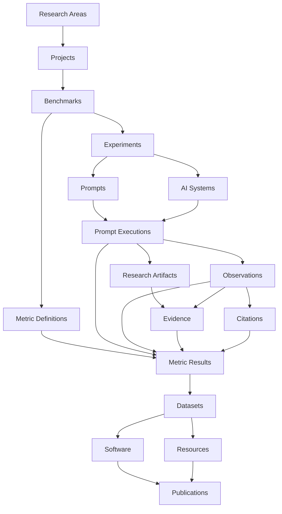

<p align="center">
  
</p>

<p align="center">
  <strong>Scientific infrastructure for Generative Search, Artificial Intelligence, GEO, benchmarks, evidence, versioned metrics and reproducible research.</strong>
</p>

<p align="center">
  <strong>English</strong> · <a href="./README.es.md">Español</a> · <a href="./docs/MANUAL_USUARIO_ES.md">Spanish user manual</a>
</p>

<p align="center">
  <a href="https://gslhub.com">Website</a> ·
  <a href="https://gslhub.com/research">Research</a> ·
  <a href="https://gslhub.com/benchmarks">Benchmarks</a> ·
  <a href="https://gslhub.com/dashboard">Scientific Dashboard</a> ·
  <a href="https://gslhub.com/publications">Publications</a> ·
  <a href="https://github.com/gslhub">GitHub organization</a>
</p>

<p align="center">
  
  
  
  
  
  
</p>

---

# GSLHub

**GSLHub — Generative Search Lab Hub** is an independent scientific platform for studying how generative AI systems discover, retrieve, interpret, cite, summarize and recommend digital information.

The platform connects projects, benchmarks, experiments, versioned prompts, AI-system profiles, controlled executions, observations, research artifacts, evidence, citations, Metric Definitions, Metric Results, datasets, software, resources and publications inside one traceable infrastructure.

GSLHub is developed from Barcelona with an international research scope and currently supports preparation of a doctoral pilot on visibility and source selection in generative search systems.

## Project status — 4 August 2026

### Validated production stack

```text
GSLHub platform    0.4.2
Payload CMS        3.75.0
@payloadcms/next   3.75.0
Next.js            16.2.10
React / React DOM  19.2.7
MongoDB driver     6.21.0
Artifact storage   Local Payload uploads
```

The native Payload administrator is operational in production. Payload remains intentionally pinned at `3.75.0`; upgrading to `3.86.0` caused an empty React Server Components boundary and was reverted.

### Current milestone

| Area | Status | Current position |
| --- | --- | --- |
| Hosting and deployment | ✅ Operational | Automatic deployment from `main` to Hostinger works. |
| Payload administrator | ✅ Operational | Native login, dashboard, lists and forms work. |
| Scientific data model | ✅ Pilot-ready | Twenty connected collections cover the research lifecycle. |
| Metric methodology | ✅ Initial review complete | AIR, CR, MCP and RCR have bilingual specifications and codebooks. |
| Permanent metric synchronization | ✅ Completed | Four permanent v0.1.0 definitions were synchronized in both locales. |
| Deterministic validation | ✅ Completed | AIR, CR, MCP and RCR produced the expected synthetic results. |
| TEST cleanup | ✅ Completed | Disposable Metric Results, executions, observations and citations were removed. |
| Permanent definitions | ✅ Preserved | AIR, CR, MCP and RCR remain `Under review` and `Draft`. |
| Author technical self-review | 🚧 Next action | Version 0.4.2 adds a governed permanent review action. |
| Independent scientific review | ⏳ Pending | A different researcher must review before formal validation. |
| Real pilot | ⏳ Not started | Five real controlled executions remain to be prepared and run. |
| Artifact persistence and recovery | 🚧 Pending | Restart, redeploy, backup and restore tests remain. |

## Verified pilot metrics

| Code | Metric | Deterministic result | State |
| --- | --- | --- | --- |
| AIR | Answer Inclusion Rate | `3 / 4 = 0.7500`, one reported exclusion | Under review |
| CR | Citation Rate | `2 / 4 = 0.5000`, one reported exclusion | Under review |
| MCP | Mean Citation Position | positions `1, 2, 3`; mean `2.00` | Under review |
| RCR | Response Consistency Rate | `none, low, low, high`; `3 / 4 = 0.7500` | Under review |

These values are synthetic calculator checks, not doctoral findings. Their `TEST-` records were deleted after inspection.

All four permanent definitions retain:

```text
Version: 0.1.0
Lifecycle Status: Under review
Editorial Status: Draft
Missing Data Policy: Report separately
Validated At: empty
Validated By: empty
```

## Technical review governance

Version 0.4.2 adds a dedicated `Technical Review` block to Metric Definitions. It separates author technical self-review from formal scientific validation.

The author technical review records:

- reviewer and date;
- deterministic validation status;
- metric-specific observed result;
- bilingual review notes;
- independent-review status.

Formal validation is blocked until:

1. the Technical Review is completed;
2. deterministic validation is `Passed`;
3. an independent researcher different from the author completes review;
4. formal `Validated At` and `Validated By` are populated.

While a definition is `planned` or `under-review`, Payload rejects attempts to fill `Validated At` or `Validated By`. Once validated, the technical review and protected scientific definition fields become immutable.

## Immediate next action

After version 0.4.2 compiles and deploys:

1. Open **Administration → Administrative Batches**.
2. Create a batch using:

```text
Record pilot metric author technical review — AIR, CR, MCP and RCR v0.1.0
```

3. Run the action.
4. Confirm `Status: Completed` and `Record Count: 4`.
5. Verify each definition contains:

```text
Technical Review Status: Completed
Review Mode: Author self-review
Reviewed By: Eduardo José Yauri Luna
Deterministic Validation Status: Passed
Independent Review Status: Pending
Lifecycle Status: Under review
Validated At / By: empty
```

Runbooks:

- [Metric synchronization and deterministic validation](./docs/metrics/PILOT_METRIC_SYNC_AND_VALIDATION.md)
- [Author technical review](./docs/metrics/PILOT_METRIC_TECHNICAL_REVIEW.md)
- [Spanish technical-review runbook](./docs/metrics/PILOT_METRIC_TECHNICAL_REVIEW_ES.md)

## Scientific architecture



## Payload collections

The production configuration registers 20 collections:

| Group | Collections |
| --- | --- |
| Administration | Users, Administrative Batches |
| Research | Research Areas, Researchers, Projects, Benchmarks, Publications |
| Research Operations | Experiments, Prompts, AI Systems, Prompt Executions, Observations, Research Artifacts, Evidence, Citations, Metric Definitions, Metrics |
| Outputs | Software, Datasets, Resources |

## Research artifacts

The current doctoral phase uses Payload local uploads:

```text
research-artifacts/
```

Operational backups must include:

```text
MongoDB database
research-artifacts/ directory
production environment variables
```

S3-compatible object storage is not a blocker for this phase and remains a future scaling option.

## What remains before the first real pilot

1. Deploy and record the author technical self-review.
2. Obtain independent scientific review of AIR, CR, MCP and RCR.
3. Complete formal metric validation.
4. Approve the AIR/CR target dictionary.
5. Approve the MCP citation surface and ordering convention.
6. Approve the RCR baseline and variation rules.
7. Verify local artifact persistence across restart and redeployment.
8. Test MongoDB and artifact backup/restore.
9. Freeze benchmark, experiment, prompt and AI-system profile.
10. Create exactly five real `GSL-EXEC-` executions.
11. Run five isolated sessions under the frozen protocol.
12. Preserve evidence, code observations and citations, and calculate real metrics.
13. Prepare the first dataset, protocol release and technical report.

## Local development

```bash
git clone https://github.com/gslhub/website.git
cd website
npm install
cp .env.example .env.local
npm run dev
```

Quality checks:

```bash
npm run lint
npm run typecheck
npm run build
```

Required environment variables:

```env
NEXT_PUBLIC_SITE_URL=http://localhost:3000
PAYLOAD_SECRET=replace-with-a-long-random-secret
DATABASE_URL=mongodb+srv://<username>:<password>@<cluster-hostname>/?retryWrites=true&w=majority&appName=GSLHub
```

## Compatibility policy

Do not automatically upgrade the pinned Payload, Next.js or React packages and do not run `npm audit fix --force` against production. Test framework upgrades on a separate branch with the complete administrator workflow.

The repository still needs a validated `package-lock.json` to freeze transitive dependencies.

## Changelog and documentation

- [English changelog](./CHANGELOG.md)
- [Spanish changelog](./CHANGELOG.es.md)
- [Spanish user manual](./docs/MANUAL_USUARIO_ES.md)
- [Payload/Next compatibility incident](./docs/COMPATIBILIDAD_PAYLOAD_NEXT_ES.md)

## Contact

- Website: [gslhub.com](https://gslhub.com)
- GitHub: [github.com/gslhub](https://github.com/gslhub)
- Research email: [research@gslhub.com](mailto:research@gslhub.com)
- Founder and researcher: [Eduardo José Yauri Luna](https://www.linkedin.com/in/eduardoyauriluna/)

---

<p align="center">
  <strong>Research · Benchmarks · Evidence · Metric Definitions · Metric Results · Software · Datasets · Open Science</strong>
</p>

<p align="center">
  Last updated: 4 August 2026
</p>
