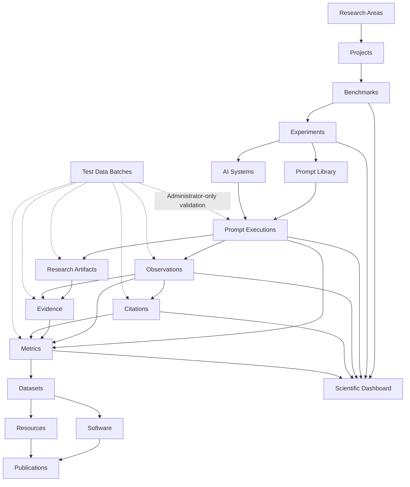

<p align="center">
  
</p>

<p align="center">
  <strong>Scientific infrastructure for Generative Search, Artificial Intelligence, GEO, benchmarks, evidence, metrics and reproducible research.</strong>
</p>

<p align="center">
  <a href="https://gslhub.com">Website</a>
  ·
  <a href="https://gslhub.com/research">Research</a>
  ·
  <a href="https://gslhub.com/benchmarks">Benchmarks</a>
  ·
  <a href="https://gslhub.com/dashboard">Scientific Dashboard</a>
  ·
  <a href="https://gslhub.com/publications">Publications</a>
  ·
  <a href="https://github.com/gslhub">GitHub organization</a>
</p>

<p align="center">
  
  
  
  
  
  
</p>

---

# GSLHub

**GSLHub — Generative Search Lab Hub** is an independent scientific platform for studying how generative artificial intelligence systems discover, retrieve, interpret, cite, summarize and recommend digital information.

The platform connects scientific project management, benchmark design, controlled experiments, versioned prompts, AI-system documentation, prompt executions, observations, uploaded research artifacts, evidence, citations, metrics, datasets, software, methodological resources and publications inside one traceable infrastructure.

GSLHub is based in Barcelona and is being developed with an international research scope.

> **Current stage — 26 July 2026:** the infrastructure, scientific CMS, public catalogues, operational research model, evidence upload workflow, integrity hooks, administrator test-data framework and public scientific dashboard are working. A complete synthetic research pipeline containing 27 connected records has been generated successfully in production. The next milestone is to validate full cleanup and then run the first real controlled pilot round.

## Mission

GSLHub develops transparent, reproducible and practice-led research in:

- generative search;
- Generative Engine Optimization (GEO);
- artificial intelligence;
- information retrieval;
- source selection and citation;
- digital transformation;
- process automation;
- open science and research software.

Its mission is to transform real-world questions about AI-mediated search into documented methods, measurable experiments, reusable datasets, research software and citable scientific outputs.

## Vision

GSLHub aims to become an independent international reference for research on visibility, retrieval, citation, recommendation and authority in generative search systems.

The platform is designed to support the full scientific lifecycle:

1. define research areas and projects;
2. design benchmarks and experiments;
3. version prompts and document AI systems;
4. execute controlled research runs;
5. preserve responses and uploaded evidence artifacts;
6. code observations and source-level citations;
7. calculate transparent metrics;
8. validate the workflow with disposable administrator-only test data;
9. release datasets, software and methodological resources;
10. publish reusable and citable scientific outputs.

## Research domains

| Domain | Scope |
| --- | --- |
| **Generative Search** | How AI-mediated search systems discover, synthesize and present information. |
| **Generative Engine Optimization (GEO)** | Technical, semantic and authority-related factors associated with visibility and citation in generative systems. |
| **Artificial Intelligence** | Language models, agents, retrieval systems and applied AI workflows. |
| **Information Retrieval** | Source discovery, ranking, selection, grounding and answer construction. |
| **Digital Transformation** | Organizational adoption and measurable impact of digital systems. |
| **Automation** | Process redesign, system integration and intelligent workflow orchestration. |
| **Open Science** | Reproducible methods, FAIR data, transparent versioning and citable research outputs. |

## Scientific architecture



The architecture preserves traceability from the research question and protocol to the evaluated system, exact prompt, individual execution, uploaded artifact, preserved evidence, coded observation, source citation, calculated metric and released output.

## Current platform status

### Payload CMS collections

The production Payload configuration currently registers **19 collections**: authentication, administrator test-data control and 17 connected scientific domains.

| Collection | Purpose | Current capability |
| --- | --- | --- |
| Users | Authentication and role management. | ✅ Operational |
| Test Data Batches | Administrator-only generation and safe cleanup of disposable sample data. | ✅ Operational |
| Research Areas | Scientific domains and thematic classification. | ✅ Operational |
| Researchers | Researcher profiles, roles and scholarly identifiers. | ✅ Operational |
| Projects | Objectives, methodology, lifecycle and research relationships. | ✅ Operational |
| Benchmarks | Evaluation frameworks, systems, protocols and core metrics. | ✅ Operational |
| Experiments | Research questions, hypotheses, variables and sampling design. | ✅ Operational |
| Prompts | Exact prompt wording, versions, constraints and validation metadata. | ✅ Operational |
| AI Systems | Providers, products, access modes, capabilities and observed versions. | ✅ Operational |
| Prompt Executions | Planned and completed runs, environment snapshots, responses and quality control. | ✅ Operational |
| Observations | Structured coding of response, citation and visibility outcomes. | ✅ Operational |
| Research Artifacts | Private uploaded files, provenance metadata and automatic SHA-256 integrity. | ✅ Operational |
| Evidence | Evidence metadata, checksums, preserved content and chain of custody. | ✅ Operational |
| Citations | Source-level citation extraction, normalization and verification. | ✅ Operational |
| Metrics | Versioned metric results, formulas, samples and reproducibility metadata. | ✅ Operational |
| Publications | Articles, reports, preprints and citation metadata. | ✅ Operational |
| Software | Research software, source availability, versions and releases. | ✅ Operational |
| Datasets | Data methodology, formats, availability and release metadata. | ✅ Operational |
| Resources | Protocols, guides, templates and methodological materials. | ✅ Operational |

### Cross-platform capabilities

| Capability | Status |
| --- | --- |
| English and Spanish localized scientific fields | ✅ Operational |
| Draft and publish workflow | ✅ Operational |
| Authenticated draft access and anonymous published-only access | ✅ Operational |
| Administrator, editor and researcher roles | ✅ Operational |
| Custom GSLHub Payload branding and logout workflow | ✅ Operational |
| MongoDB Atlas persistence | ✅ Operational |
| Public REST API | ✅ Operational |
| Public scientific catalogues | ✅ Operational |
| Public scientific dashboard | ✅ Operational |
| Planned-versus-completed execution lifecycle validation | ✅ Operational |
| Private research artifact uploads | ✅ Operational |
| Automatic artifact SHA-256 calculation | ✅ Operational |
| Scientific MIME normalization for text, CSV, HTML and JSON artifacts | ✅ Operational |
| Automatic artifact context inheritance from prompt executions | ✅ Operational |
| Administrator-only test-data generation and cleanup tracking | ✅ Operational |
| Full synthetic pipeline validation with 27 connected records | ✅ Validated in production |
| Automated real prompt execution | ⏳ Not implemented |
| Automated production metric engine | ⏳ Not implemented |
| S3-compatible permanent evidence archive | ⏳ Not implemented |
| Dataset and release export pipeline | ⏳ Not implemented |

## Administrator test-data framework

GSLHub includes a dedicated **Test Data Batches** collection for validating workflows without contaminating real research data.

Only users with the `admin` role can create, inspect, generate or remove test-data batches.

### Available scenarios

| Scenario | Generated records | Purpose |
| --- | ---: | --- |
| Pilot prompt executions | 5 | Validate planned execution records, lifecycle rules and draft visibility. |
| Full research pipeline | 27 | Validate completed executions, observations, uploads, evidence, citations and metrics end to end. |

The full-pipeline scenario creates:

```text
5 Prompt Executions
5 Observations
5 Research Artifacts
5 Evidence records
3 Citations
4 Metric results
────────────────────
27 connected records
```

### Generation lifecycle

Test-data creation is intentionally separated into two actions:

```text
Save batch
    ↓
Status: Pending generation
    ↓
Generate test data
    ↓
Status: Generated or Failed
```

The administrator action calls:

```text
POST /api/test-data-batches/:id/generate
```

This separation prevents a long generation process from interrupting the initial CMS document save and allows exact server errors to be displayed in the administration interface.

### Safety model

Every generated scientific code uses the owning batch prefix:

```text
TEST-<BATCH-CODE>-EXEC-0001
TEST-<BATCH-CODE>-OBS-0001
TEST-<BATCH-CODE>-ART-0001
TEST-<BATCH-CODE>-EVD-0001
TEST-<BATCH-CODE>-CIT-0001
TEST-<BATCH-CODE>-MET-0001
```

The batch stores the exact collection, document ID, scientific code and label for every generated record. Cleanup refuses to remove a document when its ID, collection or code no longer matches the tracked batch ownership.

Generated scientific records remain drafts and uploaded artifacts remain private. They do not appear in the public API or scientific dashboard.

When generation fails, partial records are rolled back. Failed batches can be retried. A generated batch cannot be generated twice accidentally.

Deleting a batch triggers reverse-order cleanup:

```text
Metrics
Citations
Evidence
Research Artifacts and uploaded files
Observations
Prompt Executions
```

### Validated synthetic results

The production full-pipeline test generates deterministic example results:

| Metric | Synthetic value |
| --- | ---: |
| AIR — Answer Inclusion Rate | 80% |
| CR — Citation Rate | 60% |
| MCP — Mean Citation Position | 2.0 |
| RCR — Response Consistency Rate | 80% |

These values exist only to test CMS relationships, formulas, workflow presentation and cleanup. They are not scientific findings.

## Evidence and integrity workflow

Research artifacts can preserve:

- screenshots;
- PDF documents;
- response exports;
- HTML snapshots;
- JSON and JSON-LD metadata;
- CSV tables;
- text logs;
- ZIP archives.

For every supported upload, GSLHub can:

1. normalize the MIME type when hosting environments provide a generic or charset-suffixed value;
2. calculate SHA-256 from the uploaded bytes;
3. store the checksum as read-only integrity metadata;
4. inherit project, benchmark, experiment, prompt, AI system and researcher from the linked prompt execution;
5. connect the artifact to observations and evidence records;
6. keep the file inaccessible to anonymous users.

The current production archive uses local private upload storage. Migration to a durable S3-compatible object store remains a priority before irreplaceable evidence is collected at scale.

## Current scientific assets

The first connected GSLHub research chain is prepared in the production CMS.

| Scientific object | Current record |
| --- | --- |
| Research area | Generative Search and GEO |
| Researcher | Eduardo José Yauri Luna |
| Project | GSLHub Generative Search Visibility Benchmark |
| Benchmark | GSLHub Generative Search Visibility Benchmark |
| Experiment | Pilot Validation of the GSLHub Generative Search Visibility Protocol |
| Prompt | Factors Influencing Source Selection in Generative Search |
| AI system | ChatGPT Search — authenticated web configuration |
| Publication | A Reproducible Protocol for Measuring Visibility in Generative Search Systems |
| Software | GSLHub Generative Search Benchmark Toolkit |
| Dataset | GSLHub Generative Search Visibility Benchmark Dataset |
| Resource | GSLHub Generative Search Visibility Benchmark Research Protocol |

Editorial and operational records remain drafts until their protocol, evidence, coding and quality-control requirements are complete. The public dashboard can therefore correctly display zero operational research records while private tests and initial catalogue records exist in the CMS.

## Public website

| Page | Data source | Status |
| --- | --- | --- |
| [`/research`](https://gslhub.com/research) | Research Areas and Projects | ✅ Live |
| [`/benchmarks`](https://gslhub.com/benchmarks) | Benchmarks | ✅ Live |
| [`/dashboard`](https://gslhub.com/dashboard) | Published operational records and validated metrics | ✅ Live |
| [`/publications`](https://gslhub.com/publications) | Publications | ✅ Live |
| [`/software`](https://gslhub.com/software) | Software | ✅ Live |
| [`/datasets`](https://gslhub.com/datasets) | Datasets | ✅ Live |
| [`/resources`](https://gslhub.com/resources) | Resources | ✅ Live |
| [`/people`](https://gslhub.com/people) | Researchers | ✅ Live |

The homepage, navigation, footer, sitemap, robots metadata, JSON-LD foundations, favicon and GSLHub brand system are also operational.

## Scientific dashboard

The public dashboard currently provides:

- published-record counters across the operational research pipeline;
- visibility into benchmarks, experiments, prompts, systems, executions, observations, evidence, citations and metrics;
- the latest validated and published metric results;
- metric code, version, category, direction, result, calculation date and sample size;
- a safe empty state before the first validated pilot release.

The dashboard intentionally excludes drafts, private test data and unvalidated calculations.

### Dashboard improvements planned

- benchmark and experiment filters;
- system, prompt, language and date comparisons;
- progress indicators for planned and completed repetitions;
- time-series and distribution charts;
- citation-domain rankings;
- drill-down pages for metrics, executions and sources;
- CSV, JSON and JSONL exports;
- an authenticated operations dashboard for internal workflow monitoring.

## Gap analysis

The platform now has a working scientific information architecture and a validated synthetic operational path. The remaining work is primarily **real-pilot governance, durable storage, immutability, automation, testing and formal release management**.

### Priority 0 — required before the first real pilot release

1. **Validate destructive cleanup completely**
   - Delete the successful 27-record test batch.
   - Confirm that all 27 documents disappear.
   - Confirm that all five uploaded artifact files are also removed.
   - Re-run the scenario once to confirm repeatability.

2. **Durable evidence storage**
   - Connect S3-compatible object storage or another versioned private archive.
   - Define bucket, path, retention and access policies.
   - Verify checksum preservation after upload, download and restore.

3. **Immutable research snapshots**
   - Freeze prompt snapshots after an execution starts.
   - Freeze completed response text, system metadata and execution timestamps.
   - Prevent silent edits to validated observations, citations and metric formulas.
   - Require a new version or correction record for material changes.

4. **Relationship and consistency hooks**
   - Artifact context inheritance is operational.
   - Extend equivalent inheritance and validation to evidence, citations and metrics.
   - Reject incompatible relationships across collections.
   - Validate the same prompt version and system condition throughout a controlled round.

5. **Composite uniqueness rules**
   - Prevent duplicate combinations of experiment, prompt, AI system and repetition number.
   - Reserve execution, observation, evidence, citation and metric codes safely.
   - Define deterministic names for exported artifacts.

6. **Protocol and codebook freeze**
   - Finalize inclusion and exclusion criteria.
   - Finalize the source-type taxonomy and citation-coding guide.
   - Freeze AIR, CR, MCP and RCR version `0.1.0`.
   - Define how partial responses, refusals, inaccessible sources and missing citations are handled.

7. **Backup and recovery verification**
   - Verify MongoDB backup and restore procedures.
   - Define evidence-archive backup retention.
   - Document recovery steps before collecting irreplaceable experimental evidence.

### Priority 1 — reproducible operations

1. **Execution runner**
   - Create a controlled execution service or adapter layer.
   - Support manual, assisted and API-based runs without mixing conditions.
   - Record timestamps, model labels, interface state and provider request identifiers automatically when available.

2. **Automated metrics engine**
   - Implement versioned scripts for AIR, CR, MCP and RCR.
   - Produce deterministic inputs, outputs, logs and checksums.
   - Store results only after the analytical sample and missing-data policy are explicit.

3. **Export pipeline**
   - Generate versioned CSV, JSON and JSONL packages.
   - Include a data dictionary, README, schema version, checksums and provenance metadata.
   - Produce release-ready archives for Zenodo or another public repository.

4. **Automated tests**
   - Add unit tests for formulas, MIME normalization, URL normalization and access rules.
   - Add integration tests for Payload relationships, uploads, cleanup and draft visibility.
   - Add end-to-end tests for CMS login, test-data generation, publication workflow and public pages.
   - Keep lint, type-check and production build checks in CI.

5. **Observability and operational controls**
   - Add structured application logs and error monitoring.
   - Monitor MongoDB connectivity, API errors and failed deployments.
   - Add uptime checks and deployment notifications.

### Priority 2 — scaling and open-science maturity

- Public detail pages for projects, benchmarks, experiments, datasets, software, publications and resources.
- Full public language switching and localized routes.
- ORCID synchronization and verified researcher identifiers.
- `CITATION.cff`, repository license, contribution policy, code of conduct and security policy.
- Zenodo integration and DOI release workflow.
- Schema.org metadata for `ScholarlyArticle`, `Dataset`, `SoftwareSourceCode` and research projects.
- Machine-readable provenance and dataset citation metadata.
- Public methodology changelog and release notes.
- Multi-researcher review and inter-rater reliability measurement.

## Architecture decisions before scaling

The current schema is suitable for the first pilot. Before running larger comparative studies, the following design decisions should be reviewed.

### Metric definitions versus metric results

The `metrics` collection currently stores both definition metadata and calculated results. At scale, separating **Metric Definitions** from **Metric Results** would avoid repeating formulas, directions and missing-data policies.

### Prompt families and immutable prompt versions

Payload versions preserve editorial history, but scientific referencing may benefit from separate immutable prompt-version records:

```text
Prompt Family → Prompt Version → Prompt Execution
```

### Execution rounds

A dedicated `Execution Rounds` collection would group systems, prompts, repetitions, dates and protocol versions more reliably than a free-text run label. Test Data Batches should remain exclusively for disposable validation data and must not become the real scientific execution-round model.

### Source and domain normalization

Citations currently preserve source fields directly. A normalized `Sources` or `Domains` catalogue could later support deduplication, authority analysis, publisher grouping and longitudinal citation histories.

### Rolling AI-system versions

Execution snapshots already preserve visible system metadata. A future `AI System Snapshots` entity could additionally document observed product changes across benchmark rounds.

## Immediate next milestone

The next milestone is the first real end-to-end pilot round for:

```text
Experiment: GSL-EXP-GEO-001
Prompt: GSL-PROMPT-GEO-001 v0.1.0
AI System: GSL-AISYS-001
Planned repetitions: 5
```

Recommended sequence:

1. delete the successful full-pipeline test batch and verify complete cleanup;
2. regenerate it once to confirm repeatability, then remove it again;
3. freeze the prompt, protocol, coding guide and metric definitions;
4. create five real planned execution records without the `TEST-` prefix;
5. execute the exact prompt in five isolated sessions;
6. preserve complete responses and interface evidence;
7. create one coded observation for each valid execution;
8. extract and verify every citation;
9. calculate AIR, CR, MCP and RCR using versioned scripts;
10. perform scientific review and document exclusions;
11. publish a versioned pilot dataset, protocol resource and technical report only after validation.

## Development roadmap

| Phase | Scope | Status |
| --- | --- | --- |
| **1. Infrastructure** | Domain, hosting, deployment, Next.js, Payload and MongoDB. | ✅ Complete |
| **2. Scientific CMS** | Core collections, relationships, localization, access and drafts. | ✅ Complete |
| **3. Public website** | CMS-connected catalogues, navigation, SEO and branding. | ✅ Complete |
| **4. Research data model** | Experiments, prompts, AI systems and prompt executions. | ✅ Complete |
| **5. Analysis data model** | Observations, evidence, citations and metrics. | ✅ Complete |
| **6. Scientific dashboard** | Published counters and validated metric presentation. | ✅ Initial version complete |
| **7. Evidence integrity** | Private uploads, MIME normalization, context inheritance and SHA-256. | ✅ Initial version complete |
| **8. Test-data validation** | Admin batches, explicit generation, rollback, tracking and 27-record scenario. | ✅ Validated in production |
| **9. Pilot operationalization** | Cleanup verification, protocol freeze and first five real executions. | 🚧 Current milestone |
| **10. Automation** | Execution adapters, metric scripts, exports and monitoring. | ⏳ Planned |
| **11. Publication pipeline** | Dataset, software, protocol and report releases. | ⏳ Planned |
| **12. Open-science integration** | ORCID, Zenodo, DOI and citation metadata. | ⏳ Planned |
| **13. Comparative scaling** | Multiple systems, languages, prompts and longitudinal rounds. | ⏳ Planned |

## Technology stack

### Application

- **Next.js 16.2.10** — App Router, server components and public routes.
- **React 19.2.7** — component-based user interface.
- **TypeScript 5.9** — application and CMS typing.
- **Tailwind CSS 4.3.3** — public design system and responsive layouts.

### Scientific CMS

- **Payload CMS 3.86.0** — collections, authentication, localization, access control, custom endpoints, versions, drafts and uploads.
- **Lexical** — structured rich-text editing.
- **Custom Payload branding** — GSLHub logo, icon, favicon, test-data actions and logout workflow.

### Data and files

- **MongoDB Atlas** — primary document database.
- **Payload MongoDB adapter** — persistence and scientific relationships.
- **Payload uploads** — current private local research-artifact storage.
- **Node.js crypto** — SHA-256 artifact integrity.

### Infrastructure

- **GitHub** — source control, CI and project organization.
- **GitHub Actions** — lint, type-check and production-build verification.
- **Hostinger Cloud** — production hosting and automatic deployment from `main`.
- **gslhub.com** — production domain.

## Repository structure

```text
.
├── app/
│   ├── (site)/                    Public GSLHub website and dashboard
│   ├── (payload)/                 Payload admin, API and committed import map
│   ├── api/                       Application-specific endpoints
│   ├── globals.css                Public design system
│   ├── sitemap.ts                 Public route sitemap
│   └── layout.tsx                 Root metadata and global layout
├── cms/
│   ├── access/                    Scientific access-control helpers
│   ├── collections/               Payload scientific and administration collections
│   ├── endpoints/                 Custom administrator actions
│   ├── hooks/                     Lifecycle, inheritance and integrity hooks
│   └── test-data/                 Disposable test-data generation and cleanup
├── components/
│   ├── admin/                     Payload admin custom controls
│   ├── brand/                     Reusable logo and icon components
│   └── ...                        Shared public interface components
├── scripts/                       Controlled administrative scripts
├── public/
│   └── brand/                     Vector logo and icon assets
├── .github/workflows/ci.yml       Lint, type-check and build workflow
├── .env.example                   Environment-variable template
├── payload.config.ts              Payload configuration and collection registry
├── package.json                   Scripts, version and dependencies
├── tsconfig.json                  TypeScript configuration
└── README.md                      Project status and scientific roadmap
```

## Data and access model

GSLHub separates editorial lifecycle, internal validation and public scientific availability.

- Authenticated researchers and editors can create and update scientific records.
- Administrators control destructive actions, users and test-data batches.
- Draft documents remain available inside the authenticated CMS.
- Anonymous API and website requests only receive published records.
- Research artifacts require authenticated access even when related metadata is later published.
- Test data remains draft or private and is identified by batch-owned `TEST-` codes.
- Localized fields support English and Spanish with English fallback.
- Scientific entities are connected through explicit Payload relationships.
- Custom CORS and CSRF origins trust the production GSLHub domains.
- The GSLHub authentication cookie uses a dedicated prefix.

## REST API

Published scientific records are available through Payload REST endpoints:

```text
GET /api/research-areas
GET /api/researchers
GET /api/projects
GET /api/benchmarks
GET /api/experiments
GET /api/prompts
GET /api/ai-systems
GET /api/prompt-executions
GET /api/observations
GET /api/evidence
GET /api/citations
GET /api/metrics
GET /api/publications
GET /api/software
GET /api/datasets
GET /api/resources
```

Authenticated research-artifact access:

```text
GET /api/research-artifacts
```

Administrator-only test-data generation:

```text
POST /api/test-data-batches/:id/generate
```

Localized responses can be requested with:

```text
GET /api/publications?locale=en
GET /api/publications?locale=es
```

The public API intentionally excludes draft content and private test data.

## Local development

### Requirements

- Node.js `>=20.9.0`
- npm `10.9.2` or compatible
- MongoDB or a MongoDB Atlas cluster

### Installation

```bash
git clone https://github.com/gslhub/website.git
cd website
npm install
cp .env.example .env.local
```

Required variables:

```env
NEXT_PUBLIC_SITE_URL=http://localhost:3000
PAYLOAD_SECRET=replace-with-a-long-random-secret
DATABASE_URL=mongodb+srv://<username>:<url-encoded-password>@<cluster-hostname>/?retryWrites=true&w=majority&appName=GSLHub
```

The application selects the `gslhub` database in `payload.config.ts`.

Start the development server:

```bash
npm run dev
```

Open:

- Website: `http://localhost:3000`
- Payload admin: `http://localhost:3000/admin`
- Scientific dashboard: `http://localhost:3000/dashboard`
- REST API example: `http://localhost:3000/api/research-areas`

### Quality checks

```bash
npm run lint
npm run typecheck
npm run build
```

The repository currently has CI for these three checks. Automated unit, integration and end-to-end tests are still pending.

An idempotent pilot execution seed script also remains available:

```bash
npm run seed:pilot-executions
```

The CMS Test Data Batches workflow is preferred for disposable validation because it tracks ownership and supports safe cleanup.

## Deployment notes

- Production deploys automatically from the `main` branch to Hostinger Cloud.
- The production build command remains `next build`.
- Do not add `payload generate:importmap` to the Hostinger build without retesting Node.js ESM behaviour.
- Payload admin custom components use the committed import map.
- `app/globals.css` must be imported only from the root application layout.
- Avoid overlapping rapid deployments. Allow each Hostinger deployment to finish before pushing another production change.
- Do not apply dependency updates or `npm audit fix --force` without reviewing Payload, Next.js and React compatibility together.
- Build warnings from `npm audit` must be evaluated separately from TypeScript or production build failures.

## Scientific principles

### Reproducibility

Protocols, prompts, systems, metrics, evidence and datasets should be sufficiently documented to support independent replication.

### Transparency

Methodological decisions, exclusions, limitations, test data and version changes should remain traceable.

### Versioning

Prompts, protocols, datasets, software, AI-system conditions and metrics should use explicit versions instead of silently changing historical research objects.

### FAIR data

Released datasets should be findable, accessible, interoperable and reusable whenever legal and ethical conditions allow it.

### Research integrity

The platform distinguishes planned work, synthetic validation data, work in progress, captured evidence, validated results and formally released scientific outputs.

### Responsible openness

Open access is a goal, but personal, confidential, restricted, copyrighted or non-redistributable information must not be exposed.

### Human review

Automated collection and analysis must remain subject to documented validation and human scientific oversight.

## Open-science and governance roadmap

Planned repository and release assets include:

- `CITATION.cff`;
- repository license;
- `CONTRIBUTING.md`;
- code of conduct;
- security policy;
- data-management plan;
- research ethics and responsible-AI statement;
- authorship and contributor taxonomy;
- Zenodo release workflow;
- DOI metadata;
- machine-readable dataset and software citations;
- release archives and checksums.

The repository is currently private and no repository-wide license has been formalized. Repository access alone must not be interpreted as permission to copy, modify or redistribute the code.

## Citation

A repository-level `CITATION.cff` and Zenodo workflow will be added before the first formal software or research release.

Until then, cite the public platform as:

```text
GSLHub — Generative Search Lab Hub. Independent scientific platform for generative search, GEO, artificial intelligence and reproducible research. https://gslhub.com
```

Do not assign a DOI, publication date or scholarly release status to draft or synthetic test records that have not completed the formal publication workflow.

## Contact

- Website: [gslhub.com](https://gslhub.com)
- Dashboard: [gslhub.com/dashboard](https://gslhub.com/dashboard)
- GitHub: [github.com/gslhub](https://github.com/gslhub)
- Research email: [research@gslhub.com](mailto:research@gslhub.com)
- Founder and researcher: [Eduardo José Yauri Luna](https://www.linkedin.com/in/eduardoyauriluna/)

---

<p align="center">
  <strong>Research · Benchmarks · Evidence · Metrics · Software · Datasets · Open Science</strong>
</p>

<p align="center">
  Last updated: 26 July 2026
</p>
