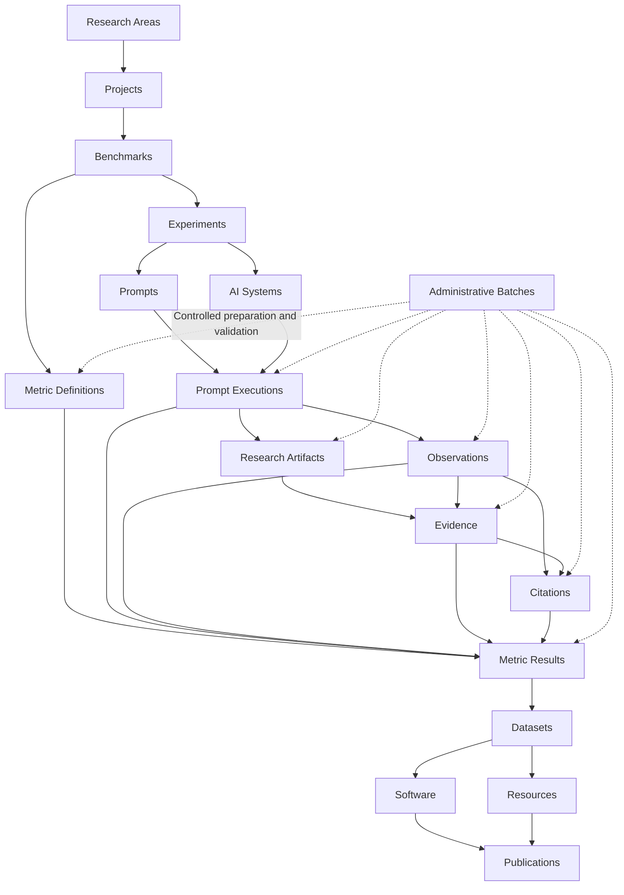

<p align="center">
  
</p>

<p align="center">
  <strong>Scientific infrastructure for Generative Search, Artificial Intelligence, GEO, benchmarks, evidence, versioned metrics and reproducible research.</strong>
</p>

<p align="center">
  <strong>English</strong> · <a href="./README.es.md">Español</a> · <a href="./docs/MANUAL_USUARIO_ES.md">Spanish user manual</a>
</p>

<p align="center">
  <a href="https://gslhub.com">Website</a> ·
  <a href="https://gslhub.com/research">Research</a> ·
  <a href="https://gslhub.com/benchmarks">Benchmarks</a> ·
  <a href="https://gslhub.com/dashboard">Scientific Dashboard</a> ·
  <a href="https://gslhub.com/publications">Publications</a> ·
  <a href="https://github.com/gslhub">GitHub organization</a>
</p>

<p align="center">
  
  
  
  
  
  
</p>

---

# GSLHub

**GSLHub — Generative Search Lab Hub** is an independent scientific platform for studying how generative AI systems discover, retrieve, interpret, cite, summarize and recommend digital information.

The platform connects research projects, benchmarks, experiments, versioned prompts, AI-system profiles, controlled executions, observations, research artifacts, evidence, citations, metric definitions, calculated results, datasets, software, methodological resources and publications in one traceable system.

GSLHub is developed from Barcelona with an international scope and is currently preparing its first doctoral research pilot on visibility and source selection in generative search systems.

## Project status — 4 August 2026

### Validated production stack

```text
GSLHub platform    0.4.1
Payload CMS        3.75.0
@payloadcms/next   3.75.0
Next.js            16.2.10
React / React DOM  19.2.7
MongoDB driver     6.21.0
Artifact storage   Local Payload uploads
```

The native Payload login, authenticated dashboard, collection lists, forms and existing records are operational in production. Payload packages remain pinned at `3.75.0`; upgrading to `3.86.0` caused the administrator to render an empty React Server Components boundary and was reverted.

### Status matrix

| Area | Status | Current position |
| --- | --- | --- |
| Hosting and deployment | ✅ Operational | Automatic deployment from `main` to Hostinger works. |
| Payload administrator | ✅ Restored | Native login, dashboard, forms and records work with Payload 3.75.0. |
| Scientific data model | ✅ Pilot-ready | Twenty connected collections cover the research and publication lifecycle. |
| Access and integrity | ✅ Implemented | Roles, identifiers, relationship validation, snapshots and frozen states are active. |
| Public website | ✅ Operational | Research, benchmarks, publications, software, datasets, resources and people are connected. |
| Synthetic pipeline | ✅ Core flow tested | The connected 27-record workflow can be generated and cleaned safely. |
| Metric methodology | ✅ Initial review complete | AIR, CR, MCP and RCR have bilingual reviews, codebooks and Payload update sheets. |
| Metric synchronization | 🚧 Deployment pending | A centralized registry and idempotent permanent synchronization service are in `main`. |
| Deterministic calculators | 🚧 Execution pending | AIR, CR, MCP and RCR scenarios exist; they must be run after the 0.4.1 deployment. |
| Real pilot context | 🚧 Prepared | Project, benchmark, experiment, prompt and AI-system records exist; final freeze is pending. |
| First controlled pilot | ⏳ Not started | Five real controlled executions still need to be created and run. |
| Artifact persistence | 🚧 Verification pending | Local storage is selected; restart, redeploy, backup and restore tests remain. |
| Dataset and publication release | ⏳ Planned | No formal scientific release should be claimed yet. |

## Completed capabilities

- Next.js production application with MongoDB Atlas persistence;
- native Payload authentication and role-based access;
- bilingual scientific fields with English fallback;
- twenty Payload collections with governed relationships;
- controlled executions with uniqueness rules;
- inherited scientific context across observations, artifacts, evidence, citations and metrics;
- reserved and immutable scientific identifiers;
- SHA-256 integrity for research artifacts and metric inputs/outputs;
- append-only evidence chain of custody;
- immutable validated or released scientific snapshots;
- versioned Metric Definitions separated from calculated Metric Results;
- automatic definition snapshots inherited by Metric Results;
- administrator-controlled data generation, rollback and cleanup;
- public catalogues and an initial scientific dashboard;
- reviewed AIR, CR, MCP and RCR v0.1.0 methodology in English and Spanish;
- centralized code registry for the four pilot metrics;
- permanent create-or-synchronize workflow that never overwrites frozen definitions;
- deterministic validation scenarios for all four metrics;
- local research-artifact storage for the current doctoral phase.

## Immediate operational sequence

1. Deploy and compile version `0.4.1`.
2. Run **Permanent pilot metric definitions** from Administrative Batches.
3. Confirm four synchronized records, both locales and `Missing Data Policy = Report separately`.
4. Run AIR, CR, MCP and RCR deterministic scenarios separately.
5. Confirm expected results, inherited snapshots and stable checksums.
6. Clean the disposable `TEST-` batches.
7. Complete independent scientific review and only then populate `Validated At` and `Validated By`.

Detailed instructions:

- [English synchronization and validation runbook](./docs/metrics/PILOT_METRIC_SYNC_AND_VALIDATION.md)
- [Spanish synchronization and validation runbook](./docs/metrics/PILOT_METRIC_SYNC_AND_VALIDATION_ES.md)

## Pilot metrics

| Code | Metric | Purpose | Precision | State |
| --- | --- | --- | ---: | --- |
| AIR | Answer Inclusion Rate | Proportion of eligible responses that visibly include the target | 4 | Under review |
| CR | Citation Rate | Proportion of eligible executions that visibly cite the target | 4 | Under review |
| MCP | Mean Citation Position | Mean first target-citation position within a frozen surface | 2 | Under review |
| RCR | Response Consistency Rate | Proportion of comparisons classified as `none` or `low` variation | 4 | Under review |

All four definitions use:

```text
Missing Data Policy: Report separately
Open Methodology: true
Lifecycle Status: Under review
Validated At: empty
Validated By: empty
```

Formal validation freezes protected scientific fields. Later methodological changes require a new semantic version rather than overwriting v0.1.0.

## Expected deterministic results

```text
AIR  3 / 4 = 0.7500, with one reported exclusion
CR   2 / 4 = 0.5000
MCP  positions 1, 2, 3 → 6 / 3 = 2.00
RCR  none, low, low, high → 3 / 4 = 0.7500
```

These are synthetic calculator checks, not doctoral findings.

## What remains before the real pilot

1. Deploy and execute metric synchronization.
2. Run and independently review all four deterministic scenarios.
3. Approve the target dictionary used by AIR and CR.
4. Approve the primary citation surface and ordering convention used by MCP.
5. Approve the RCR baseline rule and response-variation codebook.
6. Validate the four Metric Definitions with date and researcher attribution.
7. Finalize inclusion, exclusion and quality-control rules.
8. Verify persistence of `research-artifacts/` across restart and redeployment.
9. Test backup and restoration of MongoDB plus local artifacts.
10. Review and freeze the benchmark, experiment, prompt and AI-system profile.
11. Prepare the execution, capture and evidence checklist.
12. Create exactly five real `GSL-EXEC-` Prompt Executions.
13. Run five isolated sessions under the frozen protocol.
14. Preserve response and interface evidence.
15. Code and review observations and citations.
16. Calculate and independently verify the four real metrics.
17. Prepare the first dataset, protocol release and technical report.

S3-compatible object storage is **not a blocker** for this phase. It will be reconsidered when volume, collaboration, availability or preservation requirements increase.

## Scientific architecture



Traceability is preserved from the research question and frozen protocol to the system, prompt, execution, evidence, coding, citation, metric definition, calculated result and released output.

## Payload collections

The production configuration registers **20 collections**.

| Group | Collections |
| --- | --- |
| Administration | Users, Test Data Batches |
| Research | Research Areas, Researchers, Projects, Benchmarks, Publications |
| Research Operations | Experiments, Prompts, AI Systems, Prompt Executions, Observations, Research Artifacts, Evidence, Citations, Metric Definitions, Metrics |
| Outputs | Software, Datasets, Resources |

## Scientific identifiers

```text
GSL-EXEC-GEO-0001
GSL-OBS-GEO-0001
GSL-ART-GEO-0001
GSL-EVD-GEO-0001
GSL-CIT-GEO-0001
GSL-MDEF-AIR-0001
GSL-MET-GEO-0001
```

Codes are normalized, collection-specific, reserved at creation and immutable afterward. The `TEST-` namespace is reserved for administrator-controlled synthetic data.

## Research artifacts and local storage

```ts
upload: {
  staticDir: 'research-artifacts'
}
```

Operational backups must include:

```text
MongoDB database
research-artifacts/ directory
production environment variables
```

Before collecting irreplaceable pilot evidence, complete one restart/redeployment persistence test and one documented restore test.

## Public routes

| Route | Source | Status |
| --- | --- | --- |
| `/research` | Research Areas and Projects | ✅ Live |
| `/benchmarks` | Benchmarks and Metric Definitions | ✅ Live |
| `/dashboard` | Published operational records and validated metrics | ✅ Initial version |
| `/publications` | Publications | ✅ Live |
| `/software` | Software | ✅ Live |
| `/datasets` | Datasets | ✅ Live |
| `/resources` | Resources | ✅ Live |
| `/people` | Researchers | ✅ Live |

Drafts, private artifacts, `TEST-` records, under-review definitions and unvalidated calculations are excluded from public scientific claims.

## Technology stack

- Next.js 16.2.10;
- React and React DOM 19.2.7;
- TypeScript 5.9;
- Tailwind CSS 4.3.3;
- Payload CMS 3.75.0;
- MongoDB Atlas;
- Node.js crypto for SHA-256;
- GitHub and Hostinger Cloud;
- local Payload artifact storage.

## Compatibility policy

The validated framework set must not be upgraded automatically:

```text
payload
@payloadcms/next
@payloadcms/ui
@payloadcms/db-mongodb
@payloadcms/richtext-lexical
next
react
react-dom
```

Do not run `npm audit fix --force` against production. Test dependency upgrades on a separate branch and verify native login, dashboard, lists and forms before promotion.

The repository pins direct dependency versions but does **not yet contain `package-lock.json`**. A validated lockfile remains a reproducibility task.

See [Payload/Next compatibility incident](./docs/COMPATIBILIDAD_PAYLOAD_NEXT_ES.md).

## Local development

```bash
git clone https://github.com/gslhub/website.git
cd website
npm install
cp .env.example .env.local
npm run dev
```

Required variables:

```env
NEXT_PUBLIC_SITE_URL=http://localhost:3000
PAYLOAD_SECRET=replace-with-a-long-random-secret
DATABASE_URL=mongodb+srv://<username>:<url-encoded-password>@<cluster-hostname>/?retryWrites=true&w=majority&appName=GSLHub
```

Quality checks:

```bash
npm run lint
npm run typecheck
npm run build
```

## Repository structure

```text
.
├── app/                         Public site, dashboard, Payload and APIs
├── cms/
│   ├── access/                  Scientific access rules
│   ├── collections/             Scientific and administrative collections
│   ├── endpoints/               Administrator actions
│   ├── hooks/                   Lifecycle and integrity controls
│   ├── metrics/                 Calculators and reviewed metric registry
│   ├── pilot/                   Permanent pilot preparation
│   ├── storage/                 Local artifact metadata
│   └── test-data/               Synthetic validation and cleanup
├── components/                  Shared, brand and admin components
├── docs/                        Manuals, reviews, codebooks and runbooks
├── public/brand/                Brand assets
├── research-artifacts/          Local private uploads at runtime
├── CHANGELOG.md                 English change history
├── CHANGELOG.es.md              Spanish change history
├── payload.config.ts            Payload configuration
├── README.md                    English documentation
└── README.es.md                 Spanish documentation
```

## Documentation

- [Spanish user and governance manual](./docs/MANUAL_USUARIO_ES.md)
- [Metric synchronization runbook](./docs/metrics/PILOT_METRIC_SYNC_AND_VALIDATION.md)
- [Runbook in Spanish](./docs/metrics/PILOT_METRIC_SYNC_AND_VALIDATION_ES.md)
- [Metric reviews](./docs/metrics/)
- [Operational codebooks](./docs/codebooks/)
- [English changelog](./CHANGELOG.md)
- [Spanish changelog](./CHANGELOG.es.md)

## Roadmap

| Phase | Scope | Status |
| --- | --- | --- |
| 1–6 | Infrastructure, CMS, public site, integrity and synthetic lifecycle | ✅ Complete |
| 7 | Metric methodology and codebooks | ✅ Initial review complete |
| 8 | Permanent synchronization and deterministic execution | 🚧 Current milestone |
| 9 | Local persistence, backup and restore | 🚧 Pending verification |
| 10 | Protocol freeze and five real executions | ⏳ Next operational phase |
| 11 | Real calculation and independent review | ⏳ Planned |
| 12 | Dataset, software and technical report | ⏳ Planned |
| 13 | ORCID, Zenodo, DOI and formal citation | ⏳ Planned |
| 14 | Comparative systems, languages and rounds | ⏳ Future scale-up |

## Citation

A repository-level `CITATION.cff` and formal archive workflow will be added before the first scholarly release.

Until then:

```text
GSLHub — Generative Search Lab Hub. Independent scientific platform for generative search, GEO, artificial intelligence and reproducible research. https://gslhub.com
```

Do not assign a DOI, publication date or scholarly release status to draft or synthetic records.

## Contact

- Website: [gslhub.com](https://gslhub.com)
- Dashboard: [gslhub.com/dashboard](https://gslhub.com/dashboard)
- GitHub: [github.com/gslhub](https://github.com/gslhub)
- Research email: [research@gslhub.com](mailto:research@gslhub.com)
- Founder and researcher: [Eduardo José Yauri Luna](https://www.linkedin.com/in/eduardoyauriluna/)

---

<p align="center">
  <strong>Research · Benchmarks · Evidence · Metric Definitions · Metric Results · Software · Datasets · Open Science</strong>
</p>

<p align="center">
  Last updated: 4 August 2026
</p>
