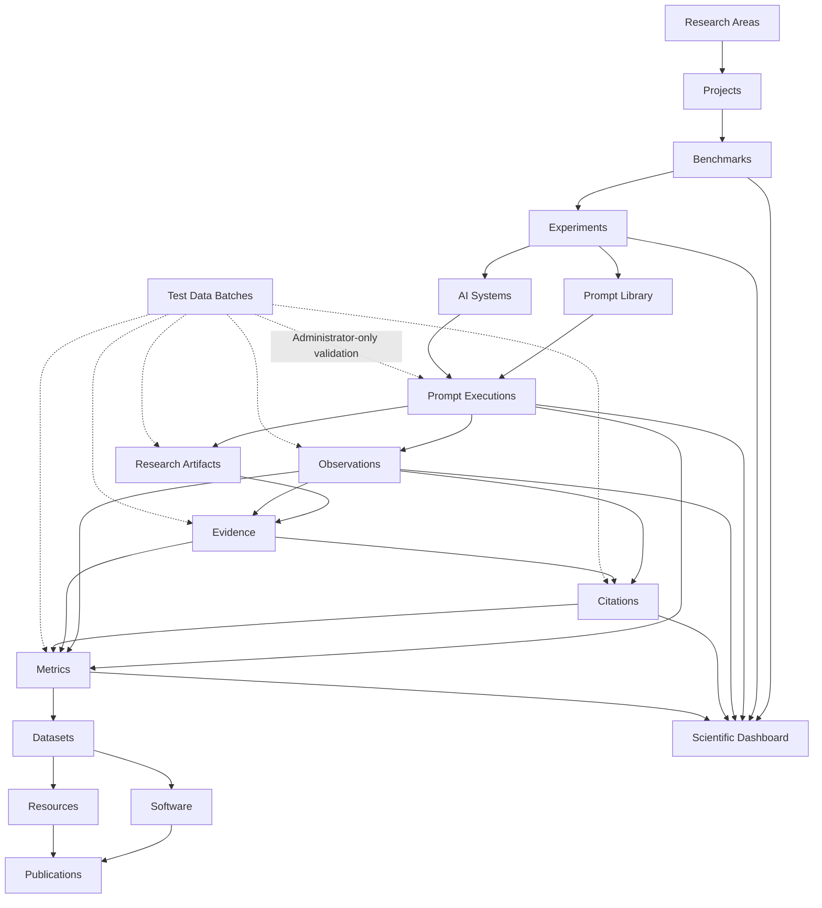

<p align="center">
  
</p>

<p align="center">
  <strong>Scientific infrastructure for Generative Search, Artificial Intelligence, GEO, benchmarks, evidence, metrics and reproducible research.</strong>
</p>

<p align="center">
  <a href="https://gslhub.com">Website</a>
  ·
  <a href="https://gslhub.com/research">Research</a>
  ·
  <a href="https://gslhub.com/benchmarks">Benchmarks</a>
  ·
  <a href="https://gslhub.com/dashboard">Scientific Dashboard</a>
  ·
  <a href="https://gslhub.com/publications">Publications</a>
  ·
  <a href="https://github.com/gslhub">GitHub organization</a>
</p>

<p align="center">
  
  
  
  
  
  
</p>

---

# GSLHub

**GSLHub — Generative Search Lab Hub** is an independent scientific platform for studying how generative artificial intelligence systems discover, retrieve, interpret, cite, summarize and recommend digital information.

The platform connects scientific project management, benchmark design, controlled experiments, versioned prompts, AI-system documentation, prompt executions, observations, uploaded research artifacts, evidence, citations, metrics, datasets, software, methodological resources and publications inside one traceable infrastructure.

GSLHub is based in Barcelona and is being developed with an international research scope.

> **Current stage — 26 July 2026:** the scientific CMS, public catalogues, dashboard, upload integrity workflow, administrator test-data framework and end-to-end relationship protections are operational. A complete synthetic pipeline containing 27 connected records has been generated, tested, safely deleted and regenerated in production. Prompt executions, observations, evidence, citations and metric results now enforce scientific context, lifecycle rules and immutable validated snapshots. The next milestone is to freeze the pilot protocol and run the first five real controlled executions.

## Mission

GSLHub develops transparent, reproducible and practice-led research in:

- generative search;
- Generative Engine Optimization (GEO);
- artificial intelligence;
- information retrieval;
- source selection and citation;
- digital transformation;
- process automation;
- open science and research software.

Its mission is to transform real-world questions about AI-mediated search into documented methods, measurable experiments, reusable datasets, research software and citable scientific outputs.

## Vision

GSLHub aims to become an independent international reference for research on visibility, retrieval, citation, recommendation and authority in generative search systems.

The platform supports the full scientific lifecycle:

1. define research areas and projects;
2. design benchmarks and experiments;
3. version prompts and document AI systems;
4. execute controlled research runs;
5. preserve responses and uploaded research artifacts;
6. code observations and source-level citations;
7. validate evidence and chain of custody;
8. calculate transparent metrics;
9. test the workflow with disposable administrator-only data;
10. release datasets, software, resources and publications.

## Research domains

| Domain | Scope |
| --- | --- |
| **Generative Search** | How AI-mediated search systems discover, synthesize and present information. |
| **Generative Engine Optimization (GEO)** | Technical, semantic and authority-related factors associated with visibility and citation in generative systems. |
| **Artificial Intelligence** | Language models, agents, retrieval systems and applied AI workflows. |
| **Information Retrieval** | Source discovery, ranking, selection, grounding and answer construction. |
| **Digital Transformation** | Organizational adoption and measurable impact of digital systems. |
| **Automation** | Process redesign, system integration and intelligent workflow orchestration. |
| **Open Science** | Reproducible methods, FAIR data, transparent versioning and citable research outputs. |

## Scientific architecture



The architecture preserves traceability from the research question and protocol to the evaluated system, exact prompt, execution, artifact, evidence, observation, citation, metric and released output.

## Current platform status

### Payload CMS collections

The production Payload configuration registers **19 collections**: authentication, administrator test-data control and 17 connected scientific domains.

| Collection | Purpose | Status |
| --- | --- | --- |
| Users | Authentication and role management. | ✅ Operational |
| Test Data Batches | Administrator-only generation and safe cleanup of disposable sample data. | ✅ Validated in production |
| Research Areas | Scientific domains and thematic classification. | ✅ Operational |
| Researchers | Researcher profiles, roles and scholarly identifiers. | ✅ Operational |
| Projects | Objectives, methodology, lifecycle and research relationships. | ✅ Operational |
| Benchmarks | Evaluation frameworks, systems, protocols and core metrics. | ✅ Operational |
| Experiments | Research questions, hypotheses, variables and sampling design. | ✅ Operational |
| Prompts | Exact prompt wording, versions, constraints and validation metadata. | ✅ Operational |
| AI Systems | Providers, products, access modes, capabilities and observed versions. | ✅ Operational |
| Prompt Executions | Planned and completed runs, environment snapshots, responses and quality control. | ✅ Integrity controls validated |
| Observations | Structured coding of response, citation and visibility outcomes. | ✅ Integrity controls validated |
| Research Artifacts | Private uploaded files, provenance metadata and automatic SHA-256 integrity. | ✅ Validated in production |
| Evidence | Evidence metadata, checksums, preserved content and chain of custody. | ✅ Integrity controls validated |
| Citations | Source-level citation extraction, normalization and verification. | ✅ Integrity controls validated |
| Metrics | Versioned metric results, formulas, samples and reproducibility metadata. | ✅ Integrity controls validated |
| Publications | Articles, reports, preprints and citation metadata. | ✅ Operational |
| Software | Research software, source availability, versions and releases. | ✅ Operational |
| Datasets | Data methodology, formats, availability and release metadata. | ✅ Operational |
| Resources | Protocols, guides, templates and methodological materials. | ✅ Operational |

### Cross-platform capabilities

| Capability | Status |
| --- | --- |
| English and Spanish localized scientific fields | ✅ Operational |
| Draft and publish workflow | ✅ Operational |
| Authenticated draft access and anonymous published-only access | ✅ Operational |
| Administrator, editor and researcher roles | ✅ Operational |
| Custom GSLHub Payload branding and deterministic logout | ✅ Operational |
| MongoDB Atlas persistence | ✅ Operational |
| Public REST API and public catalogues | ✅ Operational |
| Public scientific dashboard | ✅ Initial version operational |
| Planned-versus-completed execution lifecycle validation | ✅ Validated |
| Private research artifact uploads | ✅ Validated |
| Scientific MIME normalization | ✅ Validated |
| Automatic artifact SHA-256 calculation | ✅ Validated |
| Automatic artifact context inheritance | ✅ Validated |
| Administrator-only test-data generation | ✅ Validated |
| Rollback, retry and ownership-based cleanup | ✅ Validated |
| Physical upload deletion during cleanup | ✅ Validated |
| Full synthetic pipeline with 27 connected records | ✅ Validated and repeatable |
| Immutable completed execution snapshots | ✅ Validated |
| Immutable validated observation snapshots | ✅ Validated |
| Evidence lifecycle, integrity and append-only custody rules | ✅ Implemented and lifecycle-tested |
| Citation execution, observation and evidence consistency | ✅ Validated |
| Immutable validated citation snapshots | ✅ Validated |
| Metric input-context validation | ✅ Validated |
| Metric value, scope and lifecycle validation | ✅ Validated |
| Immutable validated metric snapshots | ✅ Validated |
| Automated real prompt execution | ⏳ Not implemented |
| Automated production metric engine | ⏳ Not implemented |
| S3-compatible permanent evidence archive | ⏳ Not implemented |
| Dataset and release export pipeline | ⏳ Not implemented |

## Scientific integrity controls

GSLHub now treats operational research records as scientific snapshots rather than ordinary editable CMS content.

### Prompt executions

After an execution starts, the following context is sealed:

- prompt, version, language and exact prompt snapshot;
- project, benchmark, experiment and AI system;
- repetition and run metadata;
- execution date and environment.

After completion, the response, timing and usage snapshot are also sealed. Completed or failed executions cannot be returned to planned or running states. Review metadata remains editable.

### Observations

Observations inherit project, benchmark, experiment, prompt and AI system from their prompt execution. A validated observation cannot be attached to another execution or silently recoded.

Validated observations protect:

- execution and scientific relationships;
- response assessment;
- citation assessment;
- source observations;
- visibility coding;
- semantic coding;
- comparison data.

Review notes, exclusion metadata and reviewer assignments remain available for documented corrections.

### Evidence

Evidence inherits its scientific context from the prompt execution and validates that any selected observation belongs to the same execution.

Validated evidence requires:

- integrity verification;
- checksum metadata when a checksum algorithm is selected;
- accepted quality control;
- a validation date.

Its preserved snapshot is immutable. Chain-of-custody events are append-only: previous events cannot be removed or modified, while new events can be added at the end.

### Citations

Every citation validates that its observation and evidence records belong to the same prompt execution and scientific context.

Validated citations protect:

- source URL, domain and metadata;
- citation position and function;
- response context and supported claim;
- target coding;
- verification and integrity data;
- execution, observation and evidence relationships.

### Metrics

Metric records validate that selected executions, observations, citations and evidence belong to the declared project, benchmark, experiment, prompt and AI system.

The metric lifecycle also checks:

- required scope relationships;
- numeric or text values according to value type;
- percentage, proportion, count and position ranges;
- positive denominators for ratios;
- positive sample size for validated metrics;
- accepted review and validation date.

Validated results seal formulas, inputs, values, sample definitions, breakdowns, confidence intervals and reproducibility metadata.

## Administrator test-data framework

GSLHub includes a dedicated **Test Data Batches** collection for validating workflows without contaminating real research data.

Only users with the `admin` role can create, inspect, generate or remove test-data batches.

### Available scenarios

| Scenario | Records | Purpose |
| --- | ---: | --- |
| Pilot prompt executions | 5 | Validate planned execution records, lifecycle rules and draft visibility. |
| Full research pipeline | 27 | Validate completed executions, observations, uploads, evidence, citations and metrics end to end. |

The full-pipeline scenario creates:

```text
5 Prompt Executions
5 Observations
5 Research Artifacts
5 Evidence records
3 Citations
4 Metric results
────────────────────
27 connected records
```

### Generation lifecycle

```text
Save batch
    ↓
Status: Pending generation
    ↓
Generate test data
    ↓
Status: Generated or Failed
```

The administrator action calls:

```text
POST /api/test-data-batches/:id/generate
```

Generation is separated from the initial save so that server errors can be reported directly without interrupting document creation.

### Safety model

Every generated scientific code uses the owning batch prefix:

```text
TEST-<BATCH-CODE>-EXEC-0001
TEST-<BATCH-CODE>-OBS-0001
TEST-<BATCH-CODE>-ART-0001
TEST-<BATCH-CODE>-EVD-0001
TEST-<BATCH-CODE>-CIT-0001
TEST-<BATCH-CODE>-MET-0001
```

The batch stores the exact collection, document ID and scientific code for every generated record. Cleanup refuses to delete a document when its identity no longer matches the recorded batch ownership.

Generated records remain drafts and uploaded artifacts remain private. They do not appear in the public API or scientific dashboard.

When generation fails, partial records are rolled back. Failed batches can be retried. A generated batch cannot be generated twice accidentally.

Deletion runs in reverse dependency order:

```text
Metrics
Citations
Evidence
Research Artifacts and physical files
Observations
Prompt Executions
```

### Production validation completed

The following test cycle has been completed successfully in production:

1. generate 27 connected records;
2. validate execution lifecycle protection;
3. validate observation relationship and immutability rules;
4. validate citation relationship and immutability rules;
5. validate metric context and immutability rules;
6. validate evidence lifecycle protection;
7. delete the batch;
8. confirm deletion of all 27 documents;
9. confirm deletion of all five physical upload files;
10. regenerate and repeat the workflow.

Synthetic metric values are deterministic test fixtures, not scientific findings:

| Metric | Synthetic value |
| --- | ---: |
| AIR — Answer Inclusion Rate | 80% |
| CR — Citation Rate | 60% |
| MCP — Mean Citation Position | 2.0 |
| RCR — Response Consistency Rate | 80% |

## Research artifacts and storage

Research artifacts can preserve:

- screenshots;
- PDF documents;
- response exports;
- HTML snapshots;
- JSON and JSON-LD metadata;
- CSV tables;
- text logs;
- ZIP archives.

For supported uploads, GSLHub can:

1. normalize the MIME type;
2. calculate SHA-256 from the uploaded bytes;
3. store the checksum as read-only integrity metadata;
4. inherit scientific context from the linked prompt execution;
5. connect artifacts to observations and evidence;
6. restrict anonymous access;
7. remove physical files through tracked test-data cleanup.

The current production archive uses private local upload storage. Migration to durable S3-compatible object storage remains a requirement before irreplaceable evidence is collected at scale.

## Current scientific assets

The first connected research chain is prepared in the CMS.

| Scientific object | Current record |
| --- | --- |
| Research area | Generative Search and GEO |
| Researcher | Eduardo José Yauri Luna |
| Project | GSLHub Generative Search Visibility Benchmark |
| Benchmark | GSLHub Generative Search Visibility Benchmark |
| Experiment | Pilot Validation of the GSLHub Generative Search Visibility Protocol |
| Prompt | Factors Influencing Source Selection in Generative Search |
| AI system | ChatGPT Search — authenticated web configuration |
| Publication | A Reproducible Protocol for Measuring Visibility in Generative Search Systems |
| Software | GSLHub Generative Search Benchmark Toolkit |
| Dataset | GSLHub Generative Search Visibility Benchmark Dataset |
| Resource | GSLHub Generative Search Visibility Benchmark Research Protocol |

Editorial and operational records remain drafts until their scientific and publication requirements are complete. The public dashboard can therefore display zero operational records while private research preparation exists in the CMS.

## Public website

| Page | Data source | Status |
| --- | --- | --- |
| [`/research`](https://gslhub.com/research) | Research Areas and Projects | ✅ Live |
| [`/benchmarks`](https://gslhub.com/benchmarks) | Benchmarks | ✅ Live |
| [`/dashboard`](https://gslhub.com/dashboard) | Published operational records and validated metrics | ✅ Live |
| [`/publications`](https://gslhub.com/publications) | Publications | ✅ Live |
| [`/software`](https://gslhub.com/software) | Software | ✅ Live |
| [`/datasets`](https://gslhub.com/datasets) | Datasets | ✅ Live |
| [`/resources`](https://gslhub.com/resources) | Resources | ✅ Live |
| [`/people`](https://gslhub.com/people) | Researchers | ✅ Live |

The homepage, navigation, footer, sitemap, robots metadata, JSON-LD foundations, favicon and GSLHub brand system are operational.

## Scientific dashboard

The public dashboard provides:

- published-record counters across the operational pipeline;
- visibility into benchmarks, experiments, prompts, systems, executions, observations, evidence, citations and metrics;
- the latest validated and published metric results;
- metric code, version, category, direction, result, calculation date and sample size;
- a safe empty state before the first validated pilot release.

Drafts, private artifacts, synthetic test data and unvalidated calculations are intentionally excluded.

Planned improvements include filters, comparisons, progress indicators, charts, citation-domain rankings, drill-down pages and versioned exports.

## Gap analysis

The information architecture and synthetic operational path are complete. Remaining work is concentrated in **pilot governance, uniqueness, durable preservation, automated analysis, formal testing and release management**.

### Completed hardening

- ✅ End-to-end 27-record synthetic workflow.
- ✅ Safe rollback, retry and ownership-based cleanup.
- ✅ Physical artifact deletion during cleanup.
- ✅ Prompt-execution lifecycle validation and immutable snapshots.
- ✅ Observation context inheritance and immutable validated coding.
- ✅ Evidence context inheritance and lifecycle validation.
- ✅ Append-only evidence chain of custody.
- ✅ Citation relationship consistency and immutable validated source records.
- ✅ Metric input-context, scope, value and lifecycle validation.
- ✅ Immutable validated metric results.
- ✅ Human-readable Payload API errors for integrity conflicts.

### Priority 0 — before the first real pilot

1. **Composite uniqueness and code reservation**
   - Prevent duplicate experiment, prompt, AI system and repetition combinations.
   - Reserve execution, observation, evidence, citation and metric codes safely.
   - Define deterministic export and artifact names.

2. **Protocol and codebook freeze**
   - Finalize inclusion and exclusion criteria.
   - Freeze prompt `GSL-PROMPT-GEO-001` version `0.1.0`.
   - Freeze AIR, CR, MCP and RCR version `0.1.0`.
   - Finalize source types, citation coding and missing-data rules.
   - Record the frozen protocol version in every real execution.

3. **Durable evidence storage**
   - Connect S3-compatible object storage or another versioned private archive.
   - Define path, retention, access and recovery policies.
   - Verify checksum preservation after upload, download and restore.

4. **Backup and recovery verification**
   - Test MongoDB backup and restore.
   - Define evidence-archive backup retention.
   - Document recovery steps before collecting irreplaceable evidence.

5. **Real pilot execution plan**
   - Create five non-test planned execution records.
   - Define the exact manual session procedure.
   - Prepare the response, screenshot and source-capture checklist.
   - Define review responsibilities and exclusion handling.

### Priority 1 — reproducible operations

1. **Versioned metrics engine**
   - Implement deterministic AIR, CR, MCP and RCR scripts.
   - Preserve input selections, output files, logs and checksums.

2. **Execution assistance**
   - Add manual and assisted execution workflows without mixing research conditions.
   - Capture timestamps, visible model labels and interface state consistently.

3. **Export pipeline**
   - Generate CSV, JSON and JSONL release packages.
   - Include schemas, data dictionaries, provenance and checksums.

4. **Automated tests and CI**
   - Add unit tests for formulas, lifecycle rules, normalization and access.
   - Add integration tests for relationships, uploads and cleanup.
   - Add end-to-end tests for admin workflows and public publication.

5. **Observability**
   - Add structured logs, error monitoring, uptime checks and deployment notifications.

### Priority 2 — open-science maturity

- public detail pages for scientific entities;
- full language switching and localized routes;
- ORCID synchronization;
- `CITATION.cff`, license, contribution and security policies;
- Zenodo integration and DOI workflow;
- machine-readable provenance and dataset citations;
- multi-researcher review and inter-rater reliability;
- public methodology changelog and release notes.

## Architecture decisions before scaling

### Metric definitions versus results

The current `metrics` collection stores both definition metadata and calculated results. A future separation into **Metric Definitions** and **Metric Results** would reduce repetition and support controlled formula versioning.

### Prompt families and immutable versions

A future model may separate:

```text
Prompt Family → Prompt Version → Prompt Execution
```

### Execution rounds

A dedicated `Execution Rounds` collection would group systems, prompts, repetitions, dates and protocol versions more reliably than a free-text run label.

### Source and domain normalization

A future `Sources` or `Domains` catalogue could support deduplication, authority analysis, publisher grouping and longitudinal citation histories.

### AI-system snapshots

A future `AI System Snapshots` entity could document visible product and interface changes across benchmark rounds.

## Immediate next milestone

The next milestone is the first real end-to-end pilot round:

```text
Experiment: GSL-EXP-GEO-001
Prompt: GSL-PROMPT-GEO-001 v0.1.0
AI System: GSL-AISYS-001
Planned repetitions: 5
```

Recommended sequence:

1. implement composite uniqueness for real executions;
2. freeze the prompt, protocol, codebook and metric definitions;
3. verify durable storage and backup procedures;
4. create five real planned execution records without the `TEST-` prefix;
5. execute the exact prompt in five isolated sessions;
6. preserve complete responses and interface evidence;
7. create one coded observation for each valid execution;
8. extract and verify every citation;
9. calculate AIR, CR, MCP and RCR with versioned scripts;
10. perform scientific review and document exclusions;
11. publish a versioned pilot dataset, protocol resource and technical report only after validation.

## Development roadmap

| Phase | Scope | Status |
| --- | --- | --- |
| **1. Infrastructure** | Domain, hosting, deployment, Next.js, Payload and MongoDB. | ✅ Complete |
| **2. Scientific CMS** | Core collections, relationships, localization, access and drafts. | ✅ Complete |
| **3. Public website** | CMS-connected catalogues, navigation, SEO and branding. | ✅ Complete |
| **4. Research data model** | Experiments, prompts, AI systems and executions. | ✅ Complete |
| **5. Analysis data model** | Observations, evidence, citations and metrics. | ✅ Complete |
| **6. Scientific dashboard** | Published counters and validated metric presentation. | ✅ Initial version complete |
| **7. Artifact integrity** | Private uploads, MIME normalization, inheritance and SHA-256. | ✅ Validated |
| **8. Test-data lifecycle** | Admin generation, rollback, tracking, cleanup and physical-file deletion. | ✅ Validated |
| **9. Scientific snapshot integrity** | Lifecycle, relationship and immutability rules across operational records. | ✅ Validated |
| **10. Pilot governance** | Uniqueness, protocol freeze, storage and backup readiness. | 🚧 Current milestone |
| **11. First real pilot** | Five executions, evidence, observations, citations and metrics. | ⏳ Next milestone |
| **12. Automation** | Metrics scripts, execution assistance, exports and monitoring. | ⏳ Planned |
| **13. Publication pipeline** | Dataset, software, protocol and report releases. | ⏳ Planned |
| **14. Open-science integration** | ORCID, Zenodo, DOI and citation metadata. | ⏳ Planned |
| **15. Comparative scaling** | Multiple systems, languages, prompts and longitudinal rounds. | ⏳ Planned |

## Technology stack

### Application

- **Next.js 16.2.10** — App Router, server components and public routes.
- **React 19.2.7** — component-based user interface.
- **TypeScript 5.9** — application and CMS typing.
- **Tailwind CSS 4.3.3** — public design system and responsive layouts.

### Scientific CMS

- **Payload CMS 3.86.0** — collections, authentication, localization, access control, custom endpoints, versions, drafts and uploads.
- **Lexical** — structured rich-text editing.
- **Custom Payload components** — GSLHub branding, logout and administrator test-data generation.

### Data and files

- **MongoDB Atlas** — primary document database.
- **Payload MongoDB adapter** — persistence and scientific relationships.
- **Payload uploads** — current private local artifact storage.
- **Node.js crypto** — SHA-256 artifact integrity.

### Infrastructure

- **GitHub** — source control and project organization.
- **GitHub Actions** — lint, type-check and production-build verification.
- **Hostinger Cloud** — production hosting and automatic deployment from `main`.
- **gslhub.com** — production domain.

## Repository structure

```text
.
├── app/
│   ├── (site)/                    Public website and scientific dashboard
│   ├── (payload)/                 Payload admin and REST API
│   ├── api/                       Application-specific endpoints
│   ├── globals.css                Public design system
│   ├── sitemap.ts                 Public sitemap
│   └── layout.tsx                 Root metadata and layout
├── cms/
│   ├── access/                    Scientific access helpers
│   ├── collections/               Scientific and administration collections
│   ├── endpoints/                 Administrator actions
│   ├── hooks/                     Lifecycle, inheritance and integrity hooks
│   └── test-data/                 Test generation and cleanup
├── components/
│   ├── admin/                     Payload admin controls
│   ├── brand/                     Logo and icon components
│   └── ...                        Shared public components
├── scripts/                       Controlled administrative scripts
├── public/brand/                  Vector brand assets
├── .github/workflows/ci.yml       Quality checks
├── .env.example                   Environment template
├── payload.config.ts              Payload configuration
├── package.json                   Scripts and dependencies
└── README.md                      Project status and roadmap
```

## Data and access model

- Authenticated researchers and editors can create and update scientific records.
- Administrators control destructive actions, users and test-data batches.
- Draft documents remain available inside the authenticated CMS.
- Anonymous API and website requests receive published records only.
- Research artifacts require authenticated access.
- Test data remains draft or private and uses batch-owned `TEST-` codes.
- Localized fields support English and Spanish with English fallback.
- Scientific entities are connected through explicit Payload relationships.
- CORS and CSRF trust the production GSLHub domains.
- GSLHub uses a dedicated authentication cookie prefix.

## REST API

Published scientific records are available through Payload REST endpoints:

```text
GET /api/research-areas
GET /api/researchers
GET /api/projects
GET /api/benchmarks
GET /api/experiments
GET /api/prompts
GET /api/ai-systems
GET /api/prompt-executions
GET /api/observations
GET /api/evidence
GET /api/citations
GET /api/metrics
GET /api/publications
GET /api/software
GET /api/datasets
GET /api/resources
```

Authenticated artifact access:

```text
GET /api/research-artifacts
```

Administrator test-data generation:

```text
POST /api/test-data-batches/:id/generate
```

Localized responses:

```text
GET /api/publications?locale=en
GET /api/publications?locale=es
```

The public API intentionally excludes drafts and private test data.

## Local development

### Requirements

- Node.js `>=20.9.0`
- npm `10.9.2` or compatible
- MongoDB or MongoDB Atlas

### Installation

```bash
git clone https://github.com/gslhub/website.git
cd website
npm install
cp .env.example .env.local
```

Required variables:

```env
NEXT_PUBLIC_SITE_URL=http://localhost:3000
PAYLOAD_SECRET=replace-with-a-long-random-secret
DATABASE_URL=mongodb+srv://<username>:<url-encoded-password>@<cluster-hostname>/?retryWrites=true&w=majority&appName=GSLHub
```

Start development:

```bash
npm run dev
```

Quality checks:

```bash
npm run lint
npm run typecheck
npm run build
```

An idempotent pilot execution seed remains available:

```bash
npm run seed:pilot-executions
```

The CMS Test Data Batches workflow is preferred for disposable validation because it tracks ownership and cleanup.

## Deployment notes

- Production deploys automatically from `main` to Hostinger Cloud.
- The production build command remains `next build`.
- Do not add `payload generate:importmap` to the Hostinger build without retesting Node.js ESM behaviour.
- Payload custom components use the committed import map.
- Avoid overlapping rapid deployments.
- Do not apply dependency updates or `npm audit fix --force` without reviewing Payload, Next.js and React compatibility together.
- `npm audit` warnings must be evaluated separately from TypeScript or production-build failures.

## Scientific principles

### Reproducibility

Protocols, prompts, systems, metrics, evidence and datasets should support independent replication.

### Transparency

Methodological decisions, exclusions, limitations, test data and version changes should remain traceable.

### Versioning

Prompts, protocols, datasets, software, AI-system conditions and metrics should use explicit versions instead of silently changing historical objects.

### FAIR data

Released datasets should be findable, accessible, interoperable and reusable whenever legal and ethical conditions allow it.

### Research integrity

The platform distinguishes planned work, synthetic validation data, work in progress, captured evidence, validated results and released scientific outputs.

### Responsible openness

Open access is a goal, but personal, confidential, restricted, copyrighted or non-redistributable information must not be exposed.

### Human review

Automated collection and analysis must remain subject to documented validation and human scientific oversight.

## Open-science and governance roadmap

Planned repository and release assets include:

- `CITATION.cff`;
- repository license;
- `CONTRIBUTING.md`;
- code of conduct;
- security policy;
- data-management plan;
- research ethics and responsible-AI statement;
- authorship and contributor taxonomy;
- Zenodo release workflow;
- DOI metadata;
- machine-readable dataset and software citations;
- release archives and checksums.

The repository is currently private and no repository-wide license has been formalized. Repository access alone must not be interpreted as permission to copy, modify or redistribute the code.

## Citation

A repository-level `CITATION.cff` and Zenodo workflow will be added before the first formal software or research release.

Until then, cite the public platform as:

```text
GSLHub — Generative Search Lab Hub. Independent scientific platform for generative search, GEO, artificial intelligence and reproducible research. https://gslhub.com
```

Do not assign a DOI, publication date or scholarly release status to draft or synthetic test records that have not completed the formal publication workflow.

## Contact

- Website: [gslhub.com](https://gslhub.com)
- Dashboard: [gslhub.com/dashboard](https://gslhub.com/dashboard)
- GitHub: [github.com/gslhub](https://github.com/gslhub)
- Research email: [research@gslhub.com](mailto:research@gslhub.com)
- Founder and researcher: [Eduardo José Yauri Luna](https://www.linkedin.com/in/eduardoyauriluna/)

---

<p align="center">
  <strong>Research · Benchmarks · Evidence · Metrics · Software · Datasets · Open Science</strong>
</p>

<p align="center">
  Last updated: 26 July 2026
</p>
