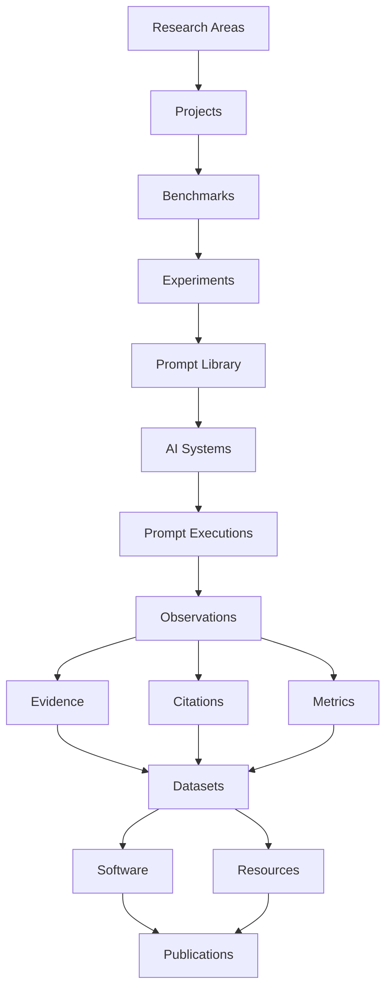

<p align="center">
  
</p>

<p align="center">
  <strong>Open scientific infrastructure for Generative Search, Artificial Intelligence, GEO, benchmarks, datasets and reproducible research.</strong>
</p>

<p align="center">
  <a href="https://gslhub.com">Website</a>
  ·
  <a href="https://gslhub.com/research">Research</a>
  ·
  <a href="https://gslhub.com/benchmarks">Benchmarks</a>
  ·
  <a href="https://gslhub.com/publications">Publications</a>
  ·
  <a href="https://github.com/gslhub">GitHub organization</a>
</p>

<p align="center">
  
  
  
  
  
  
</p>

---

# GSLHub

**GSLHub — Generative Search Lab Hub** is an independent scientific platform for studying how generative artificial intelligence systems discover, retrieve, interpret, cite, summarize and recommend digital information.

The platform connects research management, benchmark design, scientific software, datasets, methodological resources and publications inside one versioned and reproducible infrastructure.

GSLHub is based in Barcelona and is being developed with an international research scope.

> Current stage: the scientific content infrastructure and public catalogue are operational. The next development phase is the research execution engine.

## Mission

GSLHub develops transparent, reproducible and practice-led research in:

- generative search;
- Generative Engine Optimization (GEO);
- artificial intelligence;
- information retrieval;
- source selection and citation;
- digital transformation;
- process automation;
- open science and research software.

Its mission is to transform real-world questions about AI-mediated search into documented methods, measurable experiments, reusable datasets, open tools and citable research outputs.

## Vision

GSLHub aims to become an independent international reference for research on visibility, retrieval, citation and authority in generative search systems.

The long-term platform will support the full scientific lifecycle:

1. defining research areas and projects;
2. designing benchmarks and experiments;
3. versioning prompts and AI systems;
4. executing controlled observations;
5. recording evidence and citations;
6. calculating transparent metrics;
7. releasing datasets and research software;
8. publishing reusable and citable scientific outputs.

## Research domains

| Domain | Scope |
| --- | --- |
| **Generative Search** | How AI-mediated search systems discover, synthesize and present information. |
| **Generative Engine Optimization (GEO)** | Technical, semantic and authority-related factors associated with visibility and citation in generative systems. |
| **Artificial Intelligence** | Language models, agents, retrieval systems and applied AI workflows. |
| **Information Retrieval** | Source discovery, ranking, selection, grounding and answer construction. |
| **Digital Transformation** | The organizational adoption and measurable impact of digital systems. |
| **Automation** | Process redesign, system integration and intelligent workflow orchestration. |
| **Open Science** | Reproducible methods, FAIR data, open software, transparent versioning and citable outputs. |

## Scientific architecture



The architecture is designed to preserve traceability between a research question, its protocol, the systems evaluated, every recorded observation, the resulting metrics and the final publication.

## Platform modules

### Operational modules

| Module | Purpose | Status |
| --- | --- | --- |
| Research Areas | Scientific domains and thematic classification. | ✅ Operational |
| Researchers | Researcher profiles, roles and scholarly identifiers. | ✅ Operational |
| Projects | Research programmes, objectives, methodology and lifecycle. | ✅ Operational |
| Benchmarks | Reproducible evaluation frameworks, systems and metrics. | ✅ Operational |
| Publications | Articles, preprints, reports and citation metadata. | ✅ Operational |
| Software | Research software, repositories, versions and releases. | ✅ Operational |
| Datasets | Methodology, formats, availability, DOI and release metadata. | ✅ Operational |
| Resources | Protocols, guides, templates and methodological materials. | ✅ Operational |
| EN/ES localization | Localized scientific content with fallback support. | ✅ Operational |
| Draft and publish workflow | Private preparation and controlled public release. | ✅ Operational |
| Role-based access | Administrator, editor and researcher permissions. | ✅ Operational |
| Public REST API | Access-controlled scientific collection endpoints. | ✅ Operational |
| Public catalogue | CMS-connected research, people and output pages. | ✅ Operational |

### Research engine roadmap

| Module | Purpose | Status |
| --- | --- | --- |
| Experiments | Experimental design, variables, hypotheses and protocol versions. | 🚧 Next phase |
| Prompt Library | Versioned prompts, languages, intents, topics and benchmark relations. | ⏳ Planned |
| AI Systems | Providers, products, models, access modes and observed versions. | ⏳ Planned |
| Prompt Executions | Individual controlled executions and runtime metadata. | ⏳ Planned |
| Observations | Structured outcomes extracted from each execution. | ⏳ Planned |
| Metrics Engine | Versioned metric definitions, formulas and interpretations. | ⏳ Planned |
| Citation Engine | Source, domain, URL, position and citation-level analysis. | ⏳ Planned |
| Evidence Repository | Screenshots, HTML, JSON, files and validation evidence. | ⏳ Planned |
| Scientific Dashboard | Experiment monitoring, comparisons and benchmark results. | ⏳ Planned |

## Current public catalogue

| Page | Data source |
| --- | --- |
| [`/research`](https://gslhub.com/research) | Research Areas and Projects |
| [`/benchmarks`](https://gslhub.com/benchmarks) | Benchmarks |
| [`/publications`](https://gslhub.com/publications) | Publications |
| [`/software`](https://gslhub.com/software) | Software |
| [`/datasets`](https://gslhub.com/datasets) | Datasets |
| [`/resources`](https://gslhub.com/resources) | Resources |
| [`/people`](https://gslhub.com/people) | Researchers |

Draft records remain private. Public pages and anonymous API requests only expose records that have completed the Payload publication workflow.

## Technology stack

### Application

- **Next.js 16** — App Router, server components and public routes.
- **React 19** — component-based user interface.
- **TypeScript 5** — strict application and CMS typing.
- **Tailwind CSS 4** — public design system and responsive layouts.

### Scientific CMS

- **Payload CMS 3.86** — collections, authentication, localization, access control, versions and drafts.
- **Lexical** — structured rich-text editing.
- **Custom Payload branding** — GSLHub logo, icon, favicon and logout workflow.

### Data

- **MongoDB Atlas** — primary database.
- **Payload MongoDB adapter** — persistence layer and document relationships.

### Infrastructure

- **GitHub** — source control and project organization.
- **Hostinger Cloud** — production hosting and automatic deployment from the `main` branch.
- **gslhub.com** — production domain.

### Planned open-science integrations

- ORCID;
- Zenodo;
- DOI registration;
- Google Scholar;
- `CITATION.cff`;
- release archives and checksums;
- machine-readable dataset and software citations.

## Repository structure

```text
.
├── app/
│   ├── (site)/                 Public GSLHub website
│   ├── (payload)/              Payload admin and API integration
│   ├── api/                    Application endpoints
│   ├── globals.css             Public design system
│   └── layout.tsx              Root metadata and global layout
├── cms/
│   ├── access/                 Scientific access-control helpers
│   ├── collections/            Payload scientific collections
│   └── fields/                 Reusable lifecycle and status fields
├── components/
│   ├── admin/                  Payload admin custom components
│   ├── brand/                  Reusable logo and icon components
│   └── ...                     Shared public interface components
├── public/
│   └── brand/                  Vector logo and icon assets
├── payload.config.ts           Payload configuration and collection registry
├── package.json                Scripts and dependency versions
├── tsconfig.json               TypeScript configuration
└── README.md                   Project overview and development roadmap
```

## Data and access model

GSLHub separates editorial lifecycle from public scientific availability.

- Authenticated researchers and editors can create and update scientific records.
- Administrators control destructive actions and user management.
- Draft documents are available inside the authenticated CMS.
- Anonymous API and website requests only receive published records.
- Localized fields support English and Spanish with English fallback.
- Scientific entities are connected through explicit Payload relationships.

## Local development

### Requirements

- Node.js `>=20.9.0`
- npm `10.9.2` or compatible
- a MongoDB database or MongoDB Atlas cluster

### Installation

```bash
git clone https://github.com/gslhub/website.git
cd website
npm install
```

Create a local environment file:

```bash
cp .env.example .env.local
```

Required variables:

```env
NEXT_PUBLIC_SITE_URL=http://localhost:3000
PAYLOAD_SECRET=replace-with-a-long-random-secret
DATABASE_URL=mongodb://127.0.0.1:27017/gslhub
```

For MongoDB Atlas, use the connection string provided by the cluster and keep credentials outside version control.

Start the development server:

```bash
npm run dev
```

Open:

- Website: `http://localhost:3000`
- Payload admin: `http://localhost:3000/admin`
- REST API example: `http://localhost:3000/api/research-areas`

### Quality checks

```bash
npm run lint
npm run typecheck
npm run build
```

## API examples

Published scientific records are available through Payload REST endpoints:

```text
GET /api/research-areas
GET /api/researchers
GET /api/projects
GET /api/benchmarks
GET /api/publications
GET /api/software
GET /api/datasets
GET /api/resources
```

Localized responses can be requested with:

```text
GET /api/publications?locale=en
GET /api/publications?locale=es
```

The public API intentionally excludes draft content for anonymous requests.

## Scientific principles

GSLHub is being designed around the following principles:

### Reproducibility

Research protocols, prompts, systems, metrics and datasets should be sufficiently documented to support independent replication.

### Transparency

Methodological decisions, exclusions, limitations and version changes should remain traceable.

### Versioning

Prompts, protocols, datasets, software and metrics should use explicit versions instead of silently changing historical research objects.

### FAIR data

Released datasets should be findable, accessible, interoperable and reusable whenever legal and ethical conditions allow it.

### Research integrity

The platform must distinguish planned work, work in progress, validated results and formally released scientific outputs.

### Responsible openness

Open access is a goal, but personal, confidential, restricted or non-redistributable information must not be exposed.

### Human review

Automated collection and analysis must remain subject to documented validation and human scientific oversight.

## Development roadmap

| Phase | Scope | Status |
| --- | --- | --- |
| **1. Infrastructure** | Domain, hosting, deployment, Next.js, Payload and MongoDB. | ✅ Complete |
| **2. Scientific CMS** | Collections, relationships, localization, access and drafts. | ✅ Complete |
| **3. Public website** | CMS-connected catalogues, navigation, SEO and branding. | ✅ Complete |
| **4. Research platform** | Experiments, prompts, AI systems and executions. | 🚧 In progress |
| **5. Analysis engine** | Observations, citations, evidence and metrics. | ⏳ Planned |
| **6. Scientific dashboard** | Monitoring, comparison, quality control and exports. | ⏳ Planned |
| **7. Publication pipeline** | Dataset, software and publication release workflows. | ⏳ Planned |
| **8. Open-science integration** | ORCID, Zenodo, DOI and citation metadata. | ⏳ Planned |

### Immediate next milestone

The next module is **Experiments**, which will become the central entity connecting research questions, hypotheses, benchmark protocols, researchers, prompt sets, AI systems, execution rounds and resulting datasets.

## Branding

The GSLHub visual identity represents:

- a knowledge network;
- generative discovery;
- search and source tracing;
- open scientific collaboration.

Primary assets:

```text
public/brand/gslhub-logo.svg
public/brand/gslhub-icon.svg
```

Brand palette:

| Token | Value |
| --- | --- |
| Deep Navy | `#0B132B` |
| Electric Blue | `#2563FF` |
| White | `#FFFFFF` |

## Contributing

The contribution model will be formalized before opening external development workflows.

Planned contribution documentation includes:

- code and documentation standards;
- scientific metadata requirements;
- research-integrity expectations;
- issue and pull-request templates;
- dataset and software release checklists;
- authorship, attribution and citation rules.

Until those policies are published, coordinate contributions through the GSLHub organization or the research contact below.

## Citation

A repository-level `CITATION.cff` and Zenodo release workflow will be added when the first formal software or research release is prepared.

Until then, cite the public platform as:

```text
GSLHub — Generative Search Lab Hub. Independent scientific platform for generative search, GEO, artificial intelligence and reproducible research. https://gslhub.com
```

Do not assign a DOI, publication date or scholarly release status to draft records that have not completed the formal publication workflow.

## License

A repository-wide license file has not yet been formalized. Do not assume permission to copy, modify or redistribute the code solely from repository access.

Individual publications, datasets, software releases and resources may later use different licenses appropriate to their content. Each released scientific object will state its own access and reuse conditions.

## Contact

- Website: [gslhub.com](https://gslhub.com)
- GitHub: [github.com/gslhub](https://github.com/gslhub)
- Research email: [research@gslhub.com](mailto:research@gslhub.com)
- Founder and researcher: [Eduardo José Yauri Luna](https://www.linkedin.com/in/eduardoyauriluna/)

---

<p align="center">
  <strong>Research · Software · Datasets · Benchmarks · Open Science</strong>
</p>

<p align="center">
  Last updated: 24 July 2026
</p>
