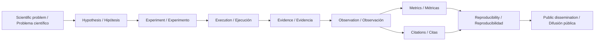
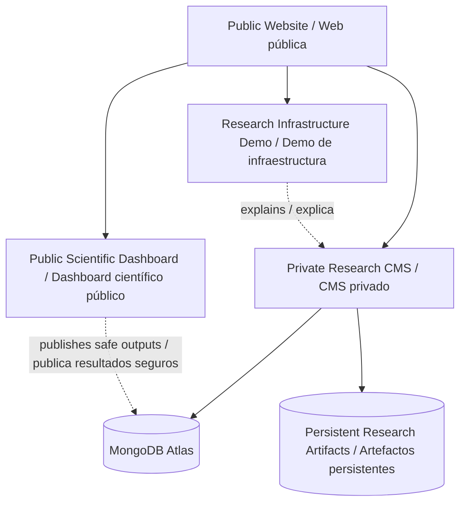
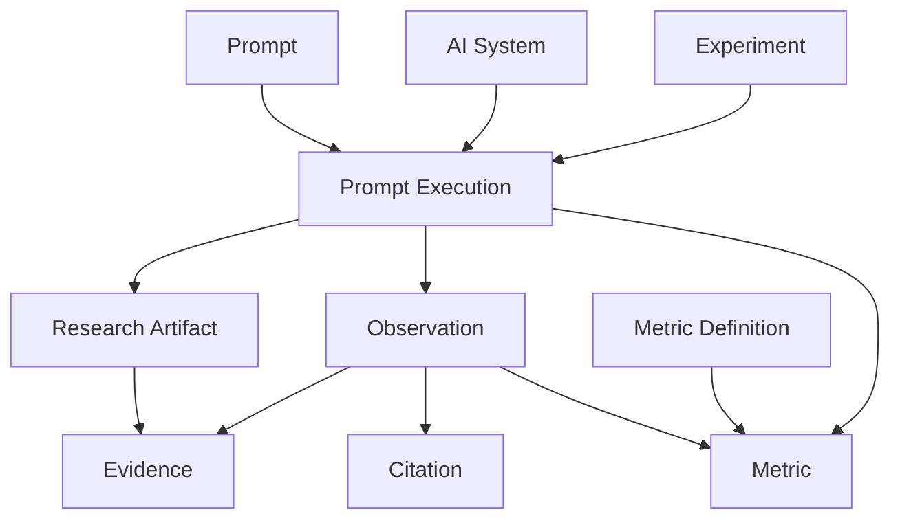

# GSLHub Project Matrix / Matriz del Proyecto GSLHub

**Version / Versión:** 0.6.2  
**Purpose / Propósito:** preserve the conceptual and operational model used to explain how GSLHub works in scientific, technical and doctoral contexts. / Preservar el modelo conceptual y operativo utilizado para explicar cómo funciona GSLHub en contextos científicos, técnicos y doctorales.

---

## 1. Core model / Modelo central



This is the shortest accurate description of GSLHub. / Esta es la descripción breve más fiel de GSLHub.

---

## 2. Functional project matrix / Matriz funcional del proyecto

| Component / Componente | Scientific role / Rol científico | Operational role / Rol operativo | Main records / Registros principales | Presentation value / Valor para presentación |
| --- | --- | --- | --- | --- |
| Scientific Problem / Problema científico | Defines what must be explained or measured. / Define qué se quiere explicar o medir. | Frames the project, benchmark and research question. / Enmarca proyecto, benchmark y pregunta. | Project, Benchmark | Shows academic purpose. / Demuestra propósito académico. |
| Hypothesis / Hipótesis | States a testable expectation. / Formula una expectativa contrastable. | Connects the question to measurable outcomes. / Conecta la pregunta con resultados medibles. | Experiment | Shows scientific rigor. / Demuestra rigor científico. |
| Experiment / Experimento | Defines controlled methodology. / Define la metodología controlada. | Configures protocol, repetitions, prompt and AI-system conditions. / Configura protocolo, repeticiones, prompt y condiciones del sistema IA. | Experiment, Prompt, AI System | Shows experimental design. / Demuestra diseño experimental. |
| Execution / Ejecución | Produces one empirical trial. / Produce una prueba empírica. | Records the exact execution state and environment. / Registra estado y entorno exactos. | Prompt Execution | Shows that the research actually runs. / Demuestra ejecución real. |
| Research Artifact / Artefacto | Preserves original material. / Preserva material original. | Stores raw response exports, screenshots or files with checksum. / Conserva respuestas, capturas o ficheros con checksum. | Research Artifact | Shows integrity and preservation. / Demuestra integridad y preservación. |
| Evidence / Evidencia | Establishes provenance. / Establece procedencia. | Links preserved artifacts to the execution and observation. / Vincula artefactos con ejecución y observación. | Evidence | Shows auditability. / Demuestra auditabilidad. |
| Observation / Observación | Converts evidence into coded findings. / Convierte evidencia en hallazgos codificados. | Records inclusion, citations, recommendation, language and semantic findings. / Registra inclusión, citas, recomendación, idioma y hallazgos semánticos. | Observation | Shows the analytical layer. / Demuestra la capa analítica. |
| Citation / Cita | Measures source visibility. / Mide visibilidad de fuentes. | Records source/domain and citation position where observable. / Registra fuente/dominio y posición. | Citation | Shows traceable source analysis. / Demuestra análisis trazable de fuentes. |
| Metrics / Métricas | Quantifies outcomes. / Cuantifica resultados. | Calculates governed AIR, CR, MCP and RCR records. / Calcula AIR, CR, MCP y RCR gobernados. | Metric, Metric Definition | Shows measurable scientific outputs. / Demuestra resultados cuantificables. |
| Reproducibility / Reproducibilidad | Tests integrity and repeatability. / Comprueba integridad y repetibilidad. | Uses versioning, SHA-256, storage checks, lifecycle rules and recovery verification. / Usa versionado, SHA-256, storage checks, ciclos de vida y recovery. | Storage Verification + governed metadata | Shows methodological robustness. / Demuestra robustez metodológica. |
| Dissemination / Difusión | Makes safe findings accessible. / Hace accesibles resultados seguros. | Publishes selected indicators and explanatory pages without exposing restricted records. / Publica indicadores y páginas sin exponer registros restringidos. | Public website, Dashboard | Shows academic and institutional value. / Demuestra valor académico e institucional. |

---

## 3. Platform layers / Capas de la plataforma



### Public layer / Capa pública

- institutional presentation / presentación institucional;
- research areas and projects / áreas y proyectos;
- Research Infrastructure demonstrator / demostrador de infraestructura;
- scientific dashboard with publishable information only / dashboard con información publicable;
- no restricted artifacts or private governance records. / sin artefactos restringidos ni registros privados de gobernanza.

### Private research layer / Capa privada de investigación

- controlled experiment preparation;
- prompt execution;
- observations and evidence;
- research-artifact provenance;
- citations;
- metrics;
- storage verification;
- Development / Doctoral Research environment controls.

---

## 4. Data and provenance chain / Cadena de datos y procedencia



Key principle / Principio clave:

> A metric is not an isolated number. It must be traceable back through governed observations and executions to preserved evidence whenever the metric methodology requires it. / Una métrica no es un número aislado: debe poder rastrearse a observaciones y ejecuciones gobernadas y, cuando la metodología lo requiera, a evidencia preservada.

---

## 5. Core metrics / Métricas principales

| Code | Name | What it represents / Qué representa | Unit / Unidad |
| --- | --- | --- | --- |
| AIR | Answer Inclusion Rate | Frequency with which the defined target appears in eligible answers. / Frecuencia con la que el target aparece en respuestas elegibles. | proportion |
| CR | Citation Rate | Frequency with which the defined target is cited in eligible answers. / Frecuencia con la que el target es citado. | proportion |
| MCP | Mean Citation Position | Mean visible citation position for eligible citations. / Posición media visible de cita. | position |
| RCR | Response Consistency Rate | Consistency across controlled repeated responses according to the defined coding rule. / Consistencia entre respuestas repetidas según la regla definida. | proportion |

Deterministic development tests completed:

```text
AIR = 3/4 = 0.75   PASS
CR  = 2/4 = 0.50   PASS
MCP = 6/3 = 2.00   PASS
RCR = 3/4 = 0.75   PASS
```

These values are software-validation fixtures, not doctoral findings. / Son fixtures de validación del software, no resultados doctorales.

---

## 6. Reproducibility controls / Controles de reproducibilidad

GSLHub currently combines:

```text
Versioned protocol
+ controlled execution snapshots
+ preserved artifacts
+ Evidence ↔ Artifact provenance
+ SHA-256
+ lifecycle sealing
+ quality control
+ independent review
+ persistent storage
+ restart/redeploy checks
+ recovery drill
+ Development / Doctoral separation
```

This is the core argument for using GSLHub as a serious research instrument rather than a simple application dashboard. / Este conjunto es el argumento central para presentar GSLHub como instrumento de investigación serio y no como un simple panel de software.

---

## 7. Development vs doctoral boundary / Frontera desarrollo-doctorado

```text
DEVELOPMENT / DESARROLLO
build → test → detect → correct → validate → clean

DOCTORAL RESEARCH / INVESTIGACIÓN DOCTORAL
freeze protocol → reset development → clean baseline → execute → preserve → validate → analyse → publish
```

Current state / Estado actual:

```text
Platform version           0.6.2
Research Environment       Development Mode
Final Development Reset    Not executed / No ejecutado
Doctoral Research Mode     Not activated / No activado
Real doctoral data         0
```

---

## 8. Five-minute explanation map / Mapa de explicación en cinco minutos

When presenting GSLHub, do not begin with the CMS schema. Use this sequence: / Para presentar GSLHub, no empezar por el esquema del CMS. Utilizar esta secuencia:

1. **Problem / Problema:** generative search changes how organizations become visible and cited.
2. **Research gap / Vacío:** visibility is difficult to measure reproducibly across generative systems.
3. **Hypothesis / Hipótesis:** controlled, repeatable signals can be operationalized and measured.
4. **Method / Método:** repeated prompts under recorded conditions.
5. **Evidence / Evidencia:** raw outputs and screenshots preserved with provenance and integrity controls.
6. **Metrics / Métricas:** AIR, CR, MCP and RCR operationalize key visibility dimensions.
7. **Reproducibility / Reproducibilidad:** lifecycle controls, SHA-256, persistent storage and review.
8. **Value / Valor:** GSLHub provides an empirical infrastructure for developing and validating a scientific GEO model.

See **[DOCTORAL-DEMO.md](./DOCTORAL-DEMO.md)** for the complete bilingual presentation runbook.

---

## 9. Doctoral positioning / Posicionamiento doctoral

Provisional research line / Línea provisional:

> **From SEO to GEO / Del SEO al GEO (Generative Engine Optimization): development and validation of a scientific model to optimize organizational visibility in AI-based generative search engines.**

GSLHub's role is not to replace the doctoral research question. Its role is to provide the **experimental infrastructure** capable of executing, preserving, auditing and measuring the empirical work needed to test the model. / El papel de GSLHub no es sustituir la pregunta doctoral, sino proporcionar la **infraestructura experimental** para ejecutar, preservar, auditar y medir el trabajo empírico necesario para contrastar el modelo.

---

## 10. Keep this document stable / Mantener este documento estable

This matrix is a reference model. Update it only when the conceptual architecture of GSLHub changes materially. UI changes, small implementation fixes or individual experiments should normally be recorded in the changelog or operational status instead. / Esta matriz es un modelo de referencia. Solo debe cambiar cuando cambie de forma material la arquitectura conceptual de GSLHub. Los ajustes de UI, hotfixes o experimentos individuales deben registrarse normalmente en el changelog o en el estado operativo.

**Last updated / Última actualización:** 16 August / agosto 2026
